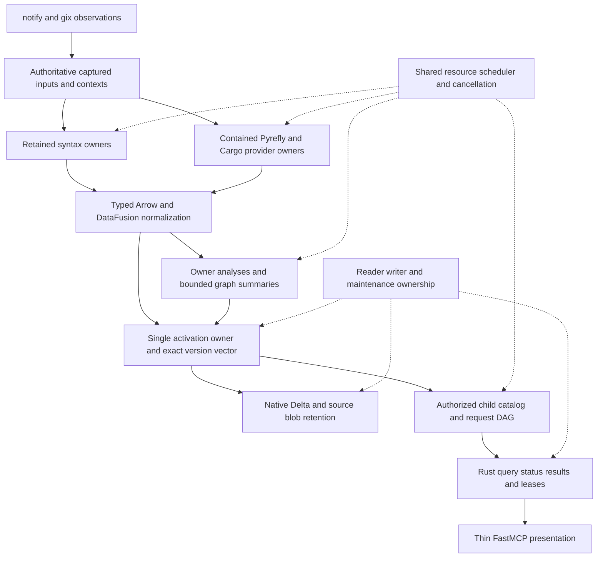

# CodeFabric: detailed implementation of remaining outcomes 4–8

Created 2026-09-09 against `126cf71f`; the diagnostic checkpoint was `4cc74d7c`. Design and remaining work expanded against `d6d1369b` and committed in `b2a97b9c`. Package execution resumed under the subsequent user instruction. Updated 2026-09-10 with P01's initial captured dependency/context vertical and phase measurements, and P02's canonical diagnostics and initial Python module/import/reference cluster.

This document expands outcomes 4–8 of the [production implementation plan](codefabric_pragmatic_production_implementation_plan.md). It is the detailed execution portion of that same backlog, not a competing plan or a new workflow. [STATUS](../../STATUS.md) remains the handoff for demonstrated behavior. Execute the cross-cutting packages in §3.3 order. The status notes distinguish demonstrated behavior and remaining acceptance; writing or updating this plan is not implementation evidence.

The objective is a useful, continuously updated Python/Rust code property graph, queried through the Rust daemon and thin FastMCP adapter, with Arrow, DataFusion and Delta doing the data work. Every selected fact family, all eight query forms, composition, truthful unfinished scope and sustained operation remain required. The first useful release is an intermediate delivery boundary, not a reduction of the full target.

For this plan, **best-in-class design** means complete selected semantics, explicit authority and
uncertainty, native library execution, economical state reuse, predictable ownership and measured
operation on the target workstation. It is an engineering target to validate, not a claim that the
current implementation is optimal or that every library feature should be enabled. All design
enhancements identified in this inspection are integrated below; this is not a claim of exhaustive
defect discovery across every repository file.

Read [§2.4](#24-source-grounded-capability-decisions) for exact library decisions,
[§3.1–3.4](#31-target-runtime-and-ownership-decisions) for architecture, code findings and implementation
order, [§§4–8](#4-outcome-4-complete-the-first-mixed-language-semantic-vertical) for the detailed work,
and [§9](#9-validation-integration-and-completion) for acceptance. The complete ontology map in §7.1 and
all 25 existing slices remain in scope. Enhancement and package labels are navigation within this
document, with no separate tracking system or completion authority.

## 1. Scope, authority and current baseline

### 1.1 Product authority

Use the revised selected domain specifications, with the [consolidated pragmatic review](../reviews/codefabric_pragmatic_product_delivery_consolidated_review_2026-09-08.md) and parent plan's delivery/resource decisions. Historical packet numbers are navigation only.

| Tag | Selected specification and relevant sections |
|---|---|
| ONT | [Fact ontology](../authoritative_design/code_property_graph_present_state_fact_ontology_specification_v2.3.md): §§5–58, source through language-specific semantics; §§61–67, metadata/identity/unknowns; AC-G-12–18 and AC-G-70–77, identity, schemas, projections, summaries and precision |
| GEN | [Fact generation](../authoritative_design/present_state_cpg_fact_generation_specification_python_rust_v2.3.md): §5, authority; §§14–51, language providers and analyses; §§52–79, common analyses and relationship families; §§80–88, reconciliation, coverage and publication |
| FAB | [Data fabric](../authoritative_design/present_state_cpg_data_fabric_specification_rust_arrow_datafusion_deltalake_v2.3.md): selected Arrow/schema, typed DataFusion, exact Delta, resource and maintenance contracts |
| QRY | [Semantic queries](../authoritative_design/code_property_graph_semantic_query_specification_v2.3.md): §4, The eight request forms; §5, Composition DAG and execution semantics; §§6–10, scope, unknowns, ordering, limits and response; §13, Preparation, input requirements, atomic start, and live references |
| LIFE | [Continuous lifecycle](../authoritative_design/codefabric_continuous_cpg_update_lifecycle_management_specification_v2.3.md): authoritative source capture, present-state repository observations, update ownership, invalidation, activation, retention and recovery |
| SRV | [FastMCP serving](../authoritative_design/present_state_cpg_fastmcp_serving_specification_v2.3.md): §§4–6, handshake and accepted query lifecycle; §§7–13, public tools, progress, response, resources, authorization and lifespan |

### 1.2 What already works and what must change

This is the current implementation baseline, reconciled from code, commits and recorded checks on 2026-09-09. The original plan started at `126cf71f`; that creation baseline no longer describes the running implementation. No outcome from 4 through 8 is complete. Existing checks establish only their recorded scope; see §9.1 and STATUS for validation limits.

| Surface | Implemented now | Remaining implementation |
|---|---|---|
| Startup/publication/reopen | Linux outcomes 1–3; fresh and live source/syntax activation before semantic convergence; exact source-only and terminal semantic reopen | Preserve these paths across complete contexts, all query forms and maintenance |
| Resources | Shared workspace/pool/store owners, joined cancellation, Linux containment, broad workstation budgets, one charged immutable toolchain capture per semantic pass | Finite retained providers/caches/history/results, sustained pressure/recovery and representative cost measurements |
| Rust contexts | Captured path dependencies; package/virtual workspace inheritance; targets, custom/disabled build scripts, library linkage, configured platforms/rustflags and explicit feature/default-feature/profile selections; closed ordinary failure retains positive observations and typed diagnostics | Registry/git and generated/proc-macro/build input closure; complete actual unit/host-target/unified-feature contexts; external tool changes, raw argv, retained build cache and parallel scheduling |
| Python contexts | Captured version/platform/ordered roots and supported configuration; one chunked checker inventory; source/stub coexistence; exact checker-selected call definitions; source files outside import roots remain queryable | External roots/distributions/stubs, additional effective settings, complete type/member/import/reference propositions and retained incremental checker state |
| Source/syntax | Python Tree-sitter/Ruff and six Rust syntax relations; recoverable errors; raw source paths; UTF-8/BOM/ASCII/Latin-1 Python and rustc BOM/CRLF original-byte mappings; UTF-8/UTF-16 public columns | Full lexical/CST/trivia census, additional codecs/coordinate contexts, complete path/rename behavior, retained parser/query state and broader incomplete-edit cases |
| Canonical facts | Source, selected entities/declarations, Python lexical references and Python/Rust call occurrences; native DataFusion normalization and exact Delta type/list restoration | Full semantic families, authority/conflicts, external/generated identities, executable instances, types/propositions and complete edit-time correspondence |
| Public forms | Four limited installed-client paths: declaration selection/facts, one-step calls and Python lexical references, exact declaration/function definition/function body source with surrounding lines and independent disclosure checks | Remaining meanings/subjects/directives, broader traversal and full composition; last four forms remain undelivered |
| Processing/wire | Requested files/targets and family scopes, exact outgoing Rust caller scope, typed optional Cargo selections, retained 130-partition remainder paging, source/semantic-current barriers and observed result truncation | All-family/owner/dependency/frontier scope, efficient authorized status, target/family freshness and historical selectors |
| Analyses | Selected real raw compiler/checker inputs and substantial existing typed Python/MIR/common algorithms; native ordinary diagnostic messages/children/spans/suggestions/edits | Complete production wiring and corrected algorithms, canonical/public consumers, full family precision and replacement |
| Updates/corpus | Owned native watch/coalescing/census loop, whole-context replacement, source/semantic stages, obsolete completion rejection, live/clean comparisons for selected source/config/stub/root/path/Cargo cases | Git/external/poll/root-recovery topology; retained providers, selective persistence and fair scheduling; full independent all-family edit corpus |
| Persistence/maintenance | Exact reopen, immutable input reuse, native checkpoints and retention-aware dry runs | Unchanged version reuse, native optimize/destructive vacuum, coordinated finite retention and actual reclamation |
| Measurement | RSS/cgroup/headroom signals and attributable small native scenario timings | Correlated phase telemetry, representative workloads/distributions, sustained edit/retention/recovery cost and measured optimization |

Current bounds supersede the original 64-module/8 MiB startup limitation: Pyrefly accepts up to 16,384 modules, 32 MiB per source file, 512 MiB source bytes and 32 MiB descriptors per context run, sent in chunks of up to 64 modules. Mixed source capture allows 1 GiB. Frames remain bounded at 4 MiB; context opening remains unary/bounded. These are configured ceilings, not measured optimal capacities or proof that arbitrary external contexts work. The compiler source manifest retains its separate bounded contract. Scaling and retention remain required; increasing an input bound does not implement scheduling.

### 1.3 Execution policy

Implement and integrate in the canonical working tree. Each slice ends with a working consumer, relevant checks and a concise STATUS update; commit coherent changes promptly. Do not accumulate independently designed interfaces in temporary worktrees. The sequence below does not mandate subagents or a fixed commit count.

Runtime actions retain compact input/output references, selected context/snapshot, outcome, coverage and useful diagnostics. Git records code changes. Do not recreate proof-language execution, per-allocation artifacts, source-artifact certification, repeated audit/status cycles or licensing investigations. Types, short algorithm arguments, independent examples and targeted failure tests provide proportionate assurance.

### 1.4 Progress checkpoint and how to execute the remaining scope

**Checkpoint and subsequent planning request, 2026-09-09.** The diagnostic-detail slice and its
handoff are finished. The subsequent request expands this same plan using the eight library
reference skills and current code, including improvements to existing design. It authorizes this
documentation revision, not another implementation slice. The full target remains required when
implementation resumes; no outcome from 4 through 8 is complete.

The current implementation includes the limited public forms and live source/semantic lifecycle
listed in §1.2. Do not redo those portions. Commit and scenario references remain in STATUS and
§9.1. In particular, source-context function/body/surrounding-line behavior, original-byte decoding,
raw source paths, Python root/stub/configuration changes, Cargo platform/feature/profile selections,
source-first fresh startup and retained failed-compilation diagnostics are implemented slices.
Their acceptance does not establish all meanings, contexts, fact families or sustained operation.

The diagnostic-detail continuation preserves ordinary native child notes, exact or explicitly
unmapped locations, suggestion alternatives and multipart edits in application-owned Arrow and
Delta. Failed compilation still leaves requested target families unknown. Separate future-breakage
report semantics and canonical/public diagnostic consumers remain open, as do the complete 7D
source/type/instance/lowering target and external/generated source closure in 4A.

| Slice | Current status | Next unmet boundary |
|---|---|---|
| 4A | Partial; captured selections and failed-run diagnostics implemented | External/generated/effective unit inputs, cache/scheduler, complete diagnostic consumers and tool-change invalidation |
| 4B | Partial, committed | Complete effective external Python contexts and semantic output; retain chunking and definition anchors |
| 4C | Partial, committed | Full source/syntax/coordinate/path behavior and parser reuse/live edits |
| 4D | Partial, committed | Remaining canonical families, authority/unknowns and external/generated/edit-time identity |
| 4E | Four limited forms demonstrated | Extend calls and SourceContext, broaden first-four meanings and composition |
| 5A | Partial; call and lexical-reference scopes demonstrated | Query dependency/owner scope, all families and efficient authorized live status |
| 5B | Partial live source/semantic barriers and typed status | Target/family-specific convergence and historical query selection |
| 6A | Partial native watch/census/rescan loop | Git inclusion, external roots, polling profile and root/config recovery |
| 6B | Partial live replacement and generation fences | Negative/configuration dependencies, complete identity rules and broader races |
| 6C | Partial shared orchestration and source/semantic stages | Retained Tree-sitter/Pyrefly/Cargo state, selective persistence and scheduling |
| 6D | Limited mixed clean/live comparison and deterministic publication pause | Broader language/context/edit corpus and all-family comparisons |
| 7A | Open; selected lexical/call prerequisites | Complete production Python semantics, canonical/query consumers and invalidation |
| 7B | Open; substantial native Ruff CFG and analysis algorithms exist | Integrate explicit native CFG/evaluation events, remove implicit derived fallthrough and qualify production behavior |
| 7C | Open | Python memory/effects/resources/exceptions/capture/async/concurrency on 7B |
| 7D | Partial raw foundation and ordinary native diagnostic details | Full typed Rust family census, canonical types/instances/lowering, generated/hygiene mappings and diagnostic consumers |
| 7E | Open | MIR analyses, exact private borrow facts and advanced state on real bodies |
| 7F | Open | Demand-rooted graph algorithms, structural facts and interprocedural summaries |
| 7G | Open; typed request infrastructure exists | Last four forms, complete first four, multi-block/repeated-form DAGs and full directives |
| 7H | Partial foundation; full slice open | All-form modern delivery, cursors/permissions, replay/reconnect/expiry and Rust-owned retention |
| 8A | Partial foundation | Selective persistence, unchanged version reuse and bounded edit-time growth |
| 8B | Open; checkpoint/dry-run only | Fix native commit-properties seams and enable owned compaction/destructive vacuum |
| 8C | Open | Coordinated finite retention/eviction/reclamation across all real owners |
| 8D | Partial Linux baseline | New update/provider/query/maintenance failure and recovery behavior |
| 8E | Open; signals/tooling only | Correlated runtime metrics and representative performance/retention measurements |
| 8F | Open; native schema-preserving pushdown already exists | Qualify all consumers/properties and optimize measured workloads without regressing existing pushdown |

The numbered requirements and acceptance paragraphs below remain the complete target. They are not a request to redo already implemented portions. Each slice's current-status note identifies what can be reused and what still needs implementation or behavioral validation. A partial family is not complete merely because its raw schema, fixture or capability label exists. No progress percentage is assigned because the remaining work is not uniform in size.

## 2. Library selection and implementation rules

### 2.1 Installed baseline

Use manifests, locks and selected source origins when implementing. These are the observed baseline, not proposed upgrades.

| Boundary | Selected libraries |
|---|---|
| Stable fabric | Arrow/Parquet 59.2.0; DataFusion 55.0.0; object_store 0.13.2; delta-rs `43a0cf10a313e5077c48637ad786a05359136bbb` |
| Stable syntax | Tree-sitter 0.26.12; Python grammar 0.25.0; Rust grammar 0.24.2; Ruff analysis crates 0.0.7 |
| Python semantics | Pinned Pyrefly 1.2.0 source graph, including the local configured-context correction and checker-selected call-definition seam |
| Rust semantics | `rustc_public` and narrow private adapters on nightly-2026-08-18; stable daemon remains Rust 1.98.0 |
| Source observation/graph | gix 0.86.0; notify-debouncer-full 0.7.0; petgraph 0.8.3, currently `std` without its optional Rayon feature |
| Rust transport/runtime | tonic/tonic-prost 0.14.6; prost 0.14.4; Tokio 1.53.1 in root/sidecar, 1.49.0 in the separately built extractor; tokio-stream 0.1.18 and tokio-util 0.7.19 in the stable domain |
| Python presentation | Python 3.14.7; FastMCP 4.0.0; MCP 2.1.1; grpcio 1.83.0; protobuf 7.36.0; Pydantic 2.13.4 |
| JSON optimization candidate | orjson 3.12.0 is covered by the reference but is not a direct adapter runtime dependency. Add it only if measured presentation serialization justifies it |

Keep one Arrow/DataFusion/object-store type universe. No new Cargo root, native Python extension, PyArrow processing layer, Flight server, SQL endpoint or FastAPI deployment is implied by reference availability. Compatible dependency additions require ordinary API/feature/lock checks; a narrow correctness patch is acceptable when the selected upstream API cannot meet a real requirement.

### 2.2 Reference-to-implementation map

All eight requested skills were used as navigators. The repository name for `codefacts-lib-ref` is `code-facts-lib-ref`. Read the relevant chapter and exact installed implementation when coding; do not follow old procedural prescriptions embedded in a reference over the current pragmatic target.

| Skill and reference | Capabilities selected for this implementation |
|---|---|
| [datafusion-pyarrow-rust-ref](../../.claude/skills/datafusion-pyarrow-rust-ref/SKILL.md); [DataFusion 55 reference](../library_ref/datafusion_rust_55_arrow59_comprehensive_advanced_reference_2026-08-23.md), chapters 43, 47, 50–54, 56; [Arrow reference](../library_ref/arrow_rust_59_datafusion55_advanced_reference_2026-08-23.md), chapters 3–7, 10, 12 | `Expr`, `DataFrame`, `LogicalPlanBuilder`, native joins/aggregates/windows and bounded recursion; `TableProvider` pushdown; `SendableRecordBatchStream`; shared `RuntimeEnv`; Arrow builders/kernels/IPC; truthful schema/statistics/property propagation |
| [code-facts-lib-ref](../../.claude/skills/code-facts-lib-ref/SKILL.md); [Tree-sitter](../library_ref/tree_sitter_rust_python.md), incremental parsing/query chapters; [Ruff](../library_ref/ruff_python_crates_advanced_reference_2026-08-18.md), chapters 2–8, 11, 14–15; [Pyrefly](../library_ref/pyrefly_rust_cpg_advanced_reference_1.2.0_2026-08-19.md), chapters 6, 9–16, 23–30; [MIR](../library_ref/rust_mir_cpg_continuous_reference_2026-08-18.md), typed MIR, identity, continuous updates and private enrichment | Reused parsers/query packs, recoverable Ruff parsing, bulk deduplicated Pyrefly type tables/callees/members, retained checker state, typed rustc bodies/types/instances, exact private identity/borrow seams |
| [deltalake-rust-ref](../../.claude/skills/deltalake-rust-ref/SKILL.md); [exact-pin Delta reference](../library_ref/deltalake_rust_1.0.0_43a0cf10_datafusion55_arrow59_advanced_reference_2026-08-23.md), chapters 5–9, 12–14 | Exact-version readers, native DataFusion provider/writes, owner replacement, caller-owned session, commit reconciliation, compaction/checkpoint/vacuum and conditional CDF |
| [gix-notify-ref](../../.claude/skills/gix-notify-ref/SKILL.md); [gix](../library_ref/gix_rust_advanced_reference.md), chapters 3–7, 16–18, 20–21, 24–25; [notify](../library_ref/notify_debouncer_full_rust_reference.md), chapters 8, 11, 27, 29–30, 40 | Read-only repository/inclusion hints, worker-local handles, debounced events, overflow/rescan recovery, dirty sets, generation fences, watch-first startup and polling fallback |
| [rust-grpc-daemon-ref](../../.claude/skills/rust-grpc-daemon-ref/SKILL.md); [tonic daemon reference](../library_ref/rust_grpc_daemon_advanced_reference_tonic_0.14.6.md), chapters 18–19, 25–29, 37 and UDS/auth sections | Long-lived channels, streamed bounded batches, deadline propagation, cancellation trees, joined tasks/processes, UDS identity and accepted-query reconnect |
| [petgraph-ref](../../.claude/skills/petgraph-ref/SKILL.md); [petgraph](../library_ref/petgraph.md), traversal, SCC/path and chapter 20 dominance sections | Demand-rooted graph projections; BFS/DFS, SCC/condensation, topological worklists, rooted dominance; canonical mapping outside transient graph indices |
| [grpcio-orjson-protobuf-ref](../../.claude/skills/grpcio-orjson-protobuf-ref/SKILL.md); [grpcio](../library_ref/grpcio_python_advanced_reference_1.83.0.md), chapters 14, 17–19, 27; [protobuf](../library_ref/protobuf_python_advanced_reference_7.36.0.md), chapters 7, 11, 14, 16–18, 26; [orjson](../library_ref/orjson_python_advanced_reference_3.12.0.md), chapters 13, 16–19, 22 | Lifespan-owned `grpc.aio` channel; explicit deadlines/cancellation; generated presence/oneof-safe DTOs; compatible field evolution; optional bytes-oriented JSON serialization |
| [fastmcp-pydantic-ref](../../.claude/skills/fastmcp-pydantic-ref/SKILL.md); [FastMCP 4](../library_ref/fastmcp_python_advanced_reference_4.0.0.md), chapters 38–44 and tool/resource/lifespan sections; [Pydantic](../library_ref/pydantic_python_advanced_reference_2.13.4.md), chapter 21 and strict/union/serialization sections | Modern negotiated extensions, replay-aware input rounds, daemon-owned handles/resources, strict typed projections, reused `TypeAdapter`, one canonical logical response |

### 2.3 Default mechanism choices

1. **Relational work stays relational.** Express selection, normalization, reconciliation, owner replacement, set operations, grouping and fixed-depth joins using typed DataFusion plans. Bind identifiers through application schemas, not generated SQL strings. Apply authorization before scans, statistics, negative reasoning or source disclosure.
2. **Arrow remains columnar.** Build owned typed arrays and bounded `RecordBatch` streams. Reuse `Arc` buffers and native filter/take/concatenation kernels where appropriate; avoid per-row JSON maps and whole-result `collect()` on unbounded paths. A zero-copy slice may retain its entire parent allocation: copy a small long-lived result when measurement shows retained-parent waste.
3. **Graph extensions are bounded and specific.** First use native joins/aggregates or bounded `RecursiveQuery`. Use existing graph integration for algorithms that require graph state. A custom `ExecutionPlan` is warranted only where it contributes real streaming/partitioning/cancellation behavior; a scalar UDF is not a hidden whole-graph executor.
4. **Reuse plans, not exhausted executions.** Cache typed plan templates by schema/algorithm/policy/context compatibility; bind exact relation versions and create fresh execution state for each request. Never reuse a consumed stream, a cancelled physical execution or a catalog authorized for another principal.
5. **Native storage owns its format.** Use delta-rs transaction, checkpoint, optimization and vacuum code. The application owns selected versions, writer/maintenance exclusion, reader leases and recovery decisions. Do not implement a second Delta log or custom file-list deletion planner.
6. **Use concurrency where work exists.** Parallelize independent files/contexts, independent query branches and partitions within the shared budget. Keep blocking compiler/graph work off control-runtime threads. Avoid multiplying 16-worker checker pools by an unrestricted number of concurrent contexts.

### 2.4 Source-grounded capability decisions

The planning inspection checked repository consumers and the selected local sources, including
delta-rs `operations/{optimize,vacuum}.rs` and `kernel/transaction/mod.rs`, DataFusion's
`TableProvider` contract, petgraph graph/dominator APIs, notify's joined `stop`, Tonic's
`Request::set_timeout`, gix repository locations/thread-local handles, and the local Pyrefly
`lib/query.rs`. API availability below is distinct from completed CodeFabric integration.

| Boundary and reference chapters | Concrete selection and implementation constraint | Integration and replacement |
|---|---|---|
| DataFusion 55, Scan planning §51 and Runtime execution §54 | Retain `SchemaContractStorageProvider::scan_with_args`, projection/filter translation, statistics requests and logical restoration. Delegate pushdown truthfully to the underlying provider. Use native join/aggregate/window/recursive plans and streaming execution with the existing shared `RuntimeEnv`, memory pool, object-store registry and disk manager | 4D/5A/7G/8F extend existing wrappers and authorized child catalogs. Replace row-oriented relation construction or repeated scans only where the inspected consumer benefits; do not rebuild a query engine or authorization policy inside an optimizer |
| Arrow 59, Buffers §4, RecordBatch §6, kernels §7, IPC §10 and Parquet §12 | Use typed builders with estimated capacity, `RecordBatch`/`ArrayRef`, native filter/take/cast kernels and bounded IPC streams. Existing `pool` features permit buffer claims; shared/sliced arrays still need correct retained-owner accounting. Null bitmap, offsets, dictionary identity and nested schema metadata are part of correctness | 4B–4D/7H/8C/8F. Keep fixed-width identity and logical/storage restoration. Selectively copy small retained pages that otherwise pin very large buffers. Do not turn buffer accounting into a promise to pre-admit all native allocations |
| Tree-sitter, Incremental parsing §10, queries §§12–18 | Retain parser plus exact old text/tree per file; apply `InputEdit`, parse the new bytes with the edited tree, then compute `changed_ranges`. Reuse compiled `Query` packs; own each mutable `QueryCursor`, enforce match/depth/range limits and progress cancellation | 4C/6C replace the publication-scoped cache boundary with a file-indexed bounded owner. Changed syntax ranges do not establish unchanged semantics or unchanged source bytes |
| Ruff, parser §4, typed AST §5, semantic model §8, ownership §11 and incrementality §15 | Reuse recoverable `Parsed`, typed visitors, `LineIndex`, `Indexer`, bindings and the already implemented native CFG/dataflow builders. Borrow AST/model state only within its source owner. Cache immutable parse-derived output by content/source mode/version; reparse changed files | 4C/7A–7C. Integrate native explicit CFG edges into derived analysis, replacing implicit ordinal fallthrough there. Do not replace Ruff with a custom parser or confuse file-local lexical binding with Pyrefly's project semantics |
| Pyrefly 1.2.0, bulk/query §§9–16, changes §23, modules §26 and performance §30 | Once per needed file/revision, export `get_type_table_in_file`, `get_callees_with_location`, and applicable `get_attributes` results. Resolve type-table indices immediately to structural application IDs. Use pinned resolver/definition/TSP implementation seams for missing propositions. `change_files` returns no affected-file census and re-adds retained file handles | 4B/6C/7A. Preserve the local configured-context/definition/diagnostic-path changes. Retain one serialized checker context only with an owned generation update path. Deletion currently rebuilds `Query`; retain that correct fallback until a narrow removal seam proves deleted handles cannot return |
| rustc/MIR, typed bodies §§4–14, updates §§41–48 and private appendices | Use Cargo's actual compilation units and native incremental artifacts; typed `rustc_public` exposes MIR/body/type/instance data. Keep narrow private capture for stable keys, HIR/source correspondence, expansion/hygiene and exact borrow-check data at the phase that retains it | 4A/7D–7E. Preserve all raw variants, MIR phase and source/entity/instance distinctions. Compiler query reuse does not itself publish a complete external owner manifest; optimized MIR is not automatically a complete source-call census |
| Delta, writes §§5.12–5.17, pinned providers §§6.24–6.25 and native scan §§6.35–6.36 | Use exact-version `TableProviderBuilder`/Delta scan providers, caller session registration and native logical-to-physical adaptation, including deletion vectors and column mapping. For a selected file scan use `FileSelection` with `MissingSelectedFilePolicy::Error`; do not substitute a raw Parquet directory scan. Native writes use owned operation/application transaction metadata and zero hidden retries | 8A/8B/8F extend `delta_exact`, `delta_write` and existing publication. Use predicate replacement or merge only after exact replacement/deletion semantics are defined. Selected pin is a pre-release Git revision, not an invitation to upgrade dependencies broadly |
| Delta maintenance, native optimize/vacuum/checkpoints and selected transaction source | Optimize rebuilds `CommitProperties` and overrides retries; vacuum's start commit also rebuilds properties. Fix those exact seams and qualify post-commit cleanup. `with_keep_versions` protects data under an experimental API; reconstructible log/checkpoint history needs separate protection | 8B–8D. Replace the present unavailable/proof-approval paths with writer exclusion and reader retention. Native checkpoint/vacuum own the format and file deletion. CDF remains conditional on an actual durable consumer |
| gix, handles §3, layout §6, index §16, excludes §18, status §20 and worktrees §25; notify §§8–11, 13 and 18 | Use worker-local gix handles (`ThreadSafeRepository::to_thread_local` when shared), `index_or_empty`, actual work/common dirs, native excludes/attributes/status and interruption. Use debouncer rename/file-ID hints, bounded notification handoff, retained rescan obligation and joined `stop`; select `PollWatcher` explicitly | 6A/6B/8D. Replace scattered inclusion/topology assumptions with one captured policy. The current gix feature set includes both SHA-1/SHA-256 and `revision`; preserve it unless actual consumer analysis justifies change. No Git history graph, hooks, filters, credentials or network observation path |
| Tonic/Tokio, deadlines §18, flow §19, UDS §§22–23, runtime/cancellation §§25–29 and shutdown §37 | Clone reusable channels/stubs, propagate remaining deadlines using `Request::set_timeout`, tie child cancellation to accepted handles, and keep one registered task/process owner. Queue capacity needs a byte bound as well as an item bound. Blocking tasks require cooperative checkpoints plus joins | 6C/7G–7H/8D. Reuse existing structured task owners rather than introducing a second tracker. Use `TaskTracker`/`JoinSet` only to fill a demonstrated ownership gap. Consider Prost `bytes` fields on large IPC payloads only with end-to-end accounting/compatibility evidence |
| grpcio §§14,17–19,27; Protobuf presence §7, oneof §11, collections §§16–17 and serialization §18 | Keep one same-event-loop `grpc.aio` channel for the adapter lifespan, finite per-call timeout and one read/write style per stream. Use generated `HasField`/`WhichOneof`, typed submessage copying and explicit optional collection wrappers where absent differs from empty. Preserve unknown fields on compatible binary forwarding | 5B/7H. Add fields and reserve removals deliberately. ProtoJSON, Pydantic JSON and canonical identity encodings have different rules for bytes, integers, enums and presence; do not replace generated conversion with generic dictionary serialization |
| FastMCP 4 §§38–42 and lifespan/tool/resource sections; Pydantic §21 and §40 | Preserve strict schemas, cached module-level `TypeAdapter`s, lifespan channel ownership and modern negotiated extensions. Guarded inputs are independent re-entrant request legs. Keep accepted queries/resources in Rust; FastMCP sessions may hold presentation preferences only | 7H. Existing strict validation, `tasks=False` and sealed request-state controls are foundations. Add authorization-scoped resource completion only for a real resource-template consumer; completions are not automatically protected by that component's authorization. No speculative FastAPI/server/proxy layer |
| orjson §§13,16–19,22 and Pydantic serialization | First measure native `TypeAdapter.dump_json`/`model_dump_json` against the current bounded projection. Add orjson only if a real payload improves materially. Its byte output, GIL-held call, UTF-8/number rules and non-string-key collisions matter; sorted keys do not define semantic identity | 8F/7H only if selected by measurement. Never pass Protobuf/Pydantic objects through `default=str`, unvalidated `Fragment`, or an implicit JSON round trip. No orjson dependency is added by this plan |

Root Ruff 0.0.7 and Pyrefly's internal Ruff 0.0.6 belong to separate process/build domains;
forcing their internal AST types to unify would increase coupling. Preserve the pinned sidecar
source and all four domain locks. At implementation time record the actual changed source
selection and affected consumer checks; a reference's example, target pin or feature inventory
does not prove what a local patch implements.

## 3. Delivery order and interfaces

The first mixed-language vertical is Rust source/context preparation → real compiler result → canonical relations → four public forms. Build query-relevant coverage alongside it. Then connect the live input loop. Expand full language analyses against that working product, and finish sustained operation using measured workloads.

| Slice group | Prerequisites | Observable delivery |
|---|---|---|
| 4A–4D | Existing startup/provider owners | Correct source/context identity and actual normalized Python/Rust facts |
| 5A–5B, then 4E | 4D; develop 5A while integrating providers | First four public forms with accurate requested/completed/remainder scope |
| 6A–6D | 4E and 5B | One daemon observes edits, reports pending work and converges to clean reconstruction |
| 7A–7F | Working canonical inputs and update replacement | All remaining Python/Rust/common fact families, delivered family by family |
| 7G–7H | 4E/5B; extend as 7A–7F add facts | All eight forms, full composition, modern public delivery |
| 8A–8F | Start persistence/instrumentation during 6; finish against 7 | Finite retained state, real maintenance, recovery and measured responsiveness |
| 9 | All groups | Integrated full-product demonstration and honest final handoff |

Do not wait for every family before exposing useful answers. Conversely, do not mark a family complete because an enum, schema or test seed exists. Each family needs its actual producer → canonical relation → query consumer → coverage → update replacement path.

Shared runtime interfaces should stay small:

- A captured input set identifies workspace, source generation, immutable bytes and effective analysis contexts.
- A provider job selects requested families/scopes and resource/deadline/trust policy; accepted output is owned Arrow plus terminal scoped coverage.
- An analysis consumes immutable accepted relations and produces facts, diagnostics and scoped completeness with its algorithm/precision identity.
- A snapshot binds exact selected relation versions, source/context generation and coverage. The activation coordinator is its single publication owner.
- A query pins one authorized snapshot and a dependency scope. Its response describes results and the unfinished portion of that same requested universe.

### 3.1 Target runtime and ownership decisions

These decisions refine the selected pragmatic design; they do not replace its authority.

| Decision | Selected design, reason and viable alternative | Assumption, consumers and decisive check |
|---|---|---|
| D1: reuse without stale facts | Separate relation content version, fact production provenance and epoch validity/coverage selection. Reuse an unchanged exact Delta pin only after its dependency inputs and schema remain valid. An epoch-specific field/metadata value must not make an otherwise reusable relation falsely claim a new production run. Rewriting everything remains the simple correctness fallback | Assumes 6B can establish the dependency closure or conservatively invalidate the context. 4D/5/6/8 consumers must agree. An unrelated edit reuses unaffected versions; a dependency-only change withdraws or recomputes affected semantics even when local source bytes are equal |
| D2: retained semantic state | One bounded checker/process owner per effective Python context and one compatible Cargo cache owner per Rust compilation context; each generation uses admitted captured inputs. Reuse provider-native invalidation, with full-context rebuild on unsupported mutation/configuration/deletion. Repeated fresh processes remain the recovery fallback | A long-lived Pyrefly process needs a private mutable work view updated only from verified captured bytes, with checker mutation/extraction serialized. It may not read a new workspace via an old immutable mount. 4A/4B/6C/8C qualify update, deletion, restart and eviction against clean builds |
| D3: native facts, application semantics | Tree-sitter/Ruff/rustc/Pyrefly own parsing and compiler meaning; DataFusion owns relational normalization; bounded owner algorithms own Python/MIR transfer semantics; petgraph owns applicable topology algorithms. Extend existing modules instead of creating an interpreter, generic plugin engine or replacement compiler | Existing Ruff CFG and MIR/common fixed-point code are reusable but production integration is unproved. 7A–7F must validate real inputs, exact authority and algorithm precision. Library substitution is useful only if it preserves the released fact meanings |
| D4: one request compiler | Keep release-owned form templates, instantiate output bindings per request block, validate one typed dependency DAG and run it in one authorized exact snapshot. Fresh execution state per branch; share immutable prior results by owned fan-out. Eight independent executors are rejected because they would duplicate resolution/coverage/limits | 4E/5/7G consumers require typed input roles and deterministic branch results. Same-form blocks with different subjects must remain distinct; an independent success survives another branch's failure |
| D5: durable relation layout | Evolve current native tables using unchanged-version reuse first, then owner-scoped replacement in practical relation/context partitions. Retain schema descriptors and the activation version vector. Avoid per-file tables, unconditional intermediate persistence and an Arrow overlay by default | Assumes exact owner deletion and uncertain-write reconciliation are available. 6C/8A/8B measure rewrite bytes and small-file growth. An overlay is a later measured alternative with durable recovery, not a prerequisite for responsiveness |
| D6: maintenance by ownership | Serialize destructive maintenance with conflicting writes and admission of historical leases for that table, protect active readers, then invoke corrected native APIs. A stale dry-run approval receipt provides no live exclusion and is retired | 8B/8C require native data plus log/checkpoint protection and command-owned retry identity. Before enabling deletion, demonstrate actual reclamation, oldest retained reopen and reader/writer/admission races |
| D7: shared scheduling and observable bounds | Reuse one process/workspace budget and explicit control headroom. Schedule owner/context jobs and query branches with cost-aware concurrency; retain byte-bounded queues and joined cleanup. The alternative of a full 16-thread checker per unrestricted concurrent context oversubscribes the workstation | 6C/8C–8F measure RSS, managed buffers, CPU, disk and queue delay separately. Broad defaults are starting settings, not optimal capacities; full semantics may legitimately consume substantial resources |

**Data contracts to evolve inside existing modules.** Use typed fields on the existing captured
input, provider job, owner manifest, processing, activation and query structures. Do not introduce
a second registry merely to carry these fields:

- A captured context selects ordered source/dependency roots, raw-path identities, compiler/checker
  configuration and executable/source content identities. Operational generation is distinct from
  semantic context identity and from the source digest of each file.
- Accepted owner output names input/context selection, provider/schema identity, family, owner and
  terminal coverage. A complete owner census permits deletion; a partial run cannot declare missing
  owners absent. Changed-body program points cannot be reused across different body content.
- Coverage has disjoint requested partition keys plus explicit containment between file/owner/context
  scopes. Job terminal state, semantic certainty, freshness and output truncation remain separate
  dimensions. Queries derive authorized dependency scope before summarizing those dimensions.
- An epoch selects relation pins, schema compatibility, source/context references and validity/coverage;
  the selected relation set may combine reused content versions with newly written ones. It may never
  be assembled from independently refreshed `latest` tables.
- A request block has its own typed input/output bindings, result role, dependency scope, limits and
  terminal state. Immutable result handles additionally bind accepted query, block, epoch and access
  scope; runtime-local graph indices and library objects never become public IDs.

### 3.2 Existing-code enhancement register

Entries below describe the enhancement scope; delivered portions are recorded with package progress.
“Confirmed” describes the inspected structure/limitation,
not a newly reproduced product failure. “Qualification” identifies a risk or integration boundary
whose behavior must be tested before drawing a stronger conclusion. Existing code paths listed
here are starting points, not instructions to replace entire files.

| ID | Current evidence and enhancement | Delivery owner and observable result |
|---|---|---|
| E01 | Confirmed: startup `rustc.rs` iterates selected targets; captured selections are narrower than Cargo's actual dependency/unit closure. Reuse native Cargo units, freeze generated/external inputs and distinguish host/target roles | 4A/7D: real dependency, build-script and proc-macro facts agree with exact captured compilation |
| E02 | Confirmed: one shared toolchain capture exists per pass, but compatible build/context retention is unfinished. Add bounded content-keyed toolchain/dependency/build reuse and actual tool-change invalidation | 4A/6C/8C: warm edits reuse native work while changed tools/features invalidate compatible selections |
| E03 | Confirmed: `pyrefly_link.rs` already uses bulk type/callee/member APIs and resets on removed modules. Complete external roots and missing semantic propositions through the pinned seams | 4B/7A: complete structural types/imports/references/member contracts from one effective checker context |
| E04 | Confirmed: `Query::change_files` re-adds retained handles and exposes no affected-file census; production retention across captured views is missing. Add an owned serialized update path and truthful recheck coverage | 4B/6C: repeated edits, stub deletion and config replacement match fresh checker state |
| E05 | Confirmed: `TreeSitterAdapter` owns a short revision deque; startup reuses runners only within a pass. Retain file-indexed parser/text/tree and Ruff parse-derived state across edits | 4C/6C: unchanged files avoid parsing; changed ranges never hide byte/semantic changes; eviction is harmless |
| E06 | Qualification: reversible source paths/decoding work for demonstrated cases, while external/generated argv and inclusion boundaries remain partial. Unify capture, watch, provider and source-query descriptors | 4A–4C/6A: raw bytes, comparison keys and display URIs remain distinct through edits and source disclosure |
| E07 | Confirmed partial normalization: startup `canonical/` serves declarations/calls/lexical references. Complete typed authority, structural type interning, modules/instances, external endpoints and conflict provenance | 4D/7A/7D: raw and canonical queries expose the same evidence with explicit proposition authority |
| E08 | Confirmed: canonical processing relations already use native aggregates; completeness scope is limited. Add all-family producer/dependency closure and exact owner/frontier scope without duplicating a status authority | 5A/7G: authorized counts and negative reasoning account for potential importers/callers and unresolved frontier |
| E09 | Confirmed: source/semantic freshness barriers work at coarse scope. Add target/family barriers and explicit retained historical selection | 5B/6B: a failed unrelated context does not block a provably independent target; uncertain dependencies retain conservative waiting |
| E10 | Confirmed: `workspace_updates.rs::relevant` filters callback paths but root registration remains recursive. Git metadata/external roots and polling need explicit topology and inclusion policy | 6A: ignored build trees do not consume unnecessary native watches; policy/root changes still trigger reconciliation |
| E11 | Confirmed partial replacement: generation fences and whole-context invalidation exist. Add positive/negative dependency indexes, complete owner manifests and unchanged-owner validity | 6B/8A: deleted owners/edges/summaries disappear and dependency-only changes cannot relabel stale facts |
| E12 | Confirmed: shared resources exist, while target work is serialized and Pyrefly uses a fixed 16-thread context. Add scheduler-assigned CPU shares, bounded fair jobs, coalescing and eviction | 6C/8C: useful parallelism with prompt source/status/cancel under background convergence |
| E13 | Confirmed: native `ruff_adapter/cfg.rs` already models branches/loops/finalizers/patterns and `dataflow.rs` emits events; `python_derived_analysis.rs` still synthesizes ordinal adjacency plus explicit edges. Bind the explicit native graph and remove implicit production fallthrough | 7B/7C: real exceptional/evaluation semantics reach canonical dataflow and program-point state |
| E14 | Qualification: MIR analysis already has finite worklists and evaluation ordering; full real-input/private-borrow/public integration is open. Complete exhaustive typed payload and exact phase distinctions | 7D/7E: exact loans differ from conservative ownership approximations; changed bodies replace all point/state rows |
| E15 | Qualification: optimized MIR may omit source calls. Separate source/HIR occurrence coverage from body-phase/executable-instance coverage before authorizing source-level absence | 4A/5A/7D: release-profile inlining/elimination cannot produce an unjustified known-empty source caller |
| E16 | Confirmed: `common_derived_analysis.rs` already uses SCC/condensation and rooted dominance, including a synthetic exit and non-exit unknowns. Integrate these against real graphs and qualify exit/unknown/summary policies | 7F: production dominance, loops, direct/propagated summaries and objective metrics have correct precision |
| E17 | Confirmed: `graph_program.rs::bounded_shortest_path_witness` queues/clones complete simple paths and builds nodes only from edges. Use distance/predecessor traversal, explicit isolated endpoint admission and fact-preserving adjacency | 7F/7G: bounded shortest/all-shortest queries preserve deterministic parallel-edge witnesses without exponential shortest-path frontier state |
| E18 | Confirmed: release templates and result schema bindings are indexed by form/result relation; typed DAG validation already exists. Instantiate block-local outputs and execute actual prior-result bindings | 4E/7G: repeated forms, typed fan-out/fan-in and independent branch failure work on one epoch |
| E19 | Confirmed partial product surface: eight-form ingress exceeds demonstrated canonical queries. Complete directives, scoped negation, path policies, set compatibility and summary mathematics | 4E/5/7G: all released forms have source-to-public behavior with honest partial results |
| E20 | Confirmed strong adapter foundations: `server.py` owns lifespan, strict validation, guarded state and no independent task authority; client/DTO modules reuse `TypeAdapter`. Extend these for all-form paging/replay/reconnect/expiry | 5B/7H: one daemon-authored logical response with stable handles and independent source authorization |
| E21 | Qualification: existing task/process/buffer ownership must span retained providers and new DAG streams. Carry end-to-end deadlines, byte bounds and cooperative blocking cancellation | 6C/7G/7H/8D: slow/disconnected readers do not strand work, unlimited queues or leases |
| E22 | Confirmed: `programmatic_relation_delta.rs` writes every selected semantic relation with `ReplaceAll`. Reuse unchanged pins, persist by consumer and introduce exact owner replacement incrementally | 6C/8A: fewer rewritten bytes/versions/files without changing query identity or coherent reopen |
| E23 | Confirmed in native source and `delta_guarded_maintenance.rs`: optimize/start-vacuum lose caller transaction policy and destructive maintenance is unavailable. Correct native commits; replace approval-receipt gating with live exclusion | 8B/8D: real compaction and safe reclamation, including uncertain acknowledgement recovery |
| E24 | Confirmed open integration: source/result/snapshot leases and broad budgets exist, but one coordinated finite policy across providers, tables, logs, sources, diagnostics and caches does not. Complete retention ownership | 8C/8D: protected reads survive maintenance; expired/unleased state is measurably reclaimed |
| E25 | Confirmed existing wrappers in `fabric/provider.rs` and `programmatic_schema.rs` already preserve pushdown/schema behavior. Qualify structured scan/statistics requests and physical properties through real canonical/Delta/query consumers | 4D/8F: native pruning/projection/limits improve actual work without corrupting schema, authorization or residual filters |
| E26 | Baseline observability gap: phase metrics remain open. P01 added finite preparation reports; P02 now initializes the daemon warning formatter on supervisor-owned stderr. Complete correlated runtime outcomes and tune from representative profiles | 8E/8F: detection-to-answer, queue, IO, memory and recovery costs are attributable; warning call sites alone are not evidence of observable operation |

### 3.3 Dependency-ordered implementation packages

Execute these packages within the existing slices. A package is a useful integration boundary,
not a prescribed commit size or a new workstream. Items inside a package can proceed independently
where their interfaces already exist; do not delay telemetry, wire evolution, update cases or
retention ownership until every semantic family is finished.

| Package | Prerequisites | Work and integrated exit |
|---|---|---|
| P01: source/context and cost foundations | Existing Linux startup and exact source epochs | E01–E06/E12/E26; start 4A–4C, 6A/6C interfaces and 8E instrumentation. First extend one real external/generated Rust unit and one external Python root through capture → provider → raw query/reopen; record phase costs. Continue the full context variants in their owning slices |
| P02: canonical semantic vertical | P01 context contracts; current canonical declarations/calls | E07/E08/E15/E25; 4D, 5A and first 7A/7D canonical types/imports/references/diagnostics. Publish evidence and requested coverage together; exact reopen preserves structural IDs and unknowns |
| P03: first release query completion | P02 for requested families | E09/E18–E21; finish 4E/5B and first 7G/7H bindings. All first-four meanings required by the parent first release work on real Python/Rust semantics, with target-scoped processing and deterministic reusable results |
| P04: retained continuous operation | P01 input contracts; P02 validity rules; P03 public comparator | E02/E04–E06/E10–E12/E21/E22; finish 6A–6C, start 8A/8C. Owned retained contexts, exact invalidation and unchanged-version reuse run under the existing source-first coordinator |
| P05: first useful release | P03/P04 | Complete 6D's first-release corpus, including external/config/negative/deletion/race cases. Independent clean builds agree; restart and leased old source/facts survive. This closes only the first release boundary, with 7/8 still required |
| P06: complete language normalization | P02/P04; may advance alongside P03–P05 | E03/E07/E14/E15; finish remaining 7A/7D families, external/generated correspondence and all canonical type/member/dispatch contracts. Each family adds public retrieval and update acceptance when it lands |
| P07: Python control and advanced analysis | P06 Python ownership/types plus 7A inputs | E13; 7B then 7C. Explicit native CFG/events drive finite flow/memory/effect/resource/async analyses; independent source cases verify transfer and unknown semantics |
| P08: Rust control and advanced analysis | P06 typed MIR/source/phase census | E14/E15; 7E plus private 7D enrichment. Real move/borrow/drop/unwind/coroutine cases reach canonical point/state/precision results; exact private facts have distinct acceptance |
| P09: common graph and summary integration | P06 callable/CFG inputs; P07/P08 direct effect/state inputs as needed | E16/E17; 7F. Demand-rooted projections, correct graph algorithms and monotone SCC summaries retain call-site evidence and unknown dependencies |
| P10: complete query algebra | P03 block compiler; P06–P09 for selected inputs | E08/E17–E19/E25; 7G. Add remaining four forms and full directives incrementally; all eight and mixed repeated-form DAGs pass real public/reopen/update cases |
| P11: complete modern delivery | P10 and each new form as it lands | E20/E21; 7H/5B. Presence-safe contracts, guarded replay, bounded resources/cursors, reconnect, authority expiry and slow readers work through installed clients |
| P12: native maintenance and finite state | P04 validity/version reuse and writer ownership; start before large P06–P10 corpora | E22–E24; 8A–8C. Correct native commit seams, selective owner replacement, protected data/log history and real optimize/vacuum/TTL cycles. Prerequisite for sustained scale, not for every small semantic fixture |
| P13: integrated failure recovery | P04/P11/P12 boundaries | E21/E23/E24/E26; 8D. Restart/cancel/pressure/interrupted maintenance exercises the real owners while preserving exact current and retained facts |
| P14: representative optimization and final product | P05–P13; 8E measurements collected throughout | E12/E17/E22/E25/E26; 8E/8F and §9.2. Optimize demonstrated costs, qualify optional mechanisms only when useful, run the assembled full-family/eight-form/edit/retention/recovery scenarios and report limits |

P06–P11 do not wait for an artificial “all providers complete” global flag. Each accepted family
becomes queryable with its actual scope. P12 begins early enough to avoid full-ontology data growth
on a rewrite-everything storage path. Do not claim that P01 or P05 closes the full outcomes.

**P01 initial exit delivered, 2026-09-10.** Captured Cargo directory-source dependencies and an
explicit native Pyrefly site-package root now reach real provider facts and exact reopen. Python
declarations, calls and source also pass through installed FastMCP clients. Cargo explicitly loads
the captured configuration files from its isolated output working directory; directory-source
packages are not independently selected as top-level projects. Cargo retains native locked/offline
resolution and checksum handling. The Python context carries bounded digest-verified `py.typed`
markers into the checker view, binds package-relative module names, and preserves explicit workspace
root order. Context/source identities and existing provider admission remain authoritative.

The latest source and semantic preparation reports record source counts/bytes, phase elapsed time
and relation counts with finite overwrite retention. Twenty-four affected root cases, all 37 sidecar
tests, strict sidecar check/lint and default/featureless root checks pass. The real Rust dependency
and reopen case takes 53.18 s; the Python installed-client/reopen case passes. The 4-file/146-byte
Python sample spends 0.523 s in Pyrefly and 5.600 s in relational execution/Delta writes; the
10-file/846-byte mixed sample spends 25.915 s in Cargo/rustc and 9.944 s in execution/writes.
These are initial cost observations, not comparative or representative performance evidence.
See STATUS for commands, logs and the transient delegated user-systemd validation environment.

This first external-input vertical uses dependency material already captured inside the authorized
workspace. Physical external-root registration/fetching, complete ecosystem identity, generated
source freezing, full Cargo unit/effective-configuration closure, raw argv, retained caches/checkers/
parsers and cost-aware concurrency remain in 4A–4C/P04/P06/8E. The existing immutable input and
provider contracts carry the new roots; full retention and scheduling acceptance is still required.
P02's initial vertical is delivered below. No outcome from 4 through 8 is complete.

**P02 diagnostic slice implemented, 2026-09-10; package exit was open at this checkpoint.** Native DataFusion
plans publish canonical primary messages for Python/Rust and Rust's child/span/suggestion/edit
hierarchy. Exact provider-run, owner-file, digest and generation joins fence message validity;
independent location joins additionally enforce captured byte bounds. Invalidated locations retain
native evidence without canonical source coordinates. CBEF message identity separates unchanged
content/context from execution run and generation. Python rendered diagnostics preserve their
explicit lack of structured fields.

Requested diagnostic messages, locations and suggestions have separate processing partitions.
Failed Rust targets retain positive messages with failed/incomplete coverage; Python structured
details are unsupported. Empty source-only relations and the closed processing validator support
fresh activation. A real failed Rust target plus Python type error passes exact canonical/raw
message comparison and Delta reopen of all five relations (46.95 s); independent Arrow cases cover
stale owners, cross-file locations, invalidated ranges and stable IDs. `canonical-diagnostics`
selects the native scenario. STATUS records checks and remaining scope.

**P02 initial Python module/import/reference cluster implemented, 2026-09-10.**
The typed Pyrefly bulk query performs one transaction/AST walk over names, attributes and import
aliases, preserving candidates, unresolved imports and module targets without definition ranges.
It disables the native editor's unresolved-import landing fallback. The shared Arrow schema adds
`provider.pyrefly.reference.v1`; source/definition anchors retain original captured bytes.
`fact.code_module`, `fact.code_semantic_reference` and `fact.code_import` use native DataFusion
context/file/digest/generation joins, exact declaration anchors, explicit import-anchor methods,
candidate aggregates and application-owned IDs. Module entities join the entity universe; output
field metadata is aligned before union optimization. Invalidated targets remain unknown.

Requested modules/imports/semantic-reference coverage combines accepted per-file native census,
syntax availability and canonical target completeness. Healthy-file imports remain complete beside
a broken import in another file. Independent Arrow cases cover context separation, multiplicity,
stale source/targets, range validity and identity stability. Real contained Pyrefly publication and
exact Delta reopen pass for aliases, class methods, modules and missing names/imports (23.45 s);
`canonical-python-references` selects the case. All 38 sidecar tests, canonical cases, root default/
featureless checks and strict sidecar checks pass; STATUS records commands, evidence and limits.
Public family retrieval and broader native reference meanings remain open.

**P02 initial Python structural type slice implemented, 2026-09-10.** One native checker transaction
and occurrence traversal now emits both the compatible presentation table and a bounded structural
graph. Typed Arrow nodes/edges/observations retain native constructors, nominal/function anchors,
builtin identities, literal values, tuple layouts and callable parameter semantics. DataFusion
selects exact accepted source/run/context inputs, requires unique canonical nominal anchors and
groups typed graph records. An application-owned normalizer uses iterative petgraph SCC traversal
and the existing CBEF TypeInterner, encoding each term once. Provider indices, hashes and rendered
type strings never become canonical identities.

`fact.code_type`, `fact.code_type_observation` and `fact.code_type_component` now preserve type IDs,
computed observation roles, component order and unknown semantics through exact Delta reopen.
Basic structural constructors, Any/Error/Unknown and class/type objects stay distinct; cycles,
unsupported advanced types and unresolved definitions retain gaps rather than guessed identities.
Byte literals have explicit typed scalar metadata; opaque carrier rejection remains active.
Requested `types` coverage combines the native per-file census with canonical graph/location gaps.
Independent Arrow cases cover stale inputs, ambiguous anchors, context separation, missing graph
nodes and run/generation stability. The real native case verifies an independently specified
integer key/ID, callable parameters, unknowns and all new relations after exact reopen (25.07 s).
`canonical-python-types` selects it; the affected 14-case run and final 21-case regression run pass.
Default/featureless root checks, strict sidecar checks and all 39 sidecar tests pass. STATUS records
commands, evidence and limits; strict root lint and full-suite completion are not claimed.

**P02 initial Rust structural type slice implemented, 2026-09-10.** The exact dated compiler
emits typed primitive/definition kinds, lengths, generic/binder counts, region classes and function
ABI/safety/variadic/unwind distinctions. Stable native type hashing preserves observed regions;
the TypeId hash that erased them is no longer used for graph correspondence. DataFusion selects
each exact accepted compiler owner/context/source graph and uses the shared iterative SCC
normalizer and application TypeInterner. Provider hashes remain provenance.

The common canonical type/observation/component relations now include Rust primitives, never,
tuples, arrays/slices, pointers/references, function pointers and resolved type-only nominal/function
applications. Unsupported binders/non-type generic arguments, missing definitions, recursion and
erased-region precision remain explicit gaps. MIR slots retain compiler owner/slot provenance and
do not mint source occurrence IDs. Target-scoped type coverage includes missing canonical source
graphs and normalization/location gaps. The real mixed-language case verifies independently
specified array/primitive keys, pointer distinctions, MIR argument/component evidence and exact
reopen (60.89 s); independent Arrow cases verify stale inputs, context/owner isolation and stable
IDs across runs/generations. `canonical-rust-types` selects the native scenario. All 21 extractor
tests and strict extractor checks pass. The final 29-case regression run, including real Python
and Rust type/reopen cases, passes (62.01 s), as do default/featureless root checks. STATUS records
commands, evidence and remaining validation limits.

The mixed-language case also exposed and corrected duplicate plan dependencies and reuse of
private Cargo output paths on retry. Fresh attempt paths preserve stable semantic identity. The
daemon now initializes existing warning events on supervisor-owned stderr using the resolved
tracing formatter. E26's immediate missing-sink issue is corrected; complete correlated metrics
and provider-output retention/recovery remain in their packages.

**P02 initial Rust import/reference cluster implemented, 2026-09-10.** A native HIR item/body
traversal exports typed resolved paths, associated paths, methods and namespace-specific imports.
Definition keys and type-checker resolutions establish native denotations; display names do not.
Raw/normalized target kinds, local binding provenance, source anchors, aliases and public/glob flags
remain typed. Native lowering list stems do not invent imports, and injected prelude imports stay
generated. The shared Arrow bundle and rebuilt extractor include both new relations.

Native DataFusion plans bind compilation owners and observation locations independently, validate
current target declaration bytes/context, preserve candidates and join imports by exact compiler
reference ordinal/run/unit/owner. Namespace alternatives share their source occurrence without
collapsing targets. Missing locations retain null canonical coordinates. Metadata-aligned native
unions share a helper with canonical types. Target-scoped coverage includes normalization gaps and
accepted observations removed by source fencing, detected with native anti joins and explicit null
target-ordinal semantics. Local/module/external/glob/macro and broader reference normalization remain P06.

All 22 extractor tests and strict extractor checks pass. The mixed native/reopen scenario passes
(62.67 s), alongside the preceding Python case. The expanded 26-case regression run passes
(64.58 s); independent Arrow and final type regression cases verify stale inputs, candidate and
context/unit isolation, null locations, identity continuity and missing-observation coverage.
`canonical-rust-references` selects the native case. STATUS records commands, final checks and limits.

**P02 public family selection and the initial package exit are delivered, 2026-09-10.** Separate immutable family programs read canonical typed relations through native semi
joins. Program identity distinguishes family schemas within RetrieveFacts; controlled selection and
guarded replay choose the admitted program without a persisted wide fact selector. Module discovery
and exact entity/file/context family meanings carry their actual processing family, including a
separate diagnostic-child census. All eleven selected family schemas, guarded import selection,
Python module discovery and exact reopen pass through installed clients (74.25 s). The final
47-case canonical/compiler/ingress/processing/public-declaration regression run passes (27.72 s).
Default/featureless checks pass; Clippy retains its existing warning backlog. STATUS records
commands, fixture corrections and limits. `canonical-fact-families` selects the new native case.

Continue with P03's full first-four meanings and block-local composition. Initial family retrieval
uses explicit entity subjects and named entity/file/context scope; mixed family schemas currently
use separate requests. Narrower ownership, broad directives and dependency scopes remain P03/P06.
Complete recursive/binder/alias/overload/ParamSpec/TypedDict
normalization, expanded type observation roles and members in P06. This does not defer or close any
of P02's required semantic verticals. P03–P14 remain in the table's order.

**P03 repeated-block output isolation passes native validation, 2026-09-10.**
The output binding is instantiated from the request, selected catalog, block ID and
exact schema authority. Native DataFusion execution keeps original public field names and canonical
input capabilities; the manifest now maps block IDs to output relation/page identities. This first
slice does not implement prior-result consumption, fan-out/fan-in or independent branch execution.
Two independent blocks of each first-four form pass installed-client and exact-reopen checks
(30.36 s), including distinct subjects, empty calls, source disclosure and page association.
All 19 runtime/compiler/public-family regressions and default/featureless root checks pass.
`repeated-first-four` selects the case; STATUS records commands, fixture correction and limits.

### 3.4 Compatibility and removal rules

**P03 reusable-result decision, 2026-09-10 (first entity-result vertical implemented).** Production consumer
slots will consume completed, typed Arrow outputs under the same admitted epoch and child
authorization. Only outputs with downstream consumers need a retained buffer; final-only outputs
keep streaming. A DataFusion `MemoryConsumer`/`MemoryReservation` on the existing shared pool owns
buffered bytes, with the existing row envelope, deadline and cancellation. Buffer ownership follows
the scan provider and final result stream. This initial bounded implementation can fail explicitly
on memory pressure; spill/externalization is a later measured optimization, not unlimited buffering.
Native semi joins retain canonical identity and analysis context. Repeated producers must have the
slot's exact declared schema and role; their returned rows form the explicit prior-result input.
The result manifest retains dependency edges and each producer's coverage/result-limit observation.

The alternative of substituting cloned producer plans remains appropriate only for existing
legacy compiler fixtures: it repeats execution and cannot establish one reusable selected result.
Production slots therefore declare materialized composition explicitly. The first slice accepts
entity results for facts, relationship subjects and source reads; other semantic roles follow with
their concrete producer schemas. Check diamond reuse, empty typed inputs, context separation,
returned-row limits, guarded role rejection, cancellation/pressure cleanup and exact reopen through
installed clients. DataFusion planning §54.8 (memory pool), §52 (join planning), and the resolved
DataFusion 55 memory-pool/MemTable sources guide the ownership and relational implementation.

The first typed entity-result vertical now passes installed clients and exact reopen (30.12 s).
Its nine blocks verify returned-row limits, reuse for facts/calls/source, multiple producer subjects,
duplicate-free subject union, typed empty inputs and separation of query IDs from explicit entity
subjects. Native semi joins preserve canonical ID/context pairs. Transient input envelopes preserve
exact field semantics while replacing inherited provider-level schema metadata. Native UNION gains
a private derived qualifier before subsequent joins. Actual producer block relations appear in
consumer provenance and manifest dependency edges. Repeated references remain bounded inputs but
share one producer execution. One-source-poll and memory/row/cancellation/deadline ownership cases
pass; all 51 affected regressions and default/featureless root checks pass. `prior-entities` selects
the new native case. All-target Clippy completes with its existing backlog and no diagnostics in
the new modules/native tests; focused lint, golden selection, docs, spelling and diff checks pass.
STATUS records corrections and logs. Independent branch
scheduling/failure, occurrence roles and remaining first-four meanings still belong to P03.

**P03 reference/import query continuation passes native validation, 2026-09-10.** Four
family/direction-specific templates query existing canonical relations. Native grouping establishes
distinct target-kind evidence; exact workspace/context joins preserve resolved targets, candidates
and unknowns. Typed projection aliases, nullability and public-ID kind evidence are part of the
immutable program/schema identity. The shared Arrow scalar formats application-owned IDs at the
query boundary, without persisted selector copies. Incoming selects denotations; outgoing selects
reference/import occurrences. Unknown targets and unmapped source occurrences retain nullable
endpoints and provider explanations. Prior entity results join their exact contexts.

Guarded selection resolves family and direction, deduplicates equivalent aliases and retains both
directions after a family answer. The native thirteen-block mixed-language installed-client case
checks aliases, both directions, repeated subjects, unknown imports, empty rows, visible truncation,
prior-entity fan-out, guarded selection and exact reopen (88.93 s). All 56 relevant regressions pass
in 93.41 s, including the eleven-family and prior-entity cases. STATUS records commands, logs and
limits. The first run exposed DataFusion's outer-Arc copy in `ScalarUDF::call`; constructing
`ScalarFunction::new_udf` with the registered Arc preserves the strict private capability check.
Default/featureless checks and focused tooling/document checks pass. The `semantic-relationships`
golden selector and corrected P02/P03 submodule paths support real test discovery.

Processing uses the selected semantic-reference/import family and conservative potential dependency
scope. Owner/frontier narrowing, broader directions/distances/filters, source/occurrence roles,
type/member facts and remaining P03 first-four meanings are still required. This slice does not
complete P03 or any outcome.

**P03 first-class occurrence selection passes native validation, 2026-09-10.** The existing
canonical entity universe now includes application-owned call, semantic-reference and import
occurrences. Candidate/namespace multiplicity stays in the fact relations. Six Python/Rust
FindEntities meanings return reusable public IDs and select their actual family coverage. A
separate occurrence-capable selector role fences these meanings from older retained snapshots;
a native catalog-extraction test checks both profiles. Typed entity-result slots feed outgoing
reference/import relationships and the explicit `call targets` meaning for call subjects.

The extended mixed-language installed-client/reopen case passes in 107.67 s, comparing full
occurrence ID sets and canonical witness columns for all three families in both languages.
All 24 affected regressions pass (104.39 s), including eleven public fact families and repeated
first-four/source queries. Default/featureless checks pass. STATUS records logs and the initial
fixture-envelope correction. This is still a P03 slice, not package/outcome completion.

**P03 occurrence/module source continuation, 2026-09-10.** Exact source descriptors now cover
canonical call/reference/import occurrences, lexical references and Python module file extents.
Native joins require workspace/generation/file/digest agreement; present provenance and valid
ranges are prerequisites, and no declaration identity is fabricated. Family-aware selection
preserves provider witnesses and aligns returned rows with processing dependencies. Resolved
prior subjects narrow language and family; mixed source subjects retain all required families.
The optional protobuf `fact_family` preserves absent historical values through prost, grpcio and
Pydantic; retained processing selectors read the historical single-family shape as well.
A distinct source-capability role protects older snapshots from false occurrence/module support.
DataFusion native joins/projections/UNION/distinct/coalesce and Arrow typed nullability, plus
Protobuf reference §7 (explicit field presence), guide these concrete boundaries.

The expanded 70-block installed-client/reopen case passes in 120.41 s, covering both languages'
occurrences, module extents, mixed line windows, exact authored bytes/coordinates and prior subjects.
Sixteen canonical regressions and the independent invalid-pin/range/provenance/deduplication case
pass. Thirty-seven recipe/processing/package cases, default/featureless root checks, 28 protobuf
checks and 109 adapter tests pass. STATUS records exact commands/logs and the fixture, witness
filter and test-duration corrections. The source authorization regression exposed a retired
form-name check on retained reads; the implementation now follows sealed exact-source input
provenance, with historical fallback. All 29 registry/package and installed disclosure cases now
pass (107.77 s), including Unicode truncation, live revocation of a retained page and exact reopen.
Final all-target Clippy has no diagnostics on new modules/changed lines; document navigation,
focused spelling and diff checks pass. This continuation is not P03 or outcome closure.

**P03 quoted identifiers and text-property filters, 2026-09-10.** Quoted code names are separate
literal operands from the resolved entity-kind phrase. Native DataFusion comparisons and escaped
`LIKE` suffix expressions preserve retained canonical Rust names while finding all exact namespace
candidates; explicit qualified-name predicates stay exact. Unknown properties/operators and
malformed quoted identifiers fail closed. Each program declares the semantic property-to-field map
used by its existing filter node, and that map is part of the program identity. Literal values
cannot select engine fields or patterns. Judgment-like code identifiers remain code literals.

The released `where` list now accepts text predicates such as
`{"property":"name","operator":"equals","value":"target"}` and `does not equal` comparisons.
Available names/kinds/languages/provider/resolution properties depend on the actual selected
program. Entity results expose existing qualified-name evidence; manifest blocks record their
resolved selections and predicates. Unavailable Python declaration qualified names are rejected
rather than inferred absent from nullable columns. The final positive/negative installed-client
and exact-reopen run passes (five cases, 107.31 s); terminal delivery now preserves the existing
non-retryable `VALIDATION_REJECTED` classification for this unavailable meaning.

The ten-block mixed native query/reopen scenario passes (107.44 s); native wildcard escaping,
Unicode, literal/intent separation, all first-four filters, ambiguity, contradictory/empty filters
and reusable subjects are exercised. All 37 relevant regressions pass (108.72 s), including the
manifest and the existing prior-result scenario. STATUS records exact evidence and the initial
call-resolution vocabulary correction. `literal-identifiers` selects the new case. DataFusion
planning §43/§44 and resolved DataFusion 55 `Expr::Like`/`Like::new` APIs guide native lowering and
field authority. This remains a P03 continuation; broader scopes, reference subjects, directives,
source/syntax meanings and independent block failures are not closed.

**P03 named subjects pass native validation, 2026-09-10.** Supported quoted declaration
and module names now reuse the first-four canonical selector in facts, relationships and source.
Kind/name predicates are literal typed operands; native identity/context semi-joins preserve the
selected epoch and all candidates. Named, explicit and prior subjects form a distinct union.
No named input produces an explicit false predicate. Source processing infers known language and
family; resolved subject predicates are retained in the manifest. Native DataFusion filter/join
APIs and the planning reference §43 guide this extension without a separate resolution executor.
Initial installed startup exposed duplicate selector declarations in diagnostic-family programs;
the integration now reuses them and directly filters already-bound entity subjects. Native union
branch elimination also changes schema-level metadata. The child preserves the compiled logical
envelope and defers its native physical metadata projection until after optimization, maintaining
exact field and final schema checks. Resolved DataFusion 55 `Projection::try_new_with_schema`,
`ProjectionExec::try_new_with_schema_metadata` and the physical projection optimizer establish the
required seam. The 18-block installed-client positive/negative scenario and exact reopen pass
(109.83 s), as do canonical fact families (113.87 s), existing prior-entity/relationship scenarios,
the eight-form child execution and all 43 affected units. Default/featureless root checks pass;
affected Clippy has no new findings. STATUS records exact evidence, corrected fixture/runner bounds
and the focused native metadata reproduction. This does not close source-location/fact references,
broad directives, or independent branch failures.

**P03 captured-path boundaries pass native validation, 2026-09-10.** Authorization accepts
closed path descriptors over the already captured inventory. File-anchored first-four outputs use
native DataFusion left semi-joins on canonical file IDs before result limits. Binary equality and
lexicographic subtree ranges retain literal path bytes and non-UTF8 descendants, without public
patterns, SQL or disk traversal. Balanced typed/native predicates keep expression depth bounded
within the existing 256-operand scope limit. This uses DataFusion 55 native filter/join expressions
from the planning reference §43 and the resolved logical-plan builder; no custom path UDF or
application row scan replaces native query execution.

Python processing narrows on the same captured paths; retained processing selections serialize the
boundary alongside the exact Delta processing version and reproduce remainder pages. Rust compiler
target/owner partitions remain conservative until file dependency ownership permits a narrower
claim. Result manifests record resolved boundaries. Unsupported descriptors and result families
without canonical file anchors return typed unavailability. Dotted declaration literals reject
unimplemented Python qualification rather than claiming complete absence; dotted module identities
remain supported. Module/package/classification boundary meanings, raw-byte root selectors,
context/representation scopes and full source/syntax meanings remain open.

An eight-block installed-client mixed-language request, empty/invalid boundaries and exact reopen
pass in 111.41 s. Independently authored source, qualified call-target names, result truncation and
excluded incomplete Python sources are checked. Native byte-prefix/collision/non-UTF8 cases and a
101-partition retained remainder/page comparison pass. The `source-boundaries` harness selector
names the scenario. All 218 tooling cases pass after correcting an existing logging-registry false
positive and removing a copied full case list from the harness failure test. Default/featureless
root checks and all 29 final affected Rust cases pass; final Clippy has no new-file/changed-line
findings. STATUS records evidence and the initial fixture corrections.
This is a P03 scope continuation, not its full exit.

**P03 canonical syntax vertical passes native validation, 2026-09-10.** The existing native
TreeCursor census now reaches `fact.code_syntax_node` and the canonical entity universe for Python
and Rust, including anonymous, extra, ERROR and MISSING nodes. Rust parsing remains independent of
Cargo discovery/compilation. Application identities use captured file/digest, normalized kind,
canonical parent and sibling ordinal; provider-local numbering is only join provenance. Structural
validation rejects invalid parents, duplicate siblings and out-of-source spans, preserving distinct
zero-width siblings. Source/syntax context is the reserved source identity while native provider
context/release/run remain separate evidence.

This uses the code-facts reference's Tree-sitter §§7.7–7.9/9/20 (identity/lifetimes, complete native
cursor traversal and recovery), and DataFusion planning §43 plus the resolved 55.0.0 aggregate,
`named_struct`, list unnest and join APIs. Native Arrow carries grouped trees and emitted IDs; the
bounded immutable mechanical fold follows the existing type-normalization seam. Native relational
plans perform exact-source validity, entity/source selection and parent joins. No Python data plane
or alternate graph executor is added. Provider node and Arrow offset limits remain explicit.

FindEntities, syntax properties, incoming/outgoing parent relationships and exact/surrounding source
accept syntax IDs, entity priors and quoted kinds. Source context mode and syntax/semantic layers
remain distinct. Parent roots produce no fabricated missing-parent edge. Requested Python/Rust file
partitions drive syntax processing; canonical root availability qualifies completed raw runs.
Captured path narrowing applies to both languages' syntax and retained remainder pages. Versioned
selector/source profiles prevent historical epochs from advertising missing syntax capabilities.

The ten-block installed-client request and exact reopen pass in 67.73 s, checking the complete
node census, every parent edge, recovery/anonymous/trivia flags, independent CRLF/Unicode text and
Rust syntax without Cargo. The failed-Rust-target diagnostic/source case passes in 87.52 s. The
`syntax-nodes` product selector names the scenario. Thirty-six affected Rust cases and all 218
tooling cases pass. Default/featureless root checks and affected Python lint pass; final all-target
Clippy has no new-file/changed-line findings. Documentation/navigation, spelling and diff checks
pass. STATUS records commands/logs, the corrected join contract and fixture issues.
This delivers syntax selection within P03; configured context defaults, source outlines,
remaining directives and full first-four acceptance remain open.

**P03 captured source locations pass native validation, 2026-09-10.** Typed `source_location`
operands resolve a captured relative file and original byte or line/byte-column point/range.
Controlled optional meanings preserve all matching candidates, literal raw syntax kinds and the
explicit beginning-on-line interpretation. Invalid paths, unknown fields/meanings, reversed ranges
and mixed coordinate bases are rejected. Locations are accepted as fact, relationship and source
subjects and as FindEntities `within` scope, including multiple location alternatives.

Following QRY v2.3 §3 and the source-location contract in QRY v1.3 §10.4/AC-G-55, captured Arrow
line offsets retain original CRLF/lone-CR/Unicode coordinates. DataFusion planning §43 and resolved
55.0.0 native filters, joins and scalar functions drive selection. An immutable bounded coordinate
function maps exact source descriptors against their captured line index; native identity/context
semi-joins reuse the existing subject compiler. No live file lookup or source-text disclosure is
needed for facts. FindEntities scopes before limits/probes. Find/Source processing intersects
location files with authorized boundaries; broader incoming/fact dependencies remain conservative.

The twelve-block installed-client Python/Rust request and exact reopen pass in 73.99 s, including
all four forms, zero-width empty syntax, byte/line equivalence and truncated range selection. The
metadata-only facts case passes in 60.44 s. The added Find-within case exposed a semantic-field-ID
versus physical-column-name mismatch, now corrected. The existing syntax/named/prior/source public
regression passes in 69.86 s. Fifty-five affected Rust cases, both root build configurations, all
218 tooling cases and affected Python lint pass. Final all-target Clippy has no new-file/changed-line
findings; documentation/navigation, affected spelling and diff checks pass. The existing truncated
UTF-8 test bytes remain the whole-file spelling exception in `daemon.rs`.
`source-locations` and `source-location-metadata`
select the native cases; STATUS records logs and final validation. Configured context defaults,
source outlines/related contexts, remaining directives/dependency scopes and independent branch
execution remain open. This slice does not close P03 or any outcome.

**P03 semantic ordering passes native validation, 2026-09-10.** Released first-four templates
now advertise semantic ordering keys present in their actual output schemas. Typed return actions
bind ascending/descending keys to a native sort node and precede deterministic remaining keys.
The compiler rejects unknown/duplicate keys and unadmitted fields; order remains inside composed
producer plans. Manifests record resolved return directives. Entity discovery exposes an intact
exact captured source anchor and defaults to source path/position, kind, name and identity/context
ordering, preserving unlocated entities with null anchors.

This follows QRY v2.3 §3 (common returns) and QRY v1.3 §§12.6/33 (semantic/default ordering).
The DataFusion reference's planning §53.8.1 and resolved 55.0.0 `LogicalPlanBuilder::sort`,
`sort_with_limit` and `distinct_on` APIs keep sorting, spill and top-k native. `DISTINCT ON` selects
one complete source descriptor per exact entity/context/file/workspace instead of independent
column minima. Scope/location semi-joins now sit below final sorts and limits. No request-supplied
SQL, separate sorting engine or application result collection is introduced.

The twelve-block installed-client Python/Rust scenario and exact reopen pass in 147.43 s, including
all four forms, source-location scope before truncation, typed prior reuse, unknown keys and repeated
sort keys. Independent native anchor/context and compiler/schema checks also pass. The initial run
hit the previously selected 120-second bound; the case now has the existing finite five-minute
public-scenario allowance. Rust expectations preserve existing qualified names. Twenty-two initial
canonical/recipe cases, default/featureless builds, final affected Clippy, 218 tooling cases and
Python lint pass. The final 28-case regression passes in 86.86 s, including existing installed-client
syntax and source locations with exact reopen. Documentation/navigation, affected spelling and
diff checks pass. `semantic-ordering` selects the scenario; STATUS records the logs.
The 23.97-second source execution/write sample is not comparative optimization evidence.
Other return directives, precise dependency scopes, broader first-four meanings and independent
branch execution remain P03 scope. No package or outcome exit is claimed.

**P03 independent compiler-branch continuation passes native validation, 2026-09-10.** Unknown
return meanings and invalid return ordering now fail their own blocks; valid dependents receive
`NOT_EXECUTED_DEPENDENCY`, and independent compiled outputs continue through the native runtime.
Structural execution-catalog mismatches remain fatal. Typed outcomes and bounded issues preserve
original request order in the sealed manifest and the public response. Execution completion is
separate from processing completeness. Successful block/relation correspondence and dependency
identities are checked when sealing and reopening retained packages.

The Protobuf reference §7.1 (explicit presence) informs the presence-bearing `QueryBlockResults`
message and optional related block ID; no existing field number changes. The grpcio replay path
compares typed outcome content separately from reissued handles. Pydantic reference §21.6 informs
reuse of compiled model validators; the adapter validates and presents Rust outcomes without
deciding semantic success. Older absent outcomes remain distinct from malformed empty outcomes.
Five compiler tests, 120 adapter tests, adapter lint/types, generated wire compatibility, 218 tooling
cases, default/featureless builds and affected Clippy pass. Thirty-five compiler/package/registry
regression cases pass, including retained reissue and malformed-manifest checks. The five-block
installed-client branch/reopen scenario passes in 76.55 s. It exposed a null-versus-absent related-ID
inconsistency; unset related IDs are now omitted consistently. `query-branches` selects the scenario.
The preceding Python/Rust ordering regression passes in 150.49 s; STATUS records commands, logs
and limits. Navigation, affected spelling and diff checks pass. Full-suite closure is not claimed.

Early phrase/input/authorization errors, native planning/stream failures and ready-block concurrency
remain open. The native fixture exposed the missing
FindEntities prior-result `within` slot; that scope must be added as remaining P03 composition.
All-failed envelopes are added in the following continuation. No package exit is claimed.

**P03 all-failed result continuation passes native validation, 2026-09-10.** A compiler request
whose blocks all failed now retains a manifest with typed outcomes, zero relations and zero pages.
The operation completes while block states remain failed/skipped; it does not fabricate empty
facts or attest complete absence. Ordinary zero-match results still publish their typed Arrow
schema. A narrowly validated semantic-response transaction admits this case; generic transactions
still require output relations. No execution child is opened when there is no executable block.

Manifest-only publication receives a durable pre-write checkpoint. Existing exact lease/owner,
checksum and private-path checks govern reissue and restart deletion. Public data totals stay zero;
the manifest itself retains its independent byte length and checksum. The petgraph reference
§16.10 (`toposort`) and resolved 0.8.3 iterative implementation validate retained failed-dependency
chains in linear graph time, using the already-enabled compact `DiGraph`; no graph feature or
public node identity is added. Unknown dependencies, successful prerequisites and cycles are invalid.

The installed mixed-success/all-failed branch case and exact reopen pass in 79.65 s. The existing
Python/Rust ordering scenario passes in 149.98 s, with all 14 selected native/registry cases green.
Package reissue/cleanup, undeclared-empty/dependency tests, default/featureless root builds,
218 tooling cases, navigation, affected spelling and diff checks pass. Final Clippy has no affected
findings. All 32 expanded coordinator/package/runtime regression cases pass in 0.38 s; STATUS
carries the logs and validation limits. Full-suite closure is not claimed.
Native runtime failure isolation is added by the following continuation.

**P03 native runtime failure continuation passes focused and installed-client validation,
2026-09-10.** DataFusion computation failures in reusable producers mark their owning block failed
and skip dependent blocks. Independent plans continue. Leaf streams remain native streams: after a
computation error, stop the stream and delete its trailing pages before replacing the exact private
cleanup checkpoint. The replacement must match the writer's previous checkpoint and retain an exact
prefix. Ordinary writes can only grow that prefix; rollback is a separate internal capability with
no new wire event. A recorder without rollback support fails closed. Failed cleanup preserves the
previous durable recovery intent. A crash before replacement therefore leaves safe idempotent cleanup.

DataFusion reference §33.2 (error category map) and §33.3 (planning vs execution errors), checked
against resolved 55.0.0 and Arrow 59.2.0, distinguish computation errors from resource/storage/schema/
internal failures. Native `find_root` unwraps error context without converting errors to strings.
Arrow divide-by-zero, arithmetic overflow, cast and compute errors are classified explicitly.
Source hard limits, cancellation/deadlines and task failures retain request-level handling. Real
native division over an admitted provider column exercises both retained-producer and leaf paths.

Sealed manifests remove failed relations, output observations and processing summaries while
retaining typed outcomes in request order. Partial-page counters and owned storage charges reconcile
with the retained pages; an all-failed stream request can seal only its manifest. Tests exercise
deletion-before-checkpoint ordering, stale checkpoint conflicts, exact reopen, independent rows,
failed cleanup and final memory/disk/page release. The first ten fault/recovery cases pass, as do
the expanded native producer/leaf and processing-pruning checks. The 57-case integrated selection
passes all 55 coordinator/package/runtime cases and the installed branch/reopen scenario (121.72 s).
Ordering first fails before query admission while native semantic publication exceeds the adapter's
120-second operation deadline; a serial rerun confirms that boundary. The ordering fixture now
waits for exact semantic activation within a separate 180-second preparation bound and passes its
unchanged query/prior/reopen assertions in 207.03 s. Source-window/hard-limit/reopen also passes
(108.63 s). Default/featureless root checks, affected Clippy, 218 tooling cases, navigation, affected
spelling and diff checks pass. STATUS carries commands and logs. Full-suite closure is not claimed.

The measured source publication writes 84 relations in 47.63 s; completed semantic preparation
spends 27.83 s in Cargo/rustc and 101.15 s executing/writing 129 relations. Initial mixed-input
readiness within 120 seconds remains unqualified. P04/P14 must profile retained-context/version
reuse and relational preparation costs using these actual phases; this checkpoint establishes
post-publication query behavior without asserting startup or comparative performance closure.
Early phrase/input/authorization errors, ready-block concurrency and broader P03 semantics remain.

**P03 ready-block scheduling continuation passes native validation,
2026-09-10.** A petgraph `DiGraph` and native iterative `toposort` reject cycles before execution.
Private node indices and outgoing dependency counts support immediate consumer readiness;
repeated producer slots count as one scheduling dependency. Stable relation-ID ordering chooses
among ready blocks. The query-owned `FuturesUnordered` set admits up to the child policy's target
partition count, within the existing query owner and shared resource pool. Completion of a fast
branch can release its consumers while an unrelated branch remains active. Failed producers still
propagate typed dependency failures; ordinary empty results remain complete returned relations.

DataFusion reference §21.4 (incremental polling and backpressure), petgraph §16.10 (`toposort`) and
Rust daemon §25.3 (task ownership), checked against resolved native sources, inform this realization.
Prepared leaf plans defer native `execute_stream` until consumption. The existing owned stream
wrapper enrolls native tasks under the creating query during both polling and destruction.
Reusable producers collect once with native shared-pool reservations; leaf delivery stays streamed.
Physical/output schema validation remains adjacent to planning. Sealed relations and observations
are deterministic despite completion order, and original public block and prior-input order remain.

Eleven deferred-stream/native-owner cases and all 24 expanded runtime/graph cases pass. Controlled
native `ScanArgs` gates prove bounded overlap, slot refill and cancellation cleanup without relying
on elapsed-time comparisons. The test corrects its initial one-partition fixture to an explicit
two-partition workspace/child authority. Installed-client branch/reopen passes in 82.80 s and
ordering/prior/reopen in 157.19 s; all 24 selected package/client cases pass. Default/featureless root
checks, navigation and affected spelling/diff checks pass. Final affected Clippy reports zero
diagnostics; the final 13-case runtime/deferred-stream selection passes in 2.52 s. STATUS carries logs. Broader P03 semantics and package
exit remain open. These observations do not establish comparative performance improvement.

**P03 application preparation continuation passes native validation, 2026-09-10.**
Canonical subject/property validation, unsupported captured-location scope and source disclosure
denial now produce typed failures for the affected query block. Descendant failures follow the
already validated compiler dependency order before processing summaries, request-owned Arrow inputs
or native planning are created. Independent rows keep their existing exact binding and ordering;
an entirely failed request uses the existing manifest-only result envelope. Successful source
execution and retained source reads still require source disclosure authorization.

Twenty focused ingress/backend/outcome cases pass in 0.11 s. Installed mixed-success/all-failed
reopen passes in 81.01 s and mixed Python/Rust literal/property reopen in 153.84 s. Source
grant/revocation/reopen/edit reaches its pinned-read edit barrier before its old 120-second outer
test bound expires during generation 2 relational publication. That case now shares the five-minute
outer bound of the other native reopen scenarios. A rerun then reaches its 60-second freshness
deadline during semantic publication (24.32 s source writes, semantic writes still running after
32.80 s). The positive convergence request now allows 90 seconds; its 30-second barrier deadlines
and source authorization assertions remain unchanged. The focused rerun passes in 152.46 s,
including revocation, restart and an exact old source read after an edit. Convergence within
60 seconds remains unqualified. Default/featureless checks, affected Clippy, all 218 tooling cases,
navigation, affected spelling and diff checks pass. No wire or adapter
schema change is required: existing typed block outcomes carry these preparation errors. Catalog,
form and consumer-slot projection gaps still require further block-local ingress work; malformed
request structure, invalid DAGs and inconsistent authority remain request-wide errors.

**P03 unavailable ingress continuation passes native validation, 2026-09-10.**
An unavailable block retains its original identity, form and typed issues without inventing an
executable program binding. Missing form programs/consumer slots and selection/return/input targets,
unsupported quoted meanings/source-location interpretations, and incompatible fact-family
combinations use this representation.
Partial input/selection/return projections and guard prompts are removed for failed blocks and
descendants. The original canonical request and exact epoch authority remain selected.

The bounded unavailable dependency graph uses native petgraph `DiGraph` and iterative `toposort`
(reference §16.10, checked against 0.8.3), including cycle and unknown-predecessor rejection.
Compiler output retains non-executable outcomes alongside independent native programs; all-unavailable
ingress uses the existing manifest-only result path. Twenty-two initial ingress/compiler cases,
26 broader compiler/recipe cases and 16 final focused cases pass. Installed prior-result
fan-out/facts/calls/source/reopen passes in 75.60 s; the expanded failed-branch/all-unavailable
manifest and reopen case passes in 80.99 s. The new summary fixture now supplies required
`group_by`; the older one-row fan-out producer explicitly requests name-ascending order instead
of relying on an obsolete default. Default/featureless checks, final affected Clippy, navigation,
spelling and diff checks pass. Global request/catalog/authority failures remain request-wide;
guard answers remain exact catalog choices. STATUS carries attributable logs and limits.

**P03 semantic-reference FindEntities scopes pass native validation, 2026-09-10.**
QRY v1.3 §13.3 defines semantic association through `within`, including references to a prior
function. A separate catalog-selected FindEntities program binds canonical target/reference IDs,
exact contexts and workspace identity through native DataFusion left semi joins. Null targets do
not match; repeated subjects/candidates do not multiply occurrences. Existing properties, ordering
and limits operate on that scope; an empty prior remains empty. Named canonical targets use the
existing exact kind/name resolution. Ordinary census and captured-location scopes retain their
existing programs; unsupported semantic meanings produce typed block outcomes.

DataFusion reference §23 and the resolved 55.0.0 join implementation support the plan. Arrow's
shared prior-result ownership supplies entity-role fan-out. Materialized consumers rebind distinct
producer relation names only with identical ordered semantic fields and roles; runtime enforces
exact Arrow names, types, nullability and metadata. Inline composition retains its relation constraint.
Output-field renaming follows values produced by each subtree, preserving same-ID prior inputs
while carrying nested projection/aggregate bindings into downstream expressions. Ingress also
supplies the documented one-step relationship default. All 53 focused cases pass, including native
null/filter/sort/sum and repeated-projection regressions. Default/featureless checks and affected
Clippy pass. Existing installed fan-out/source/reopen and independent/all-unavailable branches
pass in 74.788 s and 81.350 s. The final mixed Python/Rust scope/traversal/source and exact-version
reopen case passes in 165.151 s. Its comparator excludes only validated fresh snapshot/disclosure-
bound source handle IDs, following the existing source comparison convention; all other provenance,
canonical fields and delivered source payloads remain equal. Final navigation, spelling and diff
checks pass; STATUS records the commands, logs and validation limits.

A measured 120-second semantic-preparation timeout preceded query execution (rustc 27.34 s,
relational writes unfinished after 93.22 s). This mixed fixture now uses the existing separate
180-second preparation helper. Startup within 120 seconds remains unqualified for P04/P14.
Broader Find scopes, specialization subjects, owned parameter/return/member facts and full P03
acceptance remain open.

**P03 callable parameter/return observations pass native validation, 2026-09-10.**
Expose a canonical owner-scoped relation over existing native structures. Pyrefly reference §10.1
(whole-file extraction) and §12.2 (structured type access) support reusing the single native type
walk; pinned `query/type_graph.rs` supplies `Type::Function`, `FunctionKind::definition_id`,
`KeyUndecoratedFunctionRange` and native `Callable.params`/`ret`. Join those exact definition
anchors and canonical component rows by context, workspace, run, digest, generation, file and local
index. Rust MIR reference §8 (Body anatomy) and §9 (locals and arguments), checked against the
pinned `rustc_public` consumer, justify the MIR argument/return slot mapping. These retain compiler owner,
compilation unit and native type-key provenance. Do not label these observed types as a complete
source signature or parse native display strings.

The new `fact.code_callable_type` relation exposes role, ordinal, structural type ID, parameter
kind/name/requiredness when known, evidence kind and unknown reasons. Public `parameter and return
type observations` uses an exact owner semi join and existing prior-entity materialization. Native
DataFusion left anti joins emit unknown rows for canonical functions/methods with no callable
evidence, and existing type-processing qualification counts those gaps. Existing raw/type schemas
and provider frames remain unchanged; old epochs simply lack this family program. Focused
context/workspace/owner isolation and all 29 canonical/recipe cases pass, along with
default/featureless checks and affected Clippy. The first native run passes initial family retrieval
and independent Python type assertions before a Rust qualified-name fixture lookup failure; the
lookup is corrected. The final installed run passes in 167.659 s, independently matching Python
`int` and Rust `u8` type identities for parameters/returns, selecting exact owners from prior
FindEntities blocks, and preserving every fact across exact-version reopen. The mixed fixture
uses the existing separate 180-second preparation helper. STATUS records commands, logs and the
remaining startup qualification limit. Full declaration signatures, members, callable specializations,
update/clean acceptance and P03/P06 remain open.

**P03 declaration census passes native/public validation, 2026-09-10.**
The next native boundary improvement replaces expression-use-dependent discovery. A finish hook
inside the existing Pyrefly type-query transaction visits native function/class declarations,
including nested bodies, looks up exact native `Key::Definition(ShortIdentifier)` bindings and
export-boundary `Answers::get_type_at` values, and seeds the same bounded graph. This avoids a
position-based AST search per declaration. It does
not manufacture expression occurrences or infer types from rendered names. This supplies unused
callable evidence and a class census for the ensuing native member path. Pinned Pyrefly
`BindingClassField` exposes exact name ranges, native definition variants and `KeyClassField`
answers; reuse those and structured native types for member normalization. Preserve descriptor
roles, source-declaration identity and missing answers; effective inherited/MRO members need their
own evidence. Sidecar check/Clippy and both focused native graph/census tests pass (0.33 s).
All 40 sidecar tests pass with the final indexed lookup in 2.40 s. The rebuilt final sidecar
passes installed public unused-function parameter/return retrieval, prior-result consumption
and exact-version reopen in 181.706 s. Sidecar and affected root Clippy, docs, spelling and diff
checks pass. This closes the unused-declaration discovery gap for supported native type variants;
full signatures, member extraction and P03 completion remain open. ONT §11/§36 requires declared
member evidence to stay distinct from resolved, inherited and descriptor lookup behavior in the
next member slice.

**P03 native associated-member vertical passes public validation, 2026-09-10.**
Extend the same declaration census with bounded per-class member observations from native
`ClassFields`/`KeyClassField` and `ClassField` answers. Preserve raw binding kind, native field
kind, exact anchors, separate declared/computed type indices, finality, class variables, properties
and descriptor setter/deleter hooks. The existing dataclass descriptor helpers filter by
initialization, so a narrow exhaustive native kind/write-hook export supplies query evidence
without importing that filter. Missing binding/answer fields remain nullable; known empty class
membership and graph/census limits are explicit. This is associated-field evidence, not a complete
inherited/effective lookup result. An additive Arrow member relation uses family code 149,
leaving Rust families 147/148 intact. The old rendered-name candidate discovery is removed;
legacy display rows derive only known native values. All 41 sidecar cases pass (2.04 s), including
native descriptor setter/deleter hooks, typed Arrow anchors/nullable flags and census bounds.
Strict sidecar check/Clippy passes, and the final transport binary is rebuilt. Canonical
`fact.code_member_observation` joins workspace/context/source/generation/run-scoped class owners
and declared/computed structural type IDs. Exact member declaration mappings are optional;
implicit associated fields retain native evidence without invented canonical declarations. Class
census rows distinguish known empty membership from missing answers. Public `associated member
observations` accepts canonical and repeated prior-entity subjects; member-processing coverage
is conservatively per-file.

All 29 affected canonical/query cases pass after adding workspace identity to two synthetic
anchor fixtures. Native validation first exposed a missing closed processing-family registration,
then a module digest order mismatch: the additive member stream was sorted before type streams
were appended. Final relation sorting now follows complete assembly, with a contract regression.
The final installed Unicode/nested/empty/property/final/class-variable/prior/reopen scenario passes
in 84.109 s, reads every advertised page and independently verifies Python primitive type identity.
Default/featureless root checks, affected Clippy, docs, spelling and diff checks pass. STATUS
records commands/logs and configuration. Owner-specific processing, full signatures, effective
lookup and Rust member production remain in P03/P06; this vertical does not close P03 or an outcome.

**P03 explicit member-owner processing passes public validation, 2026-09-10.** Native
DataFusion aggregates member census and type gaps by exact class owner/workspace/context/source
generation. Only complete/partial terminal scope can be refined from the selected class; pending
and failed work retain their state. Explicit class-ID queries select owned partitions, and retained
remainders encode class IDs with the member family. Other families' owner rows cannot satisfy this
selection. Four focused native-plan/selection tests pass (0.088 s), including unrelated class gaps,
missing census, wrong pins, pending work, family isolation and retained filtering. All 39
processing/canonical cases pass (12.733 s).

The first installed run exposed error-bearing structural IDs being counted as complete member
types. A native O(nodes + edges + members) reverse-dependency pass now qualifies only affected
declared/computed roots while retaining structural identities and independent membership census.
All 42 sidecar cases pass (2.07 s), including error-bearing fields, nested tuples and method
parameters beside a known class; strict sidecar check/Clippy passes and the provider is rebuilt.
The final installed case passes in 86.056 s: empty class scope is complete, the incomplete class
has its own correctly typed public remainder, all member fact pages are read, and exact reopen
preserves facts/status. Default/featureless checks, affected root Clippy, local Pyrefly package
Clippy, docs, spelling and diff checks pass. STATUS records logs/configuration. Prior-result and
descriptive processing scopes remain broad until selected owners are available; native semi joins
already select their facts exactly. P03 and the full outcomes remain open.

**P03 bounded-call slice passes public validation, 2026-09-10.** Native DataFusion semi joins
advance endpoint/context/workspace frontiers without enumerating paths. Exact distance returns
witnesses at that hop; cumulative distance returns distinct witnesses from each included hop,
preserving separate call sites. The finite release covers two through eight steps in both
directions, with word and numeric spellings. `where` applies to every traversed edge. Source
boundaries constrain every traversal input, including paths that would leave and re-enter a
selected file. Processing stays broad until all visited owners are accounted for. These are
bounded walks and witness sets; shortest paths, unbounded closure and stopping conditions remain
separate work.

Distinct program result authorities/field namespaces and repeated identical projection lineage
have focused checks. Storage metadata restoration reuses the existing schema identity execution
node and its native property/statistics delegation. A direct native aggregate probe reproduced
the missing-metadata failure. Post-optimization native identity projections at aggregate inputs
also preserve internal logical metadata, including inside subqueries, with type/nullability checks
kept enabled. Eight focused metadata/provider cases pass; nine compiler/processing cases pass.
The installed Python/Rust resolved-call fixture passes in 191.384 s: independent edge sets,
separate call sites, incoming/outgoing traversal, repeated/empty priors, cycles, per-edge filters,
source leave/re-entry exclusion, every advertised page and exact reopen. Default/featureless
checks and final affected Clippy pass. The existing first-four-form public scenario passes in
176.262 s; all 11 child-session checks also pass. STATUS records commands, logs and validation limits.
Stop conditions, further families, transitive closure, remaining scopes/directives and the other
first-four acceptance remain open. This slice does not close P03 or an outcome.

**Next:** implement traversal stopping conditions, then remaining first-four scopes/meanings,
reusable subject roles and precise dependency scope; proceed to P04 in package order.
Full source/syntax selection and remaining P03 acceptance are still open.

Evolve the existing schema descriptor/version checks and released wire deliberately. For each
schema-changing slice, identify its raw producer, canonical consumers, persisted reader, public
projection and update replacement. Add typed fields/relations only where these consumers need
them. Preserve Protobuf numbers and known-field meanings; reserve retired names/numbers. Regenerate
all affected domain clients together and qualify the actual old/new compatibility boundary.

Keep application identities stable when their semantic inputs are unchanged. If a corrected
identity recipe or provider schema cannot read an old bundle, make that incompatibility explicit
at reopen and provide the selected migration or authorized rebuild path; never reinterpret old
fact IDs under a new recipe. The existing diagnostic bundle's cross-upgrade migration is untested.

For storage evolution, stage compatible native tables, populate and validate the selected facts,
then activate their exact vector through the existing owner. Preserve leases on the prior layout;
reclaim only when 8C permits. A partial migration must be restartable without publishing a mixed
incompatible epoch. Ordinary compatible additive evolution need not become a general migration
framework.

Remove obsolete consumers and their checks in the same slice as the replacement: implicit
production CFG adjacency, form-global output assumptions, unconditional intermediate writes,
approval-receipt-only maintenance requirements and fallback internal sessions. Keep actual schema,
source, identity, containment and uncertain-write checks. Search references before removal; rename
historical “proof” terminology only when it has a current confusing consumer, not as a repository
wide cosmetic project. Existing Clippy/format/spelling backlogs are not silently erased by this plan.

## 4. Outcome 4: complete the first mixed-language semantic vertical

### 4A. Production Rust contexts, dependencies and scheduling

**Current status — partial, committed.** Startup now performs contained metadata/compiler work for captured packages/path dependencies and multiple target contexts, with reusable immutable sysroot/dependency blobs and retained target/family failure scope (`eba6f19a`–`b6a7d777`). This implements the startup portions of items 1–2 and 5–7, plus captured dependencies and multi-target selection in items 3–4. Captured custom/default/disabled build scripts now enter context identity, and the selected host C compiler runs from an owned dependency view without widening containment. The installed cfg-change/direct-call/source comparison against an independent clean daemon passes (124.86 s); `cargo-build-live` selects it. Standard-library build-script calls retain their unresolved scope under the broad target partition; explicit admitted outgoing caller bodies now have their own coverage. Captured `build.target` strings/arrays expand requested targets into distinct platforms, resolve/deduplicate `host-tuple`, and retain typed unavailable-platform explanations. The installed missing/mixed/config-precedence/flag-change scenario passes against clean reconstruction and exact reopen (198.82 s); `cargo-platforms-live` selects it. Four focused target/processing cases, 109 adapter tests, 212 tooling tests, default/featureless root checks and full governance pass. Compiler/sysroot/extractor bytes are now captured once per semantic publication pass with one retained budget owner; their actual content digest enters context identity. Four focused context/capture cases and the installed platform scenario pass (205.79 s). This single sample does not establish an end-to-end speedup over the preceding 198.82 s sample. Typed captured library/example linkage and exact Cargo metadata admission now support custom and combined library crate types. The extractor retains the complete flag selection; 17 strict extractor tests and seven affected context/metadata tests pass. Installed live/clean/exact-reopen declaration/call/source queries pass for `cdylib`, `dylib` and combined `rlib`/`cdylib`/`staticlib` (175.53 s); `cargo-linkage-live` selects the case. All 214 tooling tests and default/featureless root checks pass; Clippy retains 954 library/36 integration warnings with no new code/file findings. Captured package/workspace metadata now selects explicit/default/disabled features, profiles and platforms with typed failure scope. The installed inheritance/override/duplicate/invalid-selection/call/source scenario passes against clean reconstruction and exact reopen (192.07 s); `cargo-selections-live` selects it. Optional typed remainder fields retain empty feature lists and disabled defaults. Kernel list storage and logical restoration pass regular/large/view/fixed-size round trips. Sixteen final schema/context/paging checks, 109 adapter tests, 216 tooling tests, default/featureless root checks and full governance pass. Clippy retains 952 library/36 integration warnings with no new findings. Remaining: registry/git, generated/build-script/proc-macro input closure, complete effective configuration/host-target separation, retained build caches, parallel scheduling, complete diagnostic/source mapping, byte-safe paths and broader update-time cases. The full acceptance below has not passed.

**Diagnostic continuation.** The pinned native emitter now supplies bounded typed primary messages,
severity, compiler/lint code and ordinal, including closed owners when compilation fails before MIR.
The real contained successful-warning and failed-no-MIR cases pass (8.21/8.12 s); installed failed
and valid targets pass together with persisted diagnostics and explicit completed/failed context
selection (76.48 s). Retained calls in the failed parent keep their unavailable remainder.
A fully closed ordinary compiler failure can retain positive observations under the same exact
source/plan binding and kernel/process/output requirements as success. Every requested target
family remains unknown and the target remains unavailable. Canonical declaration, call and body
projections select their own native prerequisites; diagnostics alone do not enable MIR transformations.
Incomplete containment, cancellation
and protocol failure still reject publication. Primary capture bounds leave explicit gaps.
The typed-detail slice implements children/suggestion alternatives/edits and exact captured
message locations with explicit unmapped states. Its actual compiler checks pass (7.80/7.71 s),
as do installed live/clean/repair/exact-reopen details (350.01 s) and all-failed startup (58.77 s). Canonical/public consumers remain open;
live/clean repair and exact failed-epoch reopening pass (374.04 s), all-failed fresh startup
retains exact source/syntax (48.36 s), and staged cancellation/restart passes (188.20 s).
All 19 strict extractor tests, 18 Rust service checks, four canonical checks, launcher proof checks,
default/featureless root checks, full governance and 216 tooling tests pass. Clippy retains its
952/36-warning baseline. This does not close 4A or 7D.

**Surfaces:** `src/analysis_context/rust_context.rs`, `src/rust_compilation_trust.rs`, `src/rustc_source_files.rs`, `src/rustc_service.rs`, `src/fabric/production_workspace_startup.rs`, startup `inputs.rs`, `rustc-extractor/src/`, existing provider contracts and containment owners.

1. Move selected compilation preparation from the real fixture into the production startup/update path. Discover each selected package/target/context from captured Cargo manifests, lockfile, target/features/profile, compiler identity, relevant `.cargo` configuration and explicit environment inputs. Separate host build dependencies/proc macros from target compilation.
2. Run Cargo metadata through the contained dependency-preparation boundary. The production contained metadata path is now implemented; any fixture-only host invocation remains limited to its test-authored trusted project. Production must not inspect an untrusted workspace by inheriting host Cargo configuration, credential helpers, network or arbitrary tool overrides.
3. Assemble the exact resolved dependency/source/sysroot view before compilation. Reuse immutable content-addressed dependency bundles across compatible jobs; do not copy the full nightly sysroot on every edit. Account source dependencies, build scripts, proc macros, generated `OUT_DIR` inputs and declared configuration in context identity. Default compilation remains locked/offline/contained. Missing materialization becomes an actionable dependency scope, not a silently different resolution.
4. Support workspace members, multiple crate types, target triples and feature selections as distinct contexts. Key Cargo incremental/build caches by compiler, target, effective build configuration and dependency/source selection; keep build output private and outside watched source inventory. Revalidate authoritative inputs even on a cache hit.
5. Supply the existing captured source-file manifest and source digests to the extractor. Extend the implemented raw-path workspace-file seam to authorized external/generated source maps and complete reversible argument handling. Preserve application file identity and content revision separately. Do not convert a rustc index or crate-root hash into a source owner.
6. Replace the Rust gap in production `ProductionProviderRuns` with the accepted contained compilation. Publish emitted raw relations even when a separately optional family is missing, with exact scope. Produce structured diagnostics; classify parse/type/build failure independently of whether some MIR bodies were emitted. Invalidate old compiler facts before treating a failed new compilation as current.
7. Reuse the supervisor/service task and descendant ownership already implemented. Bound admitted contexts and active Cargo jobs through the workspace scheduler. Trust status must distinguish contained compilation from any explicitly selected trusted-local profile; no fallback from failed containment.

**Library utilization:** Cargo/rustc incremental caches reduce repeated compilation without defining source authority; typed `rustc_public` supplies bodies/types/instances, the exact private seam supplies stable keys. Tonic carries application-owned jobs and bounded Arrow IPC. Native Rust output never passes through Python for normalization.

**Acceptance:** a real daemon indexes the mixed fixture and a multi-package/multi-file Rust workspace; changing features/target or a build input changes context-selected output. Tests cover one dependency and generated/proc-macro input, missing dependency, compiler failure, changed captured bytes, cancellation and obsolete results. The integrated 4E check queries the expected direct call and actual owner source range through the public service. The boundary test alone is insufficient to close outcome 4.

**Configuration decision implemented by the feature/profile continuation (2026-09-09).** Store explicit Rust
analysis selections in captured `package.metadata.codefabric.rust_contexts`, with fallback to
`workspace.metadata.codefabric.rust_contexts` in the owning captured Cargo workspace. Each entry
selects `features`, `default_features`, `profile` and optional `platforms`. An absent list preserves
the existing default-feature/dev/configured-platform selection. A package list replaces inherited
selections. Effective duplicates are coalesced; invalid entries retain a preparation failure.
Workspace inheritance must agree with contained Cargo metadata. Its manifest participates in
context identity. The selected configuration is semantic input and grants no additional filesystem,
network, environment or execution authority.

Cargo's pinned `manifest.html` and `workspaces.html`, both “The metadata table,” provide this
extension point and describe package-to-workspace fallback as a tool-owned convention. A registry
profile is a viable alternative for operator overrides, but would add a separate persistence and
update path for these repository-owned build choices. Captured metadata uses the existing immutable
input and live-update path. This decision assumes manifests remain inside the authorized captured
universe. Affected consumers are target discovery, effective context preparation, contained Cargo,
requested processing scope and public remainder delivery. The installed scenario recorded above covers default/disabled
features, a custom profile, workspace inheritance and package override, duplicate selections,
missing features/profiles, independent valid contexts, live changes and clean/exact reopen. Typed
remainder fields identify the feature/profile selection when compilation cannot establish a
context ID; malformed entries remain unknown. The decision itself is not acceptance evidence.

**Remaining implementation progression (E01/E02/E06/E15; P01/P02/P04).**

1. Extend captured target preparation into a typed Cargo unit description: package/source identity,
   manifest/lock selection, target kind/platform, host versus target role, actual unified features,
   profile, cfg/check-cfg, rustflags, `--extern` artifacts, search paths, declared environment and
   compiler/extractor content. Obtain actual unit invocations through the contained Cargo/wrapper
   boundary; metadata alone is not a complete compiler command and a new application dependency
   solver is unnecessary. Preserve multiple valid contexts when another cannot be prepared.
2. Add authorized registry/git source materialization using locked identities and verified local
   source contents. Dependency fetch/preparation is a distinct deliberate operation when offline
   material is missing; a query never silently enables network or inherits credential helpers.
   Distinguish external semantic endpoints, admitted dependency source, and unavailable bodies.
3. Run required build scripts/proc macros inside the existing containment policy. Freeze generated
   files, `OUT_DIR`, emitted cfg/environment/link selections and actual auxiliary tool identities
   into an owned compilation input view. `include!`, `include_bytes!`, environment reads and macro
   inputs must select that view. Missing/new reads require a new captured preparation or typed
   failure; do not allow mutable host build output through the source-manifest guard. Cargo's
   `rerun-if-*` declarations are invalidation hints, not proof of complete input capture.
4. Add cache eligibility checks before reuse: exact compiler/extractor/config/dependency identities,
   compatible private build directory, no unresolved writer and unchanged authoritative inputs.
   Keep sysroot/dependency bundles shared and build outputs private. Use Cargo/rustc's native cache;
   retain an accepted owner manifest for graph replacement even when Cargo skips unchanged units.
   A cache miss or corrupt cache rebuilds normally without changing source authority.
5. Complete raw argument/path transport, host/target separation and tool/config/dependency watch
   inputs. Assign CPU slots through the shared scheduler rather than launching all contexts with
   their own full worker allocation. Cancellation owns Cargo, compiler and descendant cleanup.
6. Qualify source call coverage independently of optimized MIR. Compile a source fixture under
   dev/release/custom profiles with inlining, constant folding and dead-code elimination; distinguish
   source occurrences, executable instances and retained MIR calls in both facts and processing.
   If source completeness needs a private HIR/type-check seam, implement it within 7D before
   treating missing MIR calls as source absence. Preserve the demonstrated direct-call cases.

Deliver exact-source public diagnostics from the current raw detail relations, with failed-context
remainder and source access checks. Qualify separate future-breakage reports independently of
ordinary warnings. Extend the mixed fixture with registry/git, generated source, proc macro,
tool/config change and missing-material cases, comparing clean/live/reopen behavior.

### 4B. Complete effective Python contexts and bulk semantic extraction

**Current status — partial, committed.** Configured version/platform, captured contained inputs, raw semantic output and one-checker chunked inventories work. Item 3 is implemented within the current bounds (`1301df5a`); do not recreate the old 64-module ceiling. Item 7 now includes the narrow definition-index seam (`92bb153d`) used to normalize actual cross-module and bound-method targets. Captured configuration with fully applied version/platform/search settings now reaches the checker; unapplied settings remain scoped unavailable. The installed live/clean case passes version/platform changes, missing import creation/deletion, unsupported configuration and exact restoration (165.86 s). External roots/stubs, additional configuration, complete type/member/import/reference propositions and retained update state remain. Local source/stub pairs and ordered roots now coexist in one checker inventory, owned by input/file identity. Installed namespace-package stub deletion/recreation and same-name declaration/call identities match independent clean builds (72.87 s); `python-stubs-live` selects that case. Configured import-root reversal now also passes independent clean/live comparison (73.85 s): all captured source files retain query bindings, including files outside those roots, without adding an import search path. `python-roots-live` selects that case. These scenarios demonstrate selected semantics, not complete context acceptance.

**Surfaces:** `src/python_context.rs`, `src/analysis_context.rs`, startup `inputs.rs`/`pyrefly.rs`, `src/pyrefly_service.rs`, `pyrefly-sidecar/src/`, `third_party/pyrefly/lib/query.rs` and the pinned configuration/module-resolution seams.

1. Resolve project configuration, Python version/platform, ordered import search paths, packages/namespace packages, `.pyi` precedence, dependency distributions and selected stub/typeshed bundles. Capture/digest the semantic inputs actually consumed. Context inventory is internal analysis input, not a public environment-inventory graph domain.
2. Materialize authorized external roots into the sidecar's immutable input view. Preserve ecosystem package/version/source identity and explicit missing-body policy. Do not execute project imports to discover semantics.
3. Preserve the implemented chunked input descriptors and one complete inventory/check under an effective checker context; extend scheduling and bounds when actual workloads require it. Increase legitimate per-file capacity with measured bounded reads; report a concrete file/context remainder when a configured bound is reached. Do not start independent checkers per chunk and lose cross-module resolution.
4. Use `Query::get_type_table_in_file` once per needed file/checker revision, intern its deduplicated structural type table into application-owned type identities, and validate every local type-table index. Use `get_callees_with_location`, `get_attributes` and solver-backed subtype requests for their supported meanings. Preserve raw type representation and unknown/error variants.
5. Use the pinned module resolver/TSP handler seam for import targets and declared/computed/expected propositions absent from the bulk Query API. Export declarations/references through the existing pinned semantic/index seam where needed; do not infer project-aware references from token spelling. Keep these adapters inside the sidecar and return the same owned Arrow contract, rather than introducing multiple independent semantic daemons.
6. A `TypeQueryStmtWalker` may filter extraction for an explicitly narrow request; its callback does not recursively traverse children. Full-profile indexing must retain every required occurrence. Use the timing-capable type-table methods to distinguish checker work from transformation cost.
7. Preserve the existing configured-context patch and handshake profile. Only add a further pinned-source seam when a required semantic output is otherwise inaccessible; test its actual answer and isolate upstream types.

**Acceptance:** real imports/re-exports, namespace packages, version/platform branches, external `.pyi` precedence, generic/member calls and unresolved dynamic targets produce expected semantic output, with public answers exercised in 4E. Context changes invalidate previous answers. A missing stub/dependency yields scoped unknowns without discarding unrelated valid facts.

**Remaining implementation progression (E03/E04/E06; P01/P02/P04/P06).**

1. Extend the existing captured configuration resolver with explicitly selected external roots,
   distribution/stub/typeshed identities and precedence. Preserve source/stub pairs and all selected
   source files independently of whether a root participates in imports. Read package metadata and
   source without importing/executing the project. Missing stubs/distributions produce named scope.
2. Expand the existing Arrow type table into closed structural variants and ordered child edges;
   preserve recursive type references with bounded, cycle-aware interning. A local hash or table
   index is not the global key. Keep parameter/default/overload/declared/inferred/expected/narrowed
   propositions separate, including error and unknown states and their locations.
3. Add import/export, semantic reference, definition/member and callable binding tables through the
   selected Query/resolver/definition/TSP implementation seams. Reuse loaded checker state; do not
   call hover/LSP once per token or start a second language server. Check whether the seam returns
   a candidate, declaration or implementation before choosing the canonical relation.
4. Extend the existing context job envelope only as needed for generation-bound incremental input.
   Admit a complete manifest and bounded source chunks, verify digests, install them in the owned
   provider work view and serialize mutation/check/extraction. Retained checker output is accepted
   only for the committed checker revision. Cancellation during mutation retires or rebuilds the
   context before another query can use it.
5. Use the current complete-context requery/deletion reset as the correctness baseline. Add a narrow
   removed-handle/affected-dependency API only when its actual consumer needs it; test transitive
   imports, missing-module creation, stub removal and same-name root replacement. Never call the
   requested file list a proven rechecked set. 5A retains conservative context coverage until the
   native affected closure can be established.

The decisive output is canonical types/imports/references/members/calls through public retrieval,
with external-body policy and exact source ownership, then identical clean/live/reopen results.
Measure whole-inventory check time, export time, wire bytes and retained RSS separately before
choosing more checker contexts or finer extraction.

### 4C. Complete owned source and syntax inputs for both languages

**Current status — partial, committed.** The real Rust Tree-sitter lane and malformed-source retention in item 1 exist (`11a61909`); Python parse failures retain syntax/diagnostics and qualify semantic coverage. Ruff callable/call-site/callable-syntax output is now published (`734821db`). Raw Python source paths, escaped file-URI transport and root initializer inputs now survive installed source/call queries and clean/live deletion/recreation (81.85 s after the final diagnostic-owner refinement). Exact checker diagnostic paths prevent lossy display collisions; all 34 sidecar tests and strict sidecar checking/lint pass. `python-paths-live` selects the installed case; default/featureless root checks pass, with the same 955-warning library Clippy baseline. Shared decoding and original-byte projections now cover UTF-8/BOM/Latin-1 Python through Ruff and Pyrefly and BOM/CRLF Rust through the pinned compiler normalization map. The mixed installed source/call scenario passes (203.40 s), including encoding changes/restoration and independent clean daemons; `decoded-source-live` selects it. Thirty-six sidecar, 14 extractor and 45 affected root source tests pass, including governed 10,000-file capture. Both strict executable checks, default/featureless root checks, all 204 tooling tests and full governance pass. Root library Clippy retains its 955-warning baseline with no changed-line library/integration findings. Explicit zero-based UTF-8/UTF-16 source-context columns now pass mixed native/clean acceptance with astral characters (202.48 s) and public split-character truncation (204.34 s). BOM and partial-character byte positions remain unmappable as text positions. Raw compiler manifests now retain non-UTF-8 paths and legacy UTF-8 reads. The pinned local-file seam supplies a binary path independently of remapped display names; owner verification and call-source joins consume it. `rust-paths-live` passes mixed declarations/calls/source through edits, independent clean comparison and exact reopen (138.00 s); a remapped compiler IPC round trip passes with all 16 extractor tests. Remaining work covers the full lexical/CST census, parser/query reuse, further coordinate contexts/codecs, reversible compiler paths and live incomplete-edit behavior. Fresh startup now activates source/syntax with pending semantics, using the existing update owner for convergence; the mixed initial/pending/deadline/obsolete/restart scenario passes (186.06 s).

**Surfaces:** `src/source_image/`, `src/provider_native_syntax.rs`, `src/production_provider_recipe.rs`, provider relation schemas and normalization consumers.

1. Retain the implemented Rust Tree-sitter grammar lane and complete the remaining Python/Rust source, lexical and CST coverage. Emit raw kind, normalized kind, parent/field/child order, named/anonymous distinctions, errors/missing nodes, comments/tokens and enclosing owner as required.
2. Reuse parser instances and compile query packs once per grammar/release. Keep trees/nodes within the adapter. Use `TreeCursor` for structural traversal and query captures for bounded feature extraction; configure query limits/cancellation and turn match exhaustion into coverage remainder.
3. Parse Python with recoverable Ruff `parse_unchecked`, retaining the complete parsed result, errors and unsupported-syntax diagnostics. Build `LineIndex`, token/trivia/index structures once per source revision. Construct semantic scopes/bindings through actual traversal; constructing `SemanticModel` alone does not analyze a file.
4. Establish byte offsets as the join coordinate. Convert through the pinned source bytes to UTF-8/UTF-16/line-column presentation; cover Unicode, CRLF, empty/end-of-file spans and missing final newline. Keep undecodable/binary/oversized/excluded inputs explicit. Source context uses lossless text or an authorized byte/base64 variant.
5. Preserve raw/reversible path bytes, comparison keys, display names and URIs separately. Retain the implemented byte-safe compiler source manifest and extend reversible argument/external/generated-path handling where needed; never substitute lossy path strings for identity. Test case-folding collisions and ambiguous rename continuity.

**Acceptance:** real `.py`, `.pyi` and `.rs` inputs produce correctly located facts, including incomplete edits. Provider disagreements/unmappable ranges remain diagnostics/ambiguity. Rust syntax continues to update when compilation fails.

**Remaining implementation progression (E05/E06; P01/P04/P06).**

1. Put source bytes, decode map, line index, grammar/source mode and parse revision under a bounded
   file owner. Reuse current within-pass runners; add file-indexed cross-edit state. Cache keys
   include grammar/parser version and Python source mode/version, not just path or modification time.
2. Derive an edit against the exact retained bytes, update the old Tree-sitter tree and parse once.
   Discard incompatible old trees. Query captures and cursor traversal produce bounded owned Arrow
   output; no borrowed node/AST escapes its owner. Ruff reparses only changed files and reuses its
   newly built indexes for all lexical/CFG consumers of that revision.
3. Treat byte changes with identical syntax shape as real changes. Replace affected enclosing
   occurrences/owners, recompute locations and invalidate semantic dependencies. Include comments,
   trivia, malformed/missing nodes, generated spans and complete source/syntax query subjects.
4. Complete coordinate cases with independent expected bytes: Unicode, CRLF/BOM, decoded Python
   encodings, undecodable bytes, multiline/end-of-file spans, raw Unix paths and comparison-key
   collisions. Test query reads after the live file changes and after the parse cache is evicted.
   Source permission and exact omission counts remain enforced by the source query owner.

### 4D. Canonical two-language normalization and authority

**Current status — partial, committed.** Native DataFusion constructs captured source, Python/Rust entities/declarations, function selectors, Python lexical references and both languages' call occurrences. Exact Python checker anchors and Rust stable keys resolve selected targets; unknown and unmapped calls remain explicit. Schema nullability refinement and exact ID/storage restoration work. Imports/exports, semantic references, structural types/propositions, members/signatures, complete dispatch/instances, module/lambda entities, external/generated endpoints and edit-time identity/authority remain. The validated call selector is a query projection, not completion of these families.

**Surfaces:** `src/production_provider_recipe.rs`, `src/provider_admission.rs`, `src/programmatic_derived_analysis.rs`, `src/schema_contract.rs`, programmatic relation builders and startup publication.

The P02 diagnostic continuation adds canonical Python/Rust messages, Rust child/span/suggestion/edit
relations and separate requested diagnostic coverage. The Python module/import/semantic-reference
cluster now has typed native observations, canonical joins, scoped coverage and exact reopen, as
recorded in §3.3. Initial Python/Rust structural types, observations and components also publish
with explicit unknown coverage and exact reopen. Initial public family selection now passes; broader
family directives, full type normalization,
and the broader semantic families below remain open. The initial Rust import/reference cluster
now also publishes typed native denotations, scoped unknowns and exact reopen as recorded in §3.3.

1. Route raw source/syntax, Pyrefly and rustc outputs into typed canonical entity, occurrence, declaration, binding, reference, import/export, type, member, callable, call-site and dispatch relations. Preserve raw relations alongside normalized facts.
2. Join ranges on `(file_id, content_digest, start_byte, end_byte)` and semantic role. Use exact matches first; a permitted containment/overlap rule records method and ambiguity. Never match unrelated declarations just because their ranges coincide.
3. Apply GEN §5 authority separately per fact proposition: syntax occurrence, binding, declared type, inferred type, call candidate, resolved target and compiler instance are different facts. Retain conflicting evidence; emit a candidate set/unknown when resolution is not justified.
4. Build canonical IDs using the released application recipes. Keep occurrence/entity/call-site/type/executable-instance distinctions and context dependence. Include external endpoints with exact ecosystem identity when available; unavailable bodies remain explicit.
   Complete ONT's closed type discriminants, including literal/never/any, unions/intersections where supported, callable/overload, ParamSpec/variadic tuple, generic parameters/applications, pointer/reference, array/slice, function item/pointer, trait object/projection/opaque and native escape/error variants. Normalize structure rather than making a provider's display string or local hash the application identity.
5. Use `LogicalPlanBuilder`, typed expressions, equijoins, anti/semi joins where valid, projection and aggregate operators. Feed immutable request/provider relations directly into the installed catalog. Avoid a generic serialized transformation interpreter or provider-specific row-map processing framework.
6. Preserve `SchemaContract` logical/physical mapping: fixed-width IDs, nullability, metadata, qualified fields and storage casts. Validate actual stream/batch and sink boundaries; Delta `BINARY` round-trips must restore the logical ID type. Do not validate by running every transformation twice.
7. Replace coarse all-or-nothing family availability with actual coverage in 5A. A valid empty completed partition and a missing partition must produce different coverage even when both have zero fact rows.

**Acceptance:** independently expected declarations/imports/references/types/calls from both languages survive Arrow → Delta → exact reopen → query. Tests check actual IDs/relationships/positions and uncertainty, not row-count positivity or matching hashes.

**Remaining implementation progression (E07/E08/E25; P02/P06).**

1. Extend the existing compiled relation/field-role definitions one semantic cluster at a time:
   modules/imports/references; structural types/propositions; members/signatures; call argument and
   dispatch candidates; external/generated/instance correspondence; diagnostics. For each cluster,
   bind real native schemas to canonical plans, processing closure and the public family selector.
2. Define keys and ownership before joins. Keep an occurrence's source identity distinct from its
   denoted entity, context-dependent type, executable instance and supporting observation. Preserve
   multiple bindings/candidates; specify valid join cardinality and expose ambiguity instead of
   using an arbitrary first row or distinct-name collapse.
3. Share typed normalization expressions and canonical encoders where both languages have the same
   meaning; keep language-specific propositions typed. Use native equijoins, projections, aggregates
   and Arrow kernels, with one execution and boundary validation. Intern type structures once per
   accepted type graph; cycles and recursive aliases must not trigger unbounded recursive encoding.
4. Attach compact source/provider/algorithm provenance and input validity to derived rows. Keep
   conflicts as observable alternatives with authority reasons. An incomplete provider partition
   contributes positive facts without certifying missing facts. Do not persist an entire execution
   trace to explain one canonical observation.
5. Qualify schemas through real providers and exact Delta reopen: reordered fields, nested/null
   values, fixed-width IDs restored from storage, candidate multiplicity, external ownership and
   row-order independence. Extend the existing pushdown wrappers; preserve residual filters and
   do not advertise key/non-null/order properties the canonical transformation cannot establish.

### 4E. First four production query forms and mixed-language demonstration

**Current status — partial.** Installed clients exercise canonical function and selected additional declaration-kind FindEntities and exact-ID declaration RetrieveFacts, including repeated subjects, scoped failure, empty results and truncation. Installed FollowRelationships queries execute one-step Python/Rust calls and exact Python reopen. The continuation adds explicit Python lexical-reference traversal, preserving write/read/call/type/import kinds, reusable occurrence endpoints and unresolved/unsupported family scope; project-aware Python/Rust semantic references and imports now pass both one-step directions, guarded family selection, typed prior-entity inputs and exact reopen; full traversal remains open. SourceContext serves exact canonical declaration spans with live independent disclosure checks, lossless byte limits and coordinates. Function definitions/bodies now use exact syntax-owner joins and an independent incomplete-owner processing family; the mixed live/clean behavioral case passes with independent expected source, nested functions, CRLF/Unicode truncation, edits and restoration (206.25 s). `function-source-live` selects it. Explicit surrounding-line windows now preserve captured CRLF, Unicode, file edges and separate anchor/requested/delivered ranges. Installed clients and exact reopen pass (33.70 s), including a non-retryable source hard-limit failure versus explicit prefix truncation; `source-lines-live` selects the case. Captured path boundaries now narrow file-anchored results before limits and preserve Python processing scope through continuation/reopen. Canonical syntax nodes now support FindEntities, properties, parent relationships and exact/surrounding source through typed priors/literal kinds, with source context, independent file coverage and public reopen. Typed captured source-location points/ranges now support all first-four forms, including FindEntities scope before limits and metadata-only facts. Native bounded call walks of two through eight steps now pass both directions, per-edge filters, source boundaries and exact reopen. Remaining syntax outlines/related contexts stay open. Broader meanings, remaining source/representation scopes, remaining semantic normalization, stop conditions, further distance/family behavior and full composition remain required. The first-four acceptance below is open.

**Prerequisites:** 4D and 5A–5B. **Surfaces:** `src/production_query_recipe.rs`, `src/relational_semantic_query.rs`, `src/query_service.rs`, `src/semantic_query_contract.rs`, existing child catalog and adapter.

Implement compositional typed plans for:

| Form | Concrete realization | Required demonstration |
|---|---|---|
| FindEntities | Authorized canonical entity/occurrence selection with representation/context filters; deterministic resolution of names and kinds | Find typed Python and Rust functions, first-class calls and explicitly requested syntax; ambiguous names return interpretations |
| FollowRelationships | Indexed/native joins for one/fixed steps; direction/stop conditions and bounded recursive expansion where needed | References, imports and resolved/candidate calls in both directions, without collapsing distinct call sites |
| RetrieveFacts | Family-selected joins, properties, provenance and point/context filters; expanded family scope for broad requests | Parameter/return types, members, call resolution and unknown reasons from actual semantic providers |
| RetrieveSourceContext | Exact snapshot source descriptors and independent disclosure authorization; byte/line bounds and syntax joins | Correct source span after current disk changes, Unicode positions and exact omitted bytes on truncation |

FindEntities now uses canonical declaration semantics, including Python class/parameter/binding/import/type-alias/type-parameter and Rust constant/static queries. P03 additionally exposes Python/Rust call, semantic-reference and import occurrences through an explicit occurrence-capable snapshot profile. New results carry reusable public entity IDs; installed clients use them for declaration fact retrieval. Guard choices have readable labels without changing their submitted opaque identities. Owner-scoped Python callable and Rust MIR parameter/return observations now pass public prior-result consumption and exact reopen with independent primitive type identities. Python associated-member census/type observations also pass public retrieval, repeated prior subjects and exact reopen; explicit class IDs receive owner-specific processing that separates empty membership from unknown member types. Retain that path and extend its remaining kinds/scopes. Reuse the existing form/request infrastructure but remove assumptions that a form can exist only when every producer is globally complete. Unsupported semantic meanings must yield a typed gap, never a syntax/name fallback.

Connect `tests/fixtures/pragmatic_cpg/expectations.json` to `tests/integration/daemon.rs` and the modern client driver. Use the existing registered-supervisor fixture and installed provider binaries. Check at least one real Pyrefly and one real rustc semantic result through the public adapter, plus partial and empty cases. This closes the static mixed-language vertical, while the first useful release still awaits outcome 6.

**Remaining implementation progression (E09/E18–E21; P03).**

1. Extend existing phrase/form bindings with complete scope/representation/context semantics;
   resolve literal code identifiers independently of controlled phrases. Bind reusable entity,
   occurrence, call-site and instance subjects to their declared roles. Empty and ambiguous
   selections receive different resolved interpretations.
2. Complete typed prior-result selection for the first four forms using 7G's block-local output
   design. Add repeated FindEntities blocks with different subjects feeding facts and relationships,
   and source reads from a prior canonical occurrence. No form-global temporary relation may
   substitute one block's result for another.
3. Add resolved references/imports, argument/return/member/type facts, relationship direction,
   distance/stop/filter directives and full source/syntax context selection as their 4D producers
   become available. Derive processing dependencies from the resolved family and direction, not
   merely from the first subject's owning file.
4. Exercise public stable ordering, repeated subjects, complete empty answers, incomplete contexts,
   authorized subsets, hard limits versus truncation and exact retained source. Close the first
   four only when all required first-release meanings have real provider-to-client answers;
   language-specific CFG/state extensions continue with their 7-series producers.

## 5. Outcome 5: query-relevant coverage, freshness and unfinished scope

### 5A. One processing authority with a query dependency scope

**Current status — partial.** Committed requested file/target and run/family relations drive canonical function/declaration query summaries independently of fact rows. Language/context filtering, reason categories and bounded public remainder continuation work. The daemon resumes an accepted query ID after restart, reads its retained exact Delta processing selection and preserves the original snapshot/counts through subsequent workspace repair; the 130-partition installed case passes with invalid block/range/released-resource checks (53.38 s). Validated call-family scope adds semantic gaps and conservative context-wide potential callers; real implicit-property/decorator and public call cases pass. Lexical-reference scope now includes requested Ruff reference partitions, unresolved/candidate target gaps and explicitly unsupported Rust references. The committed caller-scope slice adds explicit outgoing Rust caller partitions, requiring admitted MIR and exact source ownership; incoming and unmatched subjects retain conservative target scope. The installed live/clean comparison with typed caller IDs and exact reopen passes (152.97 s) for direct and known-empty callers versus unresolved build-script calls. Failed-target public queries pass (67.73 s), and retained processing pages pass (56.71 s). Six focused recipe/selection/continuation cases, all 109 adapter and 210 tooling tests, default/featureless root checks and full governance pass. Affected Clippy retains its 955/36-warning baseline with no new code/file diagnostics. Remaining: all-family/owner/dependency/frontier scope, authorization-scoped efficient scans, live transitions, precision/next actions and a terminal-versus-runnable distinction. Do not turn semantic unknowns into endlessly pending jobs.

**Surfaces:** provider admission/input observations, processing relations, `src/fabric/production_workspace_startup/input_observations.rs`, query planning/status and lifecycle coordinator.

1. Represent requested work as scopes over workspace, language, context, source generation, file/owner and family. Reuse existing coverage relations; extend them only where actual consumers need a dimension. Do not derive requested scope from emitted rows or installed provider support.
2. Track pending, running, completed, failed, cancelled, unsupported and intentionally excluded work. Keep partial execution, unresolved semantics, not-applicable work and output truncation distinguishable. Terminal job state and complete semantic knowledge are orthogonal: a successfully completed dynamic analysis may still contain unknown targets.
3. Include reason categories, affected scope, algorithm/provider precision, input generation and useful retry/next action. A provider's terminal message establishes only its requested partition, after schema/context/owner checks. Missing terminal output does not mean completion.
4. Derive each query's dependency scope from the selected relations/semantics. For incoming references/callers, include unprocessed potential referring scopes, not just the target owner. For imports, include unresolved/negative dependency search scopes. For traversal, propagate unknown frontier scope. If exact dependencies are unavailable, use a conservative context-wide set and say why.
5. Summarize counts without double-counting overlapping owner/file/context scopes; paginate detailed remainder. Keep status scans indexed/aggregated so a query does not serialize millions of coverage units. Authorization filters scope before counts or reasons can disclose hidden files.
6. Keep installed support, snapshot processing coverage and development/test confidence separate. Only the first two belong to normal runtime status. Reuse one coordinator-owned state for queries and status projections.

**Acceptance:** known-empty, missing output, parse/type/compile failure, timeout, cancellation, denied scope, unsupported context, dynamic ambiguity and limited execution all yield distinct truthful responses. A references query warns about a pending potential importer even if the target file is complete.

**Remaining implementation progression (E08/E09/E19; P02/P03/P10).**

1. Extend the current requested-processing relation and native aggregates into a typed dependency
   table keyed by selected input/context, family and file/owner scope. Retain explicit requested
   empty partitions and unknown owner sets. Deduplicate overlapping scope through one declared
   partition hierarchy; adding an owner count to its containing context count is invalid.
2. Associate each query-form/relationship/proposition binding with its required producer families
   and directional dependency rule. Positive imports/references, negative module searches, incoming
   callers and graph frontiers have different closures. Apply authorization before expanding or
   counting them. Missing dependency knowledge widens to a safe context scope with a reason.
3. Keep compact latest selected coverage separate from bounded operation diagnostics/history.
   Reuse DataFusion filter/group/aggregate plans with context/family/owner pushdown; paginate details
   using an exact selection and deterministic continuation. Inspect execution metrics before adding
   an index or materialized aggregate; a tiny answer must not require serializing full history.
4. Define a terminal/runnable transition table for preparation, syntax, semantic and derived work.
   Unsupported input, compile failure and dynamic ambiguity can be terminal while incomplete;
   retryable queued work remains runnable. Derive next actions from actual causes, and preserve
   explicit not-applicable/excluded/denied distinctions without disclosing unauthorized names.

Acceptance additionally includes an incoming query whose target is complete but possible callers
are pending, a missing import that later appears, and a traversal stopped at an unknown frontier.
Compare authorized aggregate counts with independently enumerated scope on a bounded fixture.

### 5B. Snapshot freshness and wire projection

**Current status — partial, with a live whole-workspace barrier.** Typed Protobuf/Pydantic processing,
retained manifest/reopen and presence-safe truncation are implemented. Strict policies now request a
secure source census and await an exact successor; racing selection retries within a deadline.
Best-available snapshots retain actual freshness. Snapshot freshness/context and separate live workspace
watermarks/watch health/rescan/runnable state cross the typed wire. Retained old source pages pass
across live publication. Target/family-specific barriers, historical query selectors
and all-family terminal convergence remain open. Public typed remainder pages now retain their
original query selection across updates and exact restart; old results without selection metadata
remain readable without acquiring a new continuation. Source-current now selects a durably staged
source/syntax epoch while semantic work remains pending; the other strict policies conservatively
await the full provider pass. Status distinguishes source freshness and selected semantic pending.

**Surfaces:** `src/query_service.rs`, snapshot selection, `src/semantic_query_contract.rs`, released Protobuf files under `contracts/`, generated Rust/Python clients, adapter DTOs/status tools.

1. Implement all QRY §2.3 policies against real processing state: `best_available_snapshot`, `await_latest`, `require_current_for_targets`, `require_source_current`, `require_semantic_current`. Apply the freshness barrier before semantic resolution, then pin one immutable epoch for all request blocks, source reads and resources.
2. Every response identifies snapshot, source/context revision, resolved requested universe, completed and remaining scope, precision and freshness. Strict current policies return a current selection or typed deadline/availability failure. Only explicit best-available/historical semantics may serve older material and must label it.
3. When newer source arrives, do not mutate a pinned response's generation or coverage. Report newer workspace processing separately with its own observation/generation. Withdraw invalidated facts from current snapshot views; never mark an old compiler result current to fill a gap.
4. Distinguish complete absence, no match in the observed subset, unavailable family, partial result and truncation. Negative facts/clauses require complete authority for the exact authorized scope and sufficient semantic precision; unknown targets cannot support a universal negative.
5. Add only missing released fields. Preserve field numbers, reserve retired fields/names, use explicit `optional`/`oneof` presence and typed messages, and regenerate through `just proto-gen`. Do not stuff coverage into untyped `Struct` or opaque JSON merely to avoid schema evolution.
6. Extend the implemented corpus convergence path to all requested generation/context/family scopes: wait until they have no runnable pending work and have declared terminal coverage, then separately assert the scenario's expected completeness. A failed compilation can be quiescent without semantic completeness. Use a monotonic deadline and observable state transition, not a fixed sleep.

**Acceptance:** actual service responses preserve scope through pagination, historical selection, compile failure/repair and deadline expiration. Cross-language wire tests exercise absent versus explicitly set values and terminal/remainder alternatives.

**Remaining implementation progression (E08/E09/E20/E21; P03/P04/P11).**

1. Derive target/family wait predicates from 5A before selecting the final semantic interpretation.
   If discovery itself depends on unfinished semantics, use a conservative discovery closure and
   re-resolve on the chosen epoch. Await observation watermarks and declared coverage transitions
   under one monotonic deadline; avoid busy polling or a global “all providers succeeded” flag.
2. Pin exactly one coherent epoch after the required barrier. Source-current waits for capture and
   source/syntax activation; semantic-current waits for the requested semantic closure. A quiescent
   failed context receives typed unavailable/partial semantics, not an endless wait or a false
   current result. Events racing selection either select an eligible successor or retry within budget.
3. Add explicit historical selection over retained compatible epochs and preserve original source,
   context, coverage and provenance on every result/resource page. Report the current live workspace
   watermark separately. Expired or incompatible history fails clearly; it never silently redirects.
4. Propagate any new fields through generated Rust/Python types and strict DTOs, exercising absent,
   zero, false, empty-list, terminal-error and unknown alternatives. Query resume/read/release
   remains bound to principal, accepted handle, block and epoch across restart and repair.

## 6. Outcome 6: continuous updates and quiet convergence

### 6A. Watcher, repository observations and authoritative reconciliation

**Current status — partial.** The daemon installs a native notify watcher before census, owns its
blocking lifetime, coalesces callbacks through a bounded queue, retains a rescan watermark and runs
periodic secure reconciliation. Public status exposes watch health and source observations. Installed
Python replacement/addition/deletion/atomic save and exact reopen pass. Selected external roots,
Git inclusion, excluded native watch topology, explicit polling and root/config recovery remain open.

**Surfaces:** `src/source_image/`, source/context preparation, supervisor/daemon ownership, `src/fabric/source_wave_command_effect.rs`; add a focused watcher/coordinator module within the existing stable package as needed.

1. Own one `notify-debouncer-full` watcher per workspace input topology. Install watches before initial census, buffer changes during capture, then reconcile changes observed across the capture fence. Include source/config roots and selected external input roots; exclude generated caches, Delta tables and build outputs by explicit policy.
2. Use `new_debouncer`/`new_debouncer_opt`, recursive root registration, normalized rename events and the debouncer's file-ID cache as hints. In its callback only classify/enqueue lightweight events; never parse, read large files, run Git status or block on a full queue.
3. Bridge with bounded Tokio `mpsc` and `try_send`. On queue overflow, watcher error or `need_rescan()`, set a retained reconciliation-required flag and wake the coordinator. Clearing a queue must not clear the obligation to rescan. Coalesce dirty paths and promote directory/root changes to a bounded subtree/root census.
4. Handle atomic save, rename-over-target, paired/unpaired rename, deletion/recreation, root disappearance, case collisions, ignore-boundary transitions and watcher reinstallation. A rename is continuity evidence, not permission to invent canonical identity continuity.
5. Use gix read-only discovery/index/status/ignore/attributes/directory walking to accelerate present-state inventory and inclusion. Use worker-local `Repository` handles or a `ThreadSafeRepository` converted locally; do not share `Arc<Repository>` as if it were `Sync`. Account linked-worktree git/common dirs, unborn repositories, conflict stages, nested repositories and selected submodule boundaries.
6. Reread bytes through the authoritative descriptor-relative capture path. Stat, Git index/OID, watcher events and rename similarity cannot establish current content by themselves. Disable external filters/helpers and Git writes/network in this observation path.
7. Expose watcher health and rescan state; use an explicit `PollWatcher` profile for unsuitable filesystems. Add periodic lightweight reconciliation so a lost event cannot leave the graph permanently stale.

**Acceptance:** a real running daemon observes edits without restart; forced queue loss/rescan, atomic save, root recreation and ignore/config changes reach correct source state. Tests wait on state, not an assumed debounce delay.

**Remaining implementation progression (E06/E10; P01/P04).**

1. Derive source inventory and watch topology from one captured inclusion policy. Watch selected
   source/config/external roots and the specific Git worktree/common-dir inputs needed for inclusion
   changes. `.git` stays outside CPG source facts even when selected metadata changes are observed.
   External dependency roots are observations, not permission to ingest an entire environment.
2. Use native gix index/exclude/attribute/status APIs in bounded blocking work with worker-local
   handles. A conflicted index contributes stages/ambiguity as context; filesystem bytes remain
   capture authority. Cover linked worktrees, unborn HEAD, untracked/ignored transitions, nested
   repositories and explicitly selected submodules without repository mutation or external filters.
3. Replace callback-only exclusion with explicit native watch registration where backend capability
   permits: retain parent watches for directory creation/root recovery and register included subtrees
   without recursively watching build/cache trees. Measure watch count and event volume. Where
   pruning cannot be represented safely, retain broad watching or explicit polling and report cost.
4. Preserve watch-before-census sequencing and retained loss watermarks. Reinstall roots/configured
   topology under the same owner; mark the observation unhealthy until reconciliation completes.
   Native `Debouncer::stop` joins its thread and belongs on the owned blocking shutdown path.
   A configured poll backend has its own poll interval and debounce policy, not a silent fallback.

### 6B. Conservative invalidation and owner replacement

**Current status — partial.** Monotonic source generations, whole-context replacement and immediate
stale observation are wired into live updates. Providers and activation reuse exact source/context
pins; new events cancel or invalidate older candidate work. Python edit/delete/atomic-save scenarios
pass. Mixed Python/Rust call-target edits and compiler failure/repair now match independent clean
state for the four implemented query forms. Deterministically paused completed providers are rejected
after a newer edit; exact pending-stage restart resumes the same generation. Broader configuration,
negative-dependency and context acceptance remain open.

**Surfaces:** source/context relations, provider/analysis scheduling, owner-replacement normalization and activation inputs.

1. Assign monotonic source generations and immutable context revisions. Capture the complete changed input set, including deleted owners and configuration/dependency changes. Publish processing invalidation immediately enough that current-required queries cannot serve known-obsolete semantics.
2. Start with owner-local syntax replacement and context-wide semantic invalidation when dependency closure is uncertain. Include reverse imports/calls/summary dependents where known; include negative dependencies such as a previously missing module becoming available.
3. Track additions, removals and replacements explicitly. Delete all facts owned by a replaced/deleted body, affected endpoint edges and dependent summaries; repair external/cross-owner references through recomputation. No range translation may reuse program points across different body content digests.
4. Fence queued work, provider output, derived output and activation on source/context identity. Reject an obsolete completion before it can replace newer facts, even if its compiler process succeeded. Coalesce repeated pending work by effective context, preserving the latest requested generation.
5. Retain immutable facts for existing leased snapshots. Reuse unchanged owners only when their source/context/dependency inputs are still valid for the new snapshot; do not merely relabel their generation. Retain the observation generation and validity selection distinctly.
6. Bound dependency indexes and keep an explicit full-context fallback. Fine-grained invalidation is an optimization to be introduced after clean/incremental correctness, not a prerequisite for the live product.

**Acceptance:** deletion removes old declarations and edges; rename respects identity rules; changed imports/features/stubs invalidate affected answers; a delayed older provider result cannot overwrite a repaired newer generation.

**Remaining implementation progression (E07–E11/E15/E22; P02/P04).**

1. Capture positive and negative semantic dependencies as inputs to existing owner/context validity:
   resolved imports/exports, ordered search roots, absent module candidates, type/member/call inputs,
   build configuration, proc-macro/generated inputs and selected native tools. An import that was
   missing is invalidated when an earlier search location becomes populated or root order changes.
2. Produce complete owner manifests when the provider can establish them. Compare accepted manifests
   to classify unchanged/added/changed/removed owners. Apply deletions independently of whether new
   fact rows exist; an empty new body or all-failed run cannot accidentally preserve old current edges.
   Incomplete manifests invalidate the uncertain scope instead of declaring all omitted owners gone.
3. Use native anti/semi joins to replace owner partitions and dependent endpoints/summaries. Retain
   existing provenance on reused facts and record their new valid selection separately. Invalidation
   of a broad semantic context can coexist with current unchanged syntax at the same source epoch.
4. Fence cache hits as well as newly computed outputs. Validate source/context/provider/schema and
   dependency selections immediately before activation under the existing writer generation. Repeat
   the delayed-completion scenario at cache reuse, derivation and publication boundaries when those
   paths are introduced; preserve old readers through leases, not by keeping old facts current.

### 6C. Two-speed publication and retained provider state

**Current status — partial orchestration reuse.** Startup capture/providers/normalization/publication
now serve serialized updates, and old source pages remain readable during successor publication.
Epoch retirement is separate from workspace admission shutdown. Live updates now publish source/syntax
with pending checker/named compiler target scope, then a semantic successor at the same generation.
A durable stage marker supports exact pending-stage reopen. Source-current queries use a distinct
barrier; terminal semantic failures remain incomplete without endless pending work. The deterministic mixed Python/Rust pause/deadline/obsolete-completion/restart case passes
(168.05 s), including named pending Cargo targets. Capture bytes/leases outlive the short operational
writer, allowing censuses during semantic work. Fresh startup now uses the same source-first publication and semantic-resumption path. The final installed initial-source/pending-Rust/deadline/obsolete/restart case passes (186.06 s); durable readiness passes (8.85 s). Installed semantic serving/restart, 70-module Python extraction, Python calls, failed Rust targets, guard delivery, Cargo selections with clean/reopen, and retained processing-page regressions also pass. Semantic assertions select the exact semantic successor; source-only assertions retain pending scope. Default/featureless checks, full governance, all 216 tooling tests and changed-file formatting pass; Clippy keeps its 952/36-warning code/file baseline. Retained checker/parser/Cargo state,
unchanged-version reuse, selective persistence and update scheduling remain open.

**Surfaces:** source-wave commands, candidate/activation builders, `src/fabric/production_workspace_startup.rs` reused as shared preparation/composition helpers, provider services and runtime scheduler.

1. Refactor startup-only orchestration into reusable capture → schedule → normalize → publish operations, retaining existing ownership and reopen behavior. Avoid a separate implementation of semantic rules for updates.
2. Publish a coherent source/syntax snapshot with semantic pending/remainder after invalidation, then a successor with completed semantic/derived partitions. Select one exact relation-version vector and coverage set per epoch. Readers must never independently select each table's latest version.
3. Reuse unchanged exact versions; stage only changed owner partitions/relations. A candidate that loses its generation/writer fence is abandoned and cleaned up through ordinary ownership. A write with uncertain acknowledgement is reconciled before retry or deletion.
4. For Tree-sitter, apply `InputEdit` to the retained old tree and parse the new authoritative bytes with that tree; use `changed_ranges` to narrow syntax work. Preserve text/digest and enclosing-owner changes even when tree structure is unchanged. Fall back to full parsing if an edit cannot be safely reconstructed. Ruff reparses the changed Python file; it is not an incremental parser.
5. Keep one Pyrefly checker state per effective context where resource limits allow. Use `Query::change_files`/categorized events and the pinned state invalidation machinery, then requery affected files. If the affected set is incomplete, recheck the context. Serialize mutation/extraction against checker revision; never answer from a half-updated checker.
6. Reuse Cargo incremental target state per compatible Rust context and immutable dependency bundle. Supervise long-lived sidecar services, and bound context caches by cost/last use. Dropping a context cancels and joins its work; eviction cannot alter pinned facts.
7. Prioritize source/status/control and interactive target work while allowing background semantic convergence. Bound burst coalescing with a maximum wait so continuous edits do not starve every publication. Respect shared CPU/memory headroom across providers, DataFusion and graph work.

**Acceptance:** syntax can become current while compiler facts remain explicitly pending; semantic convergence produces the expected successor; an old query continues to read its exact source/facts during multiple updates.

**Remaining implementation progression (E02/E04/E05/E12/E21/E22; P04).**

1. Attach retained parser, checker and Cargo cache owners to the existing workspace resource/lifecycle
   owner. Use cost/byte-aware idle eviction and one cancellation/join path. Share immutable toolchain,
   dependency and source blobs; source revisions selected by readers outlive parser/checker eviction.
2. For Python, keep a provider-owned writable checker view that receives only admitted captured bytes.
   Generation installation, file removal, `change_files`, full/affected recheck and Arrow export are
   serialized. No checker request may observe a half-updated view. Use a fresh context for changed
   configuration and as fallback after cancellation/deletion until native removal is qualified.
3. For Rust, allow compatible Cargo units to reuse private target state while exact captured input
   identity remains the admission check. Keep output directories out of the source watch topology.
   Schedule independent contexts using allocated CPU slots; account Cargo/rustc parallelism and
   Pyrefly's pool together. The current fixed 16-thread checker setting becomes a context allocation
   from the shared scheduler, with broad useful defaults preserved.
4. Extend the current coalescing coordinator with bounded priority classes for source/status/control,
   interactive required families and background convergence. Bound maximum coalescing delay and age
   lower-priority jobs so repeated interactive requests do not starve background completion. Coalesce
   duplicate context/generation work, cancel obsolete jobs and retain explicit runnable backlog.
5. Keep the durable source/syntax stage, then activate semantic/derived successors when their required
   partitions are coherent. Reuse unchanged versions via 8A; changed families write only their valid
   replacement scope. Dirty observations and source status must remain responsive during long native
   compilation without holding the short activation writer for the entire provider pass.

Acceptance measures cold/warm parse/check/build work, queue delay, retained bytes and cleanup,
alongside semantic equivalence. A faster run that skips a requested family does not pass.

### 6D. Real incremental-versus-clean corpus

**Current status — partial live acceptance.** An installed-client persistent Python daemon case uses
actual strict freshness waits for edits, additions, deletion, atomic save and reopen; the retained source
page case spans a live successor. `mixed-clean-live` keeps one daemon running through Python/Rust
call-target edits, Rust compilation failure and repair while independent clean daemons use separate
state and provider caches. Four-form comparisons preserve canonical identity/relationships, facts,
positions, precision, order, coverage and source bytes; operational generations/provider runs and
the explicitly snapshot-bound source-context handle differ. Independent names/call pairs and the
repaired-to-original comparison pass (259.56 s, 2026-09-09). The broader edit corpus, all-family
coverage and Rust/external configuration/dependency cases remain open. Python version/platform changes, negative import creation/deletion, unsupported configuration and exact restoration now pass against independent clean state through public declarations/calls (165.86 s); `python-context-live` selects that case. Namespace-package source/stub precedence, deletion/recreation and exact target-owner identities also match independent clean state (72.87 s). Configured root-order reversal and restoration also match clean public declaration/call results while preserving source files outside the import roots (73.85 s). A separate source-stage case deterministically holds a completed provider candidate,
rejects it after a newer edit, and resumes a pending generation after exact restart; mixed Python/Rust
target coverage passes (168.05 s). The final two-stage clean comparison passes (294.29 s), as do the
full Python edit sequence (114.60 s) and retained source-page checks (41.57 s), within 43 affected tests.

**Surfaces:** `tooling/product/corpus.py`, `edits.json`, daemon integration fixture, modern driver and golden case selection.

Implement runtime adapters that start one persistent incremental daemon, capture semantic responses, and build the same edited source in an independent clean state root for comparison. The clean rebuild must not destroy or restart the incremental daemon. Use the same effective contexts and explicit source-identity rules.

Compare identities and their relationships, facts, positions, deterministic ordering, precision and coverage. Exclude only documented operational differences such as elapsed time, operation IDs and independently allocated snapshot IDs; do not normalize away semantic identity drift. For rename continuity allowed to differ by reconstruction, compare the released identity relation/continuity semantics explicitly.

Extend edits to Python/Rust declaration and call changes, negative imports, delete/recreate, rename, config/features/stubs, malformed syntax, compile failure/repair, rapid consecutive edits and cross-file changes. Add a deterministic delayed-completion seam at the provider/publication boundary for the otherwise unreliable race test.

**First useful release is complete when:** all four public forms answer real mixed-language semantics, queries explain unfinished scope, one running daemon converges after edits, and exact persisted state reopens. Full outcome 7/8 remains open.

**Remaining implementation progression (P05, extended in P06–P14).**

Keep a small source-authored corpus that grows with each family instead of inventing a second
test runner. Each edit has an independent expected change and convergence predicate; compare the
same authorized semantic request against separate clean state/provider caches. Use cases for:

| Change class | Required comparison |
|---|---|
| Source identity/coordinates | Body and signature edits, same-shape literal/comment changes, raw/Unicode paths, rename-over-target, deletion/recreation, incomplete syntax and source ranges |
| Python context/dependencies | Root order, source/stub precedence, external stub/distribution change, absent-to-present module, re-export/member/type dependency and checker eviction |
| Rust context/dependencies | Actual unit features/host-target role, registry/git/path replacement, build/proc-macro/generated input, profile/toolchain identity, failure/repair and compatible cache reuse |
| Lifecycle | Lost events, changed inclusion topology, source-first pending state, strict target waits, delayed obsolete completion, cancellation/restart and exact retained historical reads |
| Full analyses/query | Changed CFG/body state, recursive summaries, repeated-form DAGs, paths/patterns/negation/aggregates and all-family coverage after edit/reopen |
| Sustained operation | Repeated edits across actual TTL/retention and compaction/vacuum, slow readers, expired leases and post-recovery clean equivalence |

Normalize only operational IDs/timing and explicitly released continuity differences. Include
expected facts so two identically wrong reconstructions cannot pass solely by matching each other.

## 7. Outcome 7: all fact families and all query behavior

### 7.1 Coverage map for the complete target

Each row includes its raw observations, canonical properties/relationships, derived facts where applicable, explicit unknowns, public retrieval and owner/context invalidation. The map covers ONT's semantic sections and GEN's generation/relationship sections; it does not replace those specifications with a smaller vocabulary.

| ONT section and title | Required implementation, including language specialization | Owning slices | Current implementation boundary |
|---|---|---|---|
| §5 Source and lexical ontology; §6 Syntax ontology | Files, bytes/ranges/lines, tokens/comments/trivia, syntax structure, raw/normalized kinds, malformed/generated input and coordinate mappings | 4C, 7A, 7D | Partial: real Python/Rust syntax; full lexical/coordinates and live replacement open |
| §7 Semantic identity ontology; §8 Scope, binding, and name-resolution ontology | Declarations, symbols, definitions/references, lexical owners, qualified identity, overload/candidate sets, local/global/nonlocal scopes and Rust namespaces | 4D, 7A, 7D | Partial: canonical declarations and Python lexical references; semantic scopes/references open |
| §9 Module, import, export, and dependency ontology | Packages/modules/crates, aliases/re-exports/globs, dependencies, external endpoints, positive and negative resolution inputs | 4A–4B, 7A, 7D | Partial captured Cargo inputs; canonical modules/imports/exports and external roots open |
| §10 Type ontology; §35 Python type ontology extensions; §47 Rust type ontology extensions | Canonical structural type algebra; declared/computed/expected/narrowed propositions; generics, unions, callable types, traits/projections and unknown/error forms | 4B/4D, 7A, 7D | Initial Python/Rust canonical structural types and observation roles publish with unknown coverage; complete algebra/propositions open |
| §11 Member and object-model ontology; §36 Python object-model ontology | Fields/properties/descriptors, inheritance/MRO/protocols, visibility, overrides, Rust impl/trait items and associated members | 7A, 7D | Native Python associated-member census/type facts and public retrieval; complete object model open |
| §12 Callable contract ontology; §13 Call-site ontology; §14 Dispatch ontology | Signatures, defaults/argument binding, receiver, call occurrence, resolved/possible/unknown target, callable value and executable instance distinctions | 4D, 7A, 7D | Partial: actual canonical calls; full contracts/dispatch and public traversal open |
| §15 Control-flow ontology; §16 Derived control-flow facts | Normal/exception/cleanup/unwind/suspend edges, entry/exits, reachability, dominance/post-dominance, control dependence and loops | 7B, 7E, 7F | Existing algorithms/raw inputs; real complete CFG/derived delivery open |
| §17 Value and computation ontology; §18 Definition/use and dataflow ontology | Evaluation order, temporaries/constants/operators, definitions/uses, reaching definitions, liveness and value/data dependence | 7B, 7E | Existing algorithms/raw inputs; real complete value/dataflow delivery open |
| §19 Abstract memory and state-location ontology; §20 Alias and points-to ontology | Variables/fields/elements/allocations/unknown locations, addresses, reads/writes/moves/copies/borrows, may/must alias and points-to under declared precision | 7C, 7E | Open production abstraction/analysis/query path |
| §21 Program-point state ontology | Entry/exit/before/after states tied to exact owner/body and source revision, joins and unknown states | 7B–7C, 7E | Open production state/precision/query path |
| §22 Effect ontology | Direct effects separated from propagated summaries; unknown calls imply unknown effects | 7C, 7E, 7F | Open direct/propagated effect delivery |
| §23 Exceptional-flow ontology | Python raise/handlers/exception groups/finally; Rust unwind/cleanup; normal and exceptional successors kept distinct | 7B–7C, 7E | Open complete exceptional-flow delivery |
| §24 Resource-lifetime ontology | Acquire/release/transfer/escape, exceptional cleanup, Python context managers and Rust Drop; no leak/safety verdicts | 7C, 7E, 7F | Open semantic resource-lifetime delivery |
| §25 Async and concurrency ontology | Suspension/resumption, spawn/join, lock/channel and semantics-backed possible happens-before, with no runtime ordering claims | 7C, 7E, 7F | Open static async/concurrency delivery |
| §26 Closure and capture ontology | Free/cell variables, capture mode/environment, escapes and source/lowering correspondence | 7A/7C, 7D/7E | Open complete capture/environment/escape delivery |
| §27 Generated and lowered-code ontology; §28 Generic and specialization ontology | Expansion/desugaring/synthesized nodes, provenance, monomorphized instances, shims/glue and explicit unmappable/generated spans | 7A, 7D–7E | Partial unmapped-call reasons; generated/lowered/generic normalization open |
| §29 Objective graph-analysis facts; §30 Objective structural metrics | Typed graph projections, SCC, connectivity/reachability, justified closure/reduction, degree/count/nesting distributions; no quality scores | 7F–7G | Existing graph helpers; production projections/analyses/query delivery open |
| §31 Interprocedural summary ontology; §32 Explicit unknown ontology | Bounded SCC fixpoints, effects/resources/value summaries, convergence/precision/unknown propagation and dependency invalidation | 5A, 7F | Partial scope/unknown handling; interprocedural summaries and full precision open |
| §33 Python scope ontology; §34 Python binding ontology | Module/class/function/comprehension/type-parameter scopes, rebinding/shadowing, assignment/destructuring, global/nonlocal, deletion and definition ownership | 7A–7B | Partial Ruff binding/reference normalization; full scope/evaluation semantics open |
| §37 Python call ontology; §38 Python dynamic-semantics facts | Constructor/bound-method/overload/descriptor calls, dynamic attribute/import/exec/eval uncertainty, runtime mutation boundaries | 7A–7C | Partial checker-selected call targets; full dynamic/call semantics open |
| §39 Python decorator ontology; §40 Python pattern-matching ontology; §41 Python comprehension ontology | Decorator evaluation/application order, source/transformed correspondence, pattern bindings/guards and comprehension/generator scope/evaluation | 7A–7C | Raw syntax prerequisites; canonical/evaluation/derived delivery open |
| §42 Python context-manager ontology; §43 Python async and generator ontology | Enter/exit/suppression, async enter/exit, yield/yield-from/await, exceptional resumption and cleanup/capture | 7B–7C | Open complete context-manager/async/generator semantics |
| §44 Rust source-semantic entities; §45 Rust declaration properties; §46 Rust generic ontology | Items/visibility/attributes/cfg, modules, impl/trait members, parameters/bounds/associated items and substitutions | 7D | Partial stable item/declaration normalization; full Rust semantic properties open |
| §48 Rust MIR ontology; §49 Rust place and projection ontology; §50 Rust MIR state-transition ontology | Typed bodies/blocks/statements/terminators, locals/place projections, storage transitions, calls/assert/switch/drop/return/unwind, moves/copies and aggregate/rvalue semantics | 7D–7E | Raw typed compiler foundation; complete canonical/MIR-derived delivery open |
| §51 Rust ownership and borrow ontology | Public typed accesses plus separate exact private loan/region evidence and conservative derived ownership/initialization/liveness states | 7E | Open exact private borrow and complete derived ownership delivery |
| §52 Rust call and executable-instance ontology; §53 Rust trait and dynamic-dispatch ontology | Direct/virtual/indirect calls, specialization, function-item values versus calls, trait selection, vtable candidates and unknown targets | 7D–7F | Partial direct/indirect canonical calls; instances/traits/virtual dispatch open |
| §54 Rust macro ontology; §55 Rust drop and destruction ontology; §56 Rust async and coroutine-lowering ontology | Invocation/expansion/hygiene mappings, drop glue/flags/cleanup, coroutine states/suspension/resumption and source correspondence | 7D–7E | Partial explicit unmapped macro calls; full macro/drop/coroutine delivery open |
| §57 Rust unsafe and FFI ontology; §58 Rust constants, statics, and CTFE ontology | Unsafe/ABI/raw-pointer/static facts, evidence-qualified cross-language links, const evaluation outcomes/errors and inline assembly boundaries | 7D–7F | Raw compiler foundation; complete canonical CTFE/unsafe/FFI delivery open |
| §§61–67 metadata, evidence, ownership, identity, separation, unknowns and non-evaluative rules; AC-G-12–18/70–77 | Apply across every family, including external/body policy, path encoding, precision, schema mapping, negative facts, summaries and static concurrency | All slices | Identity/pinning/unknown foundations in use; all-family/external/update closure open |

GEN §§67–79 relationship generation is included in the corresponding rows, including the lettered source/object/exception/resource/async/capture/program-state additions. A family is not delivered if its raw producer exists but its canonical relationship or public projection is missing.

### 7A. Complete Python language semantics

**Current status — open beyond selected prerequisites.** Real lexical bindings/references, callable syntax and checker-selected call targets now feed canonical relations. The complete scope/import/type/member/decorator/pattern/comprehension/dynamic census and its public/update consumers remain; implicit properties/decorators and module/lambda caller entities are known normalization gaps.

**Surfaces:** native Ruff adapter, Pyrefly sidecar, canonical normalization and `src/programmatic_derived_analysis.rs`.

Use Ruff's typed AST, scopes/bindings/reference machinery, trivia/index and source utilities for their actual authority. Complete global/nonlocal, rebinding, deletion, class versus function lookup, comprehensions/generators, pattern binding/guards, imports/re-exports/star imports, PEP 695 parameters and callable defaults/decorators. Evaluation order is not the AST's generic source-order traversal.

Use Pyrefly's type table/member/callee/resolver seams for inferred types, MRO/descriptors/properties, protocols/generics, overloads and dispatch. Preserve declared/computed/expected/narrowed propositions independently. Model decorators as source call/application facts and evidence-backed transformed semantics; arbitrary decorators do not justify claiming the original callable signature survives unchanged.

Emit dynamic `getattr`, monkey-patching, dynamic imports, `exec`/`eval`, star expansion and callable objects with candidate/unknown precision. Querying Python source must not execute it. Give unresolved targets and unavailable external bodies explicit edges/remainders so downstream effects and negative queries stay conservative.

**Acceptance:** add source-derived cases for every language row in the coverage map, including class-scope traps, comprehensions, match guards, descriptors, overloads, decorated functions and missing exports. Exercise accepted canonical relations and public facts, not only provider DTOs.

**Remaining implementation progression (E03/E07; P06).**

1. Close lexical scope/binding/import ownership first, using Ruff's typed traversal and native binding
   graph; explicitly model module/class/function/comprehension/type-parameter scope and delayed versus
   definition-time evaluation. Map semantic references through checker-selected definitions rather
   than matching names or treating a lexical import binding as a resolved external declaration.
2. Export bulk structural types and callable/member propositions, preserving ordered arguments,
   generic substitutions, parameter kinds/defaults, overload candidates, declared/inferred/narrowed
   values and descriptor/MRO evidence. Maintain source/stub and external-body distinctions.
3. Add decorator evaluation/application, implicit property/descriptor calls, constructor/callable
   object dispatch, module/lambda callers and generated callable correspondence. Reconcile syntax
   call sites with semantic targets using exact role/range/context and explicit ambiguous mapping.
4. Complete pattern/guard, comprehension/generator, dynamic attribute/import and mutation families.
   For each, wire raw → canonical → RetrieveFacts/relationships → processing → owner replacement,
   including an invalid/unknown case. External semantic models have versioned applicability and
   uncertain behavior when that applicability cannot be established.

### 7B. Correct Python CFG, evaluation order and core dataflow

**Current status — open for complete production delivery.** `ruff_adapter/cfg.rs` already contains substantial owner-scoped control construction, including loops, finalizer continuations, exception paths and patterns; `ruff_adapter/dataflow.rs` emits evaluation events. `python_derived_analysis.rs` and `analysis_cases.json` are reusable, but its seed path still adds sequential adjacency unless explicitly suppressed. Integrating the native explicit graph, qualifying missing semantics and wiring public/update consumers remain. No full source-to-public CFG/dataflow acceptance is claimed.

**Surfaces:** `src/python_derived_analysis.rs`, native syntax-to-analysis seeds, `src/programmatic_derived_analysis.rs`.

1. Bind the existing native owner-scoped Ruff CFG builder to derived analysis and replace implicit ordinal/sequential flow as its production default. Complete and qualify application-owned Python control semantics in that builder: conditionals, short-circuit booleans, conditional expressions, loops/else, break/continue, return/raise, try/except/except*/else/finally, with/async-with, match guards and suspension. An ordinal may order events; it cannot establish an executable edge by itself.
2. Distinguish definition-time evaluation from nested function/class body execution. Split normal, exceptional, cleanup and suspend/resume successors. Do not append fallthrough after terminating statements. Assign program points to actual evaluation events, including RHS-before-binding and chained/destructuring assignment.
3. Emit definitions, reads, kills and value computation before deriving flow. Reaching definitions is a forward may analysis with union joins; liveness is backward with successor union and use/def transfer. Preserve branch/loop fixpoints rather than connecting each use to the latest textual assignment.
4. Use native DataFusion joins/set operations for bulk extraction and relation construction. Use a bounded owner-local worklist when iterative transfer requires it; do not rebuild an entire global DataFusion session for each block iteration. State lattice, transfer, join and termination conditions in the implementation next to the algorithm.
5. Retain explicit unreachable points without inventing reachable flow. Partial parse/control structure or missing binding input qualifies dependent analyses. Support program-point before/after/entry/exit retrieval through RetrieveFacts.

**Acceptance:** activate the existing branch/loop/return/nested-callable expectations in `analysis_cases.json`. Add short-circuit, finally-overrides-return, exception group, loop-else, context-manager suppression and comprehension cases. Compare small graphs against an independent simple reference solver where it exposes errors the implementation could otherwise mirror.

**Remaining implementation progression (E13; P07).**

1. Add a direct typed adapter from native Ruff owner/node/edge/event relations to the existing flow
   input contracts. Preserve explicit normal/exception/cleanup/suspend edge kinds and pending
   continuation identity. Remove implicit adjacency from the accepted production path; retain any
   synthetic linear fixture helper only where explicitly declared as a test input.
2. Validate entry/exits, terminated blocks, finally continuations, exception-group splitting, loop
   else, context-manager suppression and nested owner boundaries against source-authored expected
   edges. Distinguish evaluation order within a block from control-flow order between blocks.
3. Retain correct existing owner worklists and repair transfer where needed. Reaching definitions
   joins predecessor may-sets and applies kill/gen in evaluation order; liveness joins successor
   live-in sets and applies use/def backwards. A definition/use at the same syntax span can have
   distinct event positions. State finite domain and monotonicity; exhaustion yields scoped unknown.
4. Emit Arrow relation batches for CFG, def/use, reaching/liveness/value flow and before/after state,
   consumed through native canonical joins and public program-point queries. Replace every body-owned
   point/edge/state row after an edit and invalidate advanced analyses that consumed it. Keep syntax
   and type-dependent coverage separate so absent Pyrefly input does not erase valid lexical facts.

### 7C. Python memory, effects, resources, exceptions and concurrency

**Current status — open.** Existing structures do not establish production memory/effect/resource/exception/capture/async/concurrency analysis. Implement the finite abstraction and real input/query/update path after 7B, with declared precision and unknown propagation.

**Prerequisite:** 7B's actual CFG/dataflow. **Surfaces:** Python analysis modules, canonical derived relations and common summary inputs.

Implement a finite abstraction with lexical locations and allocation-site objects; retain known field/member selectors, use an unknown selector for dynamic access, and distinguish known constant indices from summary elements. Start context-insensitive/path-insensitive where required precision permits, and label that choice. Maintain a separate conservative unknown location. Do not emit must-alias from a may-analysis or strong updates for non-singleton targets.

Derive reads/writes/escapes/points-to and before/after program state; model exception paths and resource acquisition/release/transfer through context managers and explicit semantic library models. Named models describe static behavior with version/applicability conditions; unmatched calls propagate unknown effect/resource facts. Models do not execute user imports.

Add closure/cell/environment capture, generator/async state, await/yield/yield-from, async iteration and cancellation cleanup. Record source-backed spawn/join/lock/channel operations and possible ordering only where language/library semantics support it. Keep unknown scheduling, missing bodies and dynamic resource protocols visible. Do not emit runtime order, leak verdicts or refactoring judgments.

**Acceptance:** alias through two references, dynamic attribute/index, closure mutation, exceptional release, exit suppression, async context cleanup, generator suspension and unknown external calls. Observe the distinction between direct effects and propagated summaries and between possible and definite facts.

**Remaining implementation progression (E13/E16; P07/P09).**

1. Define finite location/value domains next to the existing analysis types: lexical cells,
   allocation sites, known fields/constants, summary elements and an explicit unknown location.
   Bound context sensitivity explicitly. Use weak updates for non-singleton may-targets; require
   separate evidence for a strong update or must fact. Track uncertainty from missing bindings/types.
2. Implement monotone owner-local transfer over 7B's actual CFG, then emit compact points-to,
   memory-access and state relations. Test alias joins, loop widening if needed, dynamic fields,
   deletion, destructuring and closure-cell writes with independent expected outcomes.
3. Separate direct calls/effects from interprocedural summary inputs. Add small typed semantic models
   only for selected, identity-matched language/library contracts: context-manager enter/exit and
   suppression, exception cleanup, iterator/generator suspension, async cancellation, spawn/join and
   synchronization operations. A name resemblance cannot establish model applicability.
4. Carry normal/exception/cleanup/suspend facts into resource/capture/concurrency relations and 7F
   summaries. Unknown external or dynamic behavior introduces conservative effects/escape/order
   uncertainty. Publish actual static facts and precision; no leak/race/safety verdict is inferred.

### 7D. Complete typed Rust source, type, instance and lowering facts

**Current status — partial raw foundation; complete slice open.** Contained compiler publication, exact multi-file owners, stable declaration keys and selected direct/indirect/macro/dependency call normalization work. Full typed source/type/generic/trait/instance/MIR payload coverage, generated/hygiene/coroutine/CTFE/FFI mapping and canonical/public diagnostic consumers remain to be completed against actual compiled fixtures. The 4A continuation retains native primary diagnostic messages under ordinary compiler failure with exact receipt/source binding; failed-no-MIR and mixed-target persisted scenarios pass (8.12/76.48 s), with live/clean repair and exact failed-epoch reopening (374.04 s). The detail slice in `4cc74d7c` adds ordinary native child notes, labeled spans, suggestion alternatives and multipart edits. Its contained successful/failed cases pass original BOM/CRLF ranges and separate second-file identity/digest (7.80/7.71 s in the final selection). Twenty strict extractor tests pass, including remapped paths and unknown-versus-changed source handling. Full root checks/governance pass with the same 988 Clippy warnings; the expanded installed live/clean/repair/exact-reopen scenario passes (350.01 s), as does all-failed startup (58.77 s). All four final native cases pass. Older-provider-bundle upgrade migration was not tested. Separate future-breakage report semantics, broader generated/hygiene mapping and canonical/public diagnostic consumers remain open.

**Surfaces:** `rustc-extractor/src/`, `src/rustc_relation_schema.rs`, `src/rustc_service.rs`, source mapping and Rust normalization.

1. Enumerate supported selected-crate items and bodies through typed `rustc_public`; emit declarations/properties, types, generics/substitutions/bounds, traits/impls, associated items and executable instances. Keep compiler-local handles inside the extraction run and map stable compiler keys through application recipes.
2. Walk every required statement, terminator, operand, rvalue and place projection exhaustively. Preserve raw variants and payloads alongside normalized forms, including body phase, source scopes, promoted constants and compiler-only/false edges. A semantic CFG projection declares how such edges differ from executable successors. A new/unhandled nightly variant becomes explicit remainder with location, not a debug-string parser or silent skip.
3. Separate direct function/instance calls, virtual dispatch, function-pointer calls and executable uses that are not calls. Retain call-site arguments/receiver/return/unwind, shims, intrinsics, drop glue and available specialization correspondence.
4. Complete macro invocation/expansion/source-map/hygiene information through the narrow private adapter. Handle generated/non-file spans and dependencies without pretending they have a workspace source range. Distinguish macro syntax from expanded semantics.
5. Emit constants/statics/CTFE outcomes and errors, unsafe/ABI/raw-pointer/inline-assembly facts, attributes/cfg selection and async/coroutine lowering. Use exact evidence for cross-language ABI/export links; otherwise emit candidates retaining both contexts.
6. Complete structured diagnostics and per-body/per-family extraction coverage. A compilation that fails to expose a body cannot support negative body facts. Cache typed extraction only against exact compiler/source/context input identity.

**Acceptance:** actual compiled fixtures cover generics, trait/default/associated methods, function pointers, closures, macros, async, constants/statics and FFI declarations. Validate source/owner identity across files and generated spans, not merely raw MIR row counts.

**Remaining implementation progression (E01/E07/E14/E15; P06/P08).**

1. Extend the raw relation census by typed item/body family, checking every selected nightly variant
   and payload: source/module/namespace, type/generic/trait/impl/associated item, instance/substitution,
   MIR statement/terminator/rvalue/operand/place, attributes/cfg, constants/statics and diagnostics.
   A schema row without an actual producer and consumer is still open. Keep the dated-nightly seam
   inside the extractor and the stable wire/Arrow contracts application-owned.
2. Add source/HIR-to-instance/MIR correspondence and record extraction phase. Capture exact private
   stable keys, expansion/hygiene and borrow-related data while the compiler still owns it; export
   owned typed values before those arenas end. Cross-phase block/local identities require explicit
   mapping and must not be joined merely because numeric indices match.
3. Normalize structural types, generics/projections/opaque/error variants, callable contracts and
   trait/virtual/function-pointer dispatch. Keep a call occurrence, candidate target, concrete
   instance and non-call executable use separate. Include closure/shim/drop/coroutine/generated
   provenance and explicit missing/unmappable source rather than manufacturing workspace spans.
4. Complete unsafe/ABI/raw-pointer/inline-assembly, CTFE and static initialization facts. Cross-language
   links require exact export/import/ABI evidence and compatible context; matching a symbol spelling
   alone yields candidates. Source and diagnostic reads continue to use independent disclosure rules.
5. Bind every new family to owner/phase coverage and a canonical/public consumer. Compile cases where
   a body is unavailable, optimized away, generated or externally declared; ensure missing MIR/private
   data does not support a negative source assertion. Reopen raw/canonical facts with original phase
   and precision after live compile failure/repair.

### 7E. Rust MIR dataflow, ownership and advanced state

**Current status — open.** Real compiler relations and existing MIR analysis modules are inputs to this work, not evidence of complete derived behavior. Exact private loans/regions, finite transfer/join analyses, partial moves, drop/unwind/coroutine state and changed-body replacement all require production integration and the acceptance below.

**Surfaces:** `src/rust_mir_derived_analysis.rs`, private extractor enrichment and canonical derived integration.

Use typed MIR CFG/places/rvalues as inputs. MIR locals may be assigned repeatedly; MIR is not SSA. Implement explicit storage-live/dead, initialization/uninitialization, move/copy/assignment, projections, references/reborrows, aggregates, discriminants, calls, drops and normal/unwind cleanup. Track partial moves/field state and unknown aliasing conservatively.

Derive reaching definitions, liveness, value flow, points-to/memory accesses, ownership approximations and program-point state using explicit finite lattices and joins. A path-insensitive may fact is separate from definite initialization or exact compiler ownership evidence. Keep raw public observations and application analysis in distinct relations/provenance.

For exact borrow-check loan/region facts required by the selected profile, expose the narrow dated-nightly private seam at the compiler phase that retains those results. Do not label an inferred lifetime interval as an exact loan. Add reborrow/two-phase/region/end-point cases; missing private coverage is an explicit remaining implementation task, not permanent closure by a capability label.

Complete resource acquisition/transfer/drop/escape, unwind paths, closure capture modes, coroutine saved locals/suspension, effects and static concurrency models. Keep execution specialization and source owner correspondence intact. Integrate changed-body replacement with invalidation of all derived point/state rows.

**Acceptance:** real MIR fixtures cover branch joins, loops, partial moves, reassignment, nested projections, reborrows, drop/unwind, closure escape and async suspension. Check exact private facts separately from conservative derivations and propagate their precision into queries.

**Remaining implementation progression (E14; P08).**

1. Map accepted raw MIR to existing typed owner inputs, preserving evaluation order and successor
   kinds. Distinguish executable normal/unwind edges from false/compiler-analysis edges under an
   explicit projection policy. Reuse existing finite fixed-point machinery where its transfer is
   correct instead of replacing it solely because it predates the pragmatic pivot.
2. Complete transfer functions for initialization, partial moves, storage lifetime, copies/borrows,
   nested projections, aggregates, discriminants, call destination/unwind and drop. Use separate
   may and definite lattices with correct union/intersection joins and reachable-entry initialization.
   Keep alias uncertainty distinct from compiler-established ownership facts.
3. Add the narrow private loan/region capture required by the selected profile, using actual APIs
   from the pinned compiler source and a separate exact-fact family. Capture reborrows, two-phase
   activation, region relationships and end points where the compiler exposes them. An unavailable
   private query is remaining implementation scope; a may-analysis is not a replacement for exact loans.
4. Integrate drop/unwind/resource transfer, closure capture/escape, coroutine saved state/suspension
   and direct effects with 7F's summaries. Persist public program-point state only where consumers
   need it, keeping working sets evictable. Validate source/instance/phase identity and replace all
   dependent state after a changed body or compiler context.

### 7F. Common graphs, structural facts and interprocedural summaries

**Current status — open.** Existing petgraph/common-analysis code and newly canonical calls can be reused. No full demand-rooted graph, dominance, structural or interprocedural summary delivery has been demonstrated from real inputs through public queries and updates. Preserve call-site witnesses and explicit unknown frontiers.

**Surfaces:** `src/common_derived_analysis.rs`, existing graph execution interfaces, `src/programmatic_derived_analysis.rs`, query projections.

1. Reuse existing `tarjan_scc`, `condensation`, `toposort` and `dominators::simple_fast` integration after binding it to real accepted canonical inputs. A graph projection names node/edge identities, parallel-edge policy, direction, filters, context, unknown frontier and bounds. Build only the requested owner/component/reachable region when possible.
2. Use compact `DiGraph`/appropriate adjacency storage for immutable projections and stable application-ID ↔ local-index maps. Use `StableGraph` only where its deletion behavior is useful; local stability does not make indices canonical. Preserve distinct call-site/edge witnesses even when a topology projection deduplicates parallel edges.
3. Use DFS/BFS with reusable visited state, SCC condensation for recursive components, and demand-rooted reachability. Avoid unconditional all-pairs closure or all-simple-path materialization. Cache bounded projections by exact relation version/context/direction/filter/policy; release them under retention pressure.
4. Dominance uses a declared entry and only reachable CFG nodes. `simple_fast` is the Cooper algorithm with documented quadratic worst-case time, not Lengauer–Tarjan. Post-dominance uses a reversed CFG and explicit synthetic exit policy for normal/exceptional exits; separately handle infinite loops/non-exiting regions instead of inventing post-dominators. Derive control dependence from that policy and identify natural versus irreducible loops.
5. State each interprocedural family's lattice/order, direct inputs, transfer, join, unknown propagation and invalidation closure. Seed direct callable effects/resources/value relations, solve recursive SCCs with a monotone worklist, and propagate only changed summaries to reverse dependents. Bound iterations and abstract-domain growth; nonconvergence is a precise unknown, not an empty summary.
6. Aggregate objective counts, degrees, nesting and distributions through DataFusion. Graph closure/reduction must state graph class and semantics; do not apply a DAG-only reduction to a cyclic graph or promote structural metrics into quality/risk labels.
7. Use existing parallel worker scheduling across independent owners/SCCs. Enabling petgraph's optional Rayon algorithms is conditional on an applicable measured algorithm; do not duplicate Tokio/checker pools merely because the feature exists.

**Acceptance:** diamond/multiple-exit/unreachable/nonterminating CFGs, self loops/mutual recursion, parallel call sites, ambiguous callees, external bodies and SCC summary convergence. Compare canonical facts across reordered provider batches and incremental reconstruction.

**Remaining implementation progression (E16/E17; P09).**

1. Extend the existing graph relation inputs into explicit authorized node and edge projections.
   Include isolated requested nodes, canonical edge/fact witnesses and unknown endpoints/frontiers.
   Use `DiGraph::with_capacity` and checked index growth/`try_add_node` where appropriate; these
   reduce reallocations/index overflow risk but do not guarantee allocation failure is impossible.
   Keep a separate witness mapping when a topology-only SCC graph deduplicates parallel edges.
2. Replace the shortest-path helper's whole-path queue with bounded BFS distance/visited storage.
   For one canonical shortest witness, compute eligible shortest-path distances and walk sorted
   fact-ID choices; for all shortest paths retain a predecessor DAG, then enumerate under a result
   bound. A distance DAG has compact search state even when the number of witnesses is exponential.
   Source=target and isolated endpoints are resolved from the authorized node set. Explicit bounded
   simple-path search remains a different algorithm with per-path cycle prevention and work bounds.
3. Reuse existing SCC/condensation/toposort/dominator implementations against real owner CFGs. Preserve
   the synthetic exit and explicit non-exiting unknown behavior, qualify exception/cleanup exit
   selection and report irreducible loops separately from natural loops. Do not assume SCC numeric
   order is a semantic order or reuse graph-local indices after mutation.
4. Connect direct effect/resource/value facts to the existing recursive summary schedule. Solve
   monotone equations within SCCs, propagate changed summaries to callers and stop at a real fixed
   point. Unknown callees/external bodies contribute unknown summaries rather than an empty effect
   set. Cancellation or abstract-domain exhaustion leaves scoped incomplete results.
5. Cache only demand-rooted projections/summaries with exact relation versions, direction, filters,
   context, graph policy and access scope. Return objective metrics via DataFusion aggregates. Use
   shared worker scheduling across independent owners; enable petgraph Rayon only for a measured
   applicable algorithm after accounting for the existing runtime pools.

### 7G. Remaining forms, complete composition and query semantics

**Current status — open.** Eight-form parsing/typed ingress exists; four limited canonical forms are publicly demonstrated. FindPaths, MatchPattern, CombineResults, SummarizeFacts and full first-four behavior remain. P03 now isolates repeated first-four blocks and materializes typed entity results once for fan-out/fan-in. Compiler return-resolution/lowering and native computation failures preserve independent results with typed outcomes and failed-dependency states. Failed leaf streams reconcile owned partial-page cleanup before exact sealing/reopen. Ready blocks execute through bounded query-owned futures; native leaf execution is deferred until consumption. Canonical input/source authorization and unavailable ingress failures now remain local to their blocks. FindEntities also binds prior/named semantic-reference targets and preserves downstream entity-role consumption. Broader prior roles/scopes and the full mixed-form DAG remain.

**Surfaces:** `src/production_query_recipe.rs`, `src/relational_semantic_query.rs`, `src/query_service.rs`, query contracts and graph integration. Complete the first four forms from 4E and extend them to every relevant family in the coverage map as those families land.

| Form | Native-first plan and bounded algorithm | Correctness and partial-result requirements |
|---|---|---|
| FindPaths | Authorized edge projection; BFS for unweighted shortest paths; predecessor DAG for all-shortest witnesses; bounded simple-path search for explicit depth/count policy | Ordered node and fact IDs, parallel-edge evidence, cycles, source=target, direction, depth/path/work/deadline bounds and unknown frontier; reject unrestricted all-path enumeration |
| MatchPattern | Typed aliases and selective joins/semi joins; alternatives as tagged unions; anti joins only over complete scoped universes | Preserve binding/branch identity; negative clauses are indeterminate when coverage/semantic certainty cannot establish absence; budget intermediate cardinality and avoid implicit Cartesian explosion |
| CombineResults | Canonical-ID union/distinct, semi-join intersection, qualified anti-join difference and typed joins; context-wise output separation | Compatible workspace/epoch/context/role/representation/precision; incomplete right side cannot establish definite set difference; preserve each input's coverage and lineage |
| SummarizeFacts | Native aggregate/group/window functions for count/set/distribution and deterministic derived values; exact grouping and input filters | State input set/coverage/precision; partial counts are partial/lower bounds where mathematically valid, never complete totals; approximate algorithms require explicit requested approximation |

Use a typed compiler shared by the eight forms rather than eight unrelated executors. Implement all released scope/selection/return directives, program-point filters, stop conditions, defaults and resolved-interpretation projection. Strictly separate literal code names from controlled phrases; ambiguity produces a typed input requirement or candidates, not guessed semantic interpretation.

Build the request dependency DAG before execution; reject duplicate IDs, invalid roles and cycles. Pin one epoch. Run independent branches concurrently within the query budget, materialize/fan out one canonical prior result, and execute dependents only after valid typed inputs are available. An upstream failed branch yields `NOT_EXECUTED_DEPENDENCY` downstream while independent branches finish. Fan-in and final records use deterministic canonical ordering.

Implement row/byte/path/depth/iteration/work limits and cancellation through every operator. Limits qualify completeness; return-page truncation is distinct from incomplete input processing. An optimizer rewrite must preserve authorization, schema metadata, unknown/negative semantics and deterministic ordering. No hidden physical provider/UDF/SQL handles enter the public request.

**Acceptance:** each form has real public source-to-answer cases. Add mixed-form DAGs with fan-out/fan-in, a cycle, a failed independent branch, cross-context refusal/context-wise comparison, an incomplete negative clause, deterministic tied paths, limit exhaustion and cancellation. Test all eight forms after exact reopen and after updates.

**Remaining implementation progression (E08/E17–E19/E21/E25; P03/P10).**

1. Keep `production_query_recipe` release templates immutable; instantiate typed input/output
   relation bindings using the accepted request/block identity. Existing DAG validation handles
   IDs/roles/cycles; extend its execution consumer to resolve actual prior results, columns and
   semantic roles. Empty results still have a typed schema and coverage. Reject incompatible
   workspaces/epochs/roles; context-wise comparison is an explicit operation, not silent identity union.
2. Execute ready independent blocks within the shared query budget and one authorized child catalog.
   Materialize fan-out output once into a bounded reusable relation/result owner; spill or externalize
   through existing ownership if needed. A dependent waits for a valid completed input or receives
   `NOT_EXECUTED_DEPENDENCY`; independent branches continue. Preserve each block's error/coverage
   and deterministically assemble the logical response.
3. Compile first-four selections, relationship steps, patterns, set operations and aggregates into
   native typed DataFusion expressions/plans. Use bounded `RecursiveQuery` only where its relational
   semantics fit; keep explicit visited/depth/frontier control for cyclic traversal. Avoid hiding a
   graph executor inside a scalar UDF. Native optimizer rules improve a policy-valid plan; inspect
   subqueries/extensions and keep external table/function/store access closed at the child boundary.
4. Implement paths using 7F's bounded algorithms and deterministic edge witnesses. A shortest path
   in an observed incomplete projection is not certified globally shortest without the relevant
   coverage. Early cancellation/frontier exhaustion cannot be reported as complete absence. For
   simple/all-shortest enumeration distinguish search completeness from delivered path truncation.
5. Implement pattern alternatives as tagged typed unions and scoped negatives using explicit
   three-valued reasoning: established match, established absence, or indeterminate scope. Use an
   anti join only after the binding's required universe and semantic precision are complete. SQL
   NULL behavior alone does not encode CPG unknowns. Apply the same rule to set difference.
6. Define summary mathematics against the selected identity/precision: count distinct requested
   entities/facts, preserve grouping, and label partial observed counts. Only a mathematically valid
   count of established members may be a lower bound; uncertain candidate facts cannot be silently
   counted as known truths. Exact versus requested approximate aggregation is explicit.
7. Bind row/byte/path/depth/iteration/deadline limits to operators and resource delivery. Preserve
   canonical tie ordering through parallel execution, pagination and optimization. Do not add a
   global sort to every intermediate when only final stable order needs it. Keep optimizer/physical
   plan metrics diagnostic and avoid relying on plan shape as semantic acceptance.

**Public acceptance matrix.** This expands, rather than replaces, the existing form tests:

| Form | Required real fact inputs | Distinguishing cases |
|---|---|---|
| FindEntities | Source/syntax/declaration/call/type/instance and advanced entity families | Representation defaults, ambiguity, filters, external/generated subjects and deterministic identities |
| RetrieveFacts | Types/members/signatures/dispatch, CFG/state, effects/resources/summaries and diagnostics | Program-point selection, broad-family expansion, direct versus derived provenance and unavailable families |
| FollowRelationships | Imports/references/calls/members plus control/data/memory/correspondence edges | Incoming/outgoing, fixed/recursive distance, stop conditions, parallel call sites and unknown frontier |
| RetrieveSourceContext | Exact source, syntax owners and occurrence mappings | Outline/related occurrences, decoded/raw bytes, authorization revocation, exact truncation and retained history |
| FindPaths | Authorized typed nodes and relationship/fact witnesses | Isolated/source=target, ties, cycles, all-shortest/simple bounds and incomplete potential shortcuts |
| MatchPattern | Typed entities/relationships/properties and complete dependency scopes | Alternatives, repeated bindings, selective join order, scoped negative indeterminacy and cardinality limits |
| CombineResults | Actual prior block results with role/context/coverage | Union/intersection/difference/join/context-wise comparison, empty inputs, incomplete right side and incompatible roles |
| SummarizeFacts | Canonical scoped facts and objective analyses | Exact grouping/distinct counts/distributions, uncertainty, partial totals and stable deterministic output |

Every form participates in at least the applicable edit/reopen and mixed-DAG cases. Test repeated
forms, diamond fan-out/fan-in, a cycle, one failed independent branch, hidden inputs, deadline and
slow consumers with independently expected results. This is a behavior matrix, not a fixed test quota.

### 7H. Complete daemon-authored modern presentation

**Current status — partial foundation; full slice open.** Installed FastMCP resource/guarded-input paths, typed processing, explicit presence and diagnostic handling have passing scoped checks. Complete new forms, source permissions, public paging/cursors, replay/reconnect/expiry and slow-reader/retention behavior remain. The recorded adapter checks do not establish all-form or complete live-update presentation.

**Surfaces:** Rust v2 service/query handles, `codefabric-cpg-mcp/src/codefabric_cpg_mcp/server.py`, client/DTO modules, released Protobuf and modern driver.

1. Reuse one lifespan-owned `grpc.aio` channel/stub per daemon attachment on the same event loop. Set explicit per-call timeouts from the remaining tool budget. Stream bounded data using one read style per RPC and preserve response backpressure; do not concatenate an arbitrarily large daemon result before returning it.
2. Propagate Rust downstream deadlines with `Request::set_timeout`; endpoint-local timeouts are not the same as `grpc-timeout`. Use parent/child `CancellationToken`s for accepted query, provider, graph and materialization work. Join registered tasks/processes after cancellation; `spawn_blocking` work needs cooperative checks because dropping its future does not stop it.
3. Keep pure preparation and atomic start in the daemon. FastMCP 4 `InputRequiredResult`, `ctx.input_responses` and sealed request state carry only typed guarded continuation. Each input round re-enters middleware and the tool: replay must not create duplicate accepted queries. Bind continuations to principal/workspace/request/authority and enforce expiry/change behavior.
4. Preserve the modern negotiated extension model per request. Advertise only capabilities the adapter/client implement; do not revive legacy FastMCP task/elicitation APIs. Existing query/status/cancel/resource tools remain the public catalog; eight semantic forms are not eight new tools.
5. Keep canonical result, delivery representation and compact summary consistent. The daemon authors scope, facts, coverage, error semantics and authorized immutable resources. Python may format/project them but may not recompute completeness or maintain a second mutable graph/status cache. `UserSession`/`Context` state is not CPG authority.
6. Use strict Pydantic models/discriminated unions and reuse module-level `TypeAdapter`s where appropriate. Preserve aliases and emitted JSON schema; avoid permissive coercion, unknown-field leakage, `model_construct` at untrusted boundaries or partial-validation modes that admit truncated requests. Serialize through declared field types and explicit public projections.
7. Preserve Protobuf `optional`/`oneof`/unknown-field compatibility. Deterministic protobuf serialization and orjson `OPT_SORT_KEYS` are not canonical semantic identity encodings. Keep released canonical JSON/ID construction at its current boundary. If measured JSON encoding needs orjson, compare against Pydantic's byte serializers, require JSON-safe integers/values, reject unsupported types and never use unvalidated `Fragment`/`default=str` as a bypass.
8. Bind pagination/cursors/resource reads to snapshot, principal/access scope, query parameters and deterministic sort position. Source permission is checked separately. Cancel/reconnect uses the accepted query handle and sequence; it does not start a new logical query. Resource TTL/lease release must reach Rust ownership. Keep STDIO protocol output clean and internal paths/tokens out of errors/log projections.

**Acceptance:** real modern client tests cover all forms, multi-round/replayed input, expired/changing authority, cancellation and reconnect, bounded paging, slow readers, resource retention, source denial and consistent errors. Unit DTO/schema checks supplement these behaviors; they do not replace them.

**Remaining implementation progression (E20/E21; P03/P11).**

1. Extend the existing Rust semantic response and generated Protobuf models for new forms/families;
   preserve field presence, oneof alternatives, IDs and reason codes. Keep schema generation,
   strict Pydantic validation and explicit safe public projections aligned. Reuse the module-level
   adapters already in `wire_models.py`/`daemon/client.py`; validate bounded data once at each actual
   trust boundary instead of serializing to JSON and reparsing it between internal typed calls.
2. Keep preparation/input guards and atomic acceptance daemon-owned. Test multi-round and repeated
   modern `InputRequiredResult` legs against one request identity; the FastMCP sealed state is a
   continuation mechanism, not authorization or an accepted-query registry. The current ephemeral
   sealing state may expire across adapter restart: reprepare unaccepted work safely, while accepted
   work resumes by daemon handle. Add durable sealing keys only if the selected deployment needs
   guard continuity, with an explicit key/expiry owner rather than a second CPG state store.
3. Bind cursors to principal/access scope, request/block, epoch and deterministic sort position;
   paginate by a stable continuation rather than mutable workspace offset. Retained results carry
   exact schema/format and source lease references. Recheck applicable source disclosure authority
   at read time; an old cursor or completion candidate must not reveal newly denied source.
4. Propagate one remaining deadline through `grpc.aio` and Tonic to request-owned data/graph work.
   Bound message count and bytes, use one streaming read style, and keep slow-reader backpressure
   connected to the producer. Query cancellation releases its demand on shared workspace analysis;
   it must not cancel a shared provider needed by other queries or background convergence. Private
   query tasks are cancelled/joined by their owner; accepted handle semantics govern reconnect.
5. Keep FastMCP's existing tool catalog and negotiated modern extensions. Resources externalize
   bounded daemon-authored results; no framework task, session cache or Python recomputation becomes
   semantic authority. If resource-template completion is useful, filter candidates with the same
   authorization scope because the framework does not apply the resource's component policy for it.
6. Check absent/zero/false/empty collection, unknown enum, large integer, bytes/nonfinite-number,
   alias and union cases across the actual binary and JSON boundaries. Binary Protobuf can preserve
   unknown fields; converting through JSON can lose them. No canonical identity is derived from
   incidental protobuf serialization order or Pydantic/orjson formatting.

## 8. Outcome 8: sustained operation, native maintenance and measured performance

### 8A. Durable/recomputable split and selective persistence

**Current status — partial foundation.** Exact selected-version reopen, proof-only history removal and immutable input-blob reuse exist. Selective persistence by consumer, reuse of unchanged relation versions/owner partitions, reduced redundant observation writes and measured edit-time file/version growth remain. The current call selector does not justify a new durable-history policy by itself.

**Surfaces:** programmatic publication/observation Delta histories, `src/fabric/programmatic_delta_runtime.rs`, exact reopen, source image storage, result/cursor leases.

Classify each retained relation by its real consumer:

| Data | Default disposition |
|---|---|
| Active snapshot version vector, authoritative input/context references, compact operation/publication state and requested/completed/remainder coverage | Durable; required for coherent reopen and explanation |
| Provider-native/canonical facts selected by current or retained snapshots | Durable or exactly recoverable under the selected retention policy; raw/normalized coexistence remains queryable |
| Expensive derived facts with actual query/reopen consumers | Persist selectively and reuse unchanged exact versions |
| Intermediate joins, graph worklists/projections, recomputable catalogs/plan caches | Memory/cache by default; evictable; do not write a new Delta history merely because an internal phase exists |
| Public immutable results and source context | Retain only while leased or within configured user-visible TTL/history |
| Detailed provider/operation diagnostics | Bounded retention; compact failure/coverage references survive as needed |
| Obsolete proof/process histories | Stop new writes; remove readers or provide an explicit forward migration before reclaiming old data |

Implement unchanged-version reuse per relation/owner partition, native predicate replacement/merge where appropriate and source-blob deduplication. Under FAB §9.1, Writes and retry ownership, durable writes retain the command-owned operation/writer/application marker and `CommitProperties::with_max_retries(0)`, with the caller's exact session and required-session fallback policy. Reconcile uncertainty in the command actor before a new attempt. Batch publication writes by practical relation/context layout; avoid one Delta table/file per source owner and small-file multiplication. Preserve exact schema/ID restoration and owner deletion semantics.

Reopen the selected exact version vector; do not reconstruct an epoch by asking each table for latest. If a selected snapshot cannot be read, expose recovery/corruption with a deliberate repair/rebuild path rather than silently combining surviving versions. Migrate retained records only where a current reader requires it.

**Acceptance:** unchanged inputs avoid redundant relation rewrites, changed/deleted owners update correctly, raw and canonical queries reopen identically, and cache eviction does not change answers. Measure actual file/byte/version growth over repeated edits.

**Remaining implementation progression (E11/E22/E24; P04/P12).**

1. Inventory actual readers of current non-observation and observation relations. Mark each as
   reopen-required, expensive reusable fact, bounded diagnostic or recomputable intermediate; remove
   unnecessary writes/readers together. Preserve raw and canonical facts required by the product.
   Do not infer retention from a relation's historical “proof” name alone.
2. Add an unchanged-pin branch before `programmatic_relation_delta` constructs a write. Eligibility
   requires equal schema/descriptor, selected source/context/dependency inputs and semantics; use
   existing immutable input identities rather than executing a full relation solely to hash it twice.
   Separate epoch validity from production-run/epoch metadata that currently forces replacement.
   If eligibility cannot be established, write/recompute conservatively.
3. Extend `ControlledDeltaWriteMode` at the existing write owner for exact scoped replacement where
   measurements justify it. The native pin supports `with_replace_where`; admit a typed replacement
   predicate over the changed owner/context set and verify every incoming row lies in it. Deletes
   must work with an empty replacement stream. If native empty/predicate behavior is unsuitable,
   stage an anti-join-with-old plus union of replacements and use the existing full write fallback.
4. Use native merge only where an actual update consumer benefits. Deduplicate source keys, reject
   ambiguous multiple matches, and restrict not-matched-by-source deletion to the exact replacement
   universe; never delete unrelated owners because they were absent from an incremental batch.
   Preserve caller session, zero retries, exact predecessor and application transaction identity
   through the real merge commit path, qualifying native behavior before adopting it.
5. Keep practical tables by relation/family with measured context/owner clustering. Prefer file and
   row-group statistics, native pruning and suitable row-group/file size over one table/partition per
   file. Make source blobs content-addressed and reference-counted by real epoch/context consumers.
   Reuse current exact version vectors and descriptors when reopening a mixed reused/new selection.

Measure writes and files for unchanged, one-owner, deletion-only, dependency-only and all-context
edits. Verify unchanged facts retain provenance and identities, invalidated facts leave current
views, and a crash before/after activation exposes one complete compatible vector.

### 8B. Enable native compaction, checkpoints and vacuum

**Current status — open for compaction/reclamation.** The inspected executor still returns `OptimizeCommitIdentityAndRetryControl` for optimization and `AtomicVacuumApprovalBinding` for destructive vacuum. Native checkpoints and retention-aware dry runs work. The native commit-properties corrections, ownership replacement and actual reclamation/reader-race/recovery acceptance below have not been implemented.

**Surfaces:** `src/fabric/delta_guarded_maintenance.rs`, `programmatic_delta_maintenance_command.rs`, `programmatic_delta_maintenance_relation.rs`, `delta_commit_reconciliation.rs`, exact reader/store/writer owners and selected delta-rs source.

The current implementation still has two different blockers. Treat them differently:

**Compaction has a confirmed native commit-properties gap.** At the selected pin, `operations/optimize.rs` creates fresh `CommitProperties` for internal commits, copies `app_metadata`, and supplies its own retry count. It does not preserve the caller's entire transaction/retry policy. A builder method existing in rustdoc does not resolve that behavior.

1. Use native `OptimizeType::Compact` with explicit caller `SessionState`, `SessionFallbackPolicy::RequireSessionState`, target file size and bounded concurrent tasks. Reuse the owned object-store registry, memory pool and spill manager; no fallback internal session.
2. Initially use a single maintenance commit where the native option allows it; give it the operation/writer/application transaction marker and exact predecessor under the workspace writer/maintenance owner. Implement the narrow native fix that preserves caller transaction properties and zero retries through the actual optimize commit, including post-commit handling. The unmodified retrying builder is not admitted under FAB §9.1. Controlled native write primitives are the fallback if fixing the builder cannot meet that contract; neither route implements another Delta log or generic transaction framework.
3. If multi-commit optimization is needed, assign distinguishable per-commit markers and reconcile the committed prefix. Reusing one application transaction version across separate internal commits is not an acceptable idempotency design. Cancellation/lost acknowledgement must not trigger blind replay.
4. Retain native metrics and exact resulting table versions; publish a coherent successor relation vector. Optimization changes physical layout while preserving logical rows, owner identities and coverage. Test before/after logical queries and old leased readers.

**Vacuum's old approval-receipt requirement is unnecessary.** The current code demands an exact dry-run set bound to a later application approval revision. Replace that requirement with real exclusion and retention ownership:

1. Acquire a per-table destructive-maintenance lease through the existing writer owner. Coordinate it with snapshot publication, candidate/unresolved writers and admission of new historical/result leases. Existing readers remain active with their versions protected. Ordinary current queries may continue while the protected version set remains valid; do not serialize all workspace query execution.
2. Under that ownership, compute the actual protected versions/resources described in 8C and use native `with_keep_versions`, configured retention duration and `with_enforce_retention_duration(true)`. Run native `vacuum().with_dry_run(false)` while the protection set cannot be invalidated by admitting an older reader. A dry run is diagnostic/forecasting, not a user approval gate or deletion manifest authority.
3. Use native lite vacuum for tombstone cleanup and scheduled full vacuum for orphaned data files, with no in-flight/unresolved writer whose files could be removed. Preserve native path encoding and object-store deletion. Never hand-delete Delta data paths from an old dry-run list.
4. Inspect the pinned keep-version and native log/checkpoint cleanup behavior against actual retained readers. Native file protection alone does not guarantee that logs/checkpoints required to reconstruct those versions remain available. If the API cannot preserve a necessary read, use a narrowly scoped correction at the real cleanup seam before enabling that cleanup.
5. Record started/completed/partial maintenance outcome and useful native metrics. The pinned vacuum implementation also creates fresh properties for its start record: preserve command-owned markers and zero-retry behavior through both native start/end commits with a focused correction where necessary. A cancelled/failed deletion can have removed a safe subset; reconcile/retry as maintenance rather than treating it as an all-or-nothing semantic transaction. Full recovery must tolerate orphan files and incomplete maintenance bookkeeping.
6. Keep native checkpoint creation; coordinate log retention with protected snapshot reconstruction and any real consumer. Never implement a second checkpoint writer. Remove `AtomicVacuumApprovalBinding` and obsolete proof-receipt dependencies when their runtime consumers are replaced.

**Acceptance:** actual compaction commits with intended identity/retry behavior; lost-ack recovery identifies committed work; native vacuum really reclaims an obsolete file while current, historical and leased readers reopen; new-old-reader admission and concurrent writer races cannot invalidate the protected set. Test the actual pinned library seam rather than a mock approval receipt.

**Remaining implementation progression (E23/E24; P12).**

1. Correct the selected native optimize builder at its actual commit path. Preserve caller
   application transactions, retry count and checkpoint/log-cleanup policy, not only `app_metadata`.
   The pin's unset minimum commit interval buffers until the end; qualify that single-commit mode
   first. Bound its accumulated actions/tasks under the maintenance budget. If scale requires
   multiple commits, add explicit per-commit identity and committed-prefix recovery before enabling it.
2. Correct vacuum start and end commits with **distinct stage transaction markers** and zero native
   retries; copying one application transaction version into both commits is insufficient. Keep the
   native deletion stream and native metrics. Qualify commit conflict, lost acknowledgement and
   cancellation before start, after start and after a safe subset of deletions. A completed deletion
   need not be rolled back, but operation state must be reconciled before a conflicting retry.
3. Replace unavailable maintenance bindings only after the workspace/table owner can exclude
   conflicting publication, active/unresolved writers and new unprotected historical leases.
   Compute protected versions from real current/candidate/history/query/source/result consumers,
   call native keep-version vacuum with enforced retention and retain ordinary current reads.
   Do not turn a dry-run file list into a hand-deletion plan or user approval requirement.
4. Route native checkpoints and all automatic log-expiry decisions through the protected-history
   policy. Retaining Parquet files is insufficient if needed transaction logs/checkpoints disappear.
   Keep automatic expired-log cleanup disabled where the protected set cannot yet be honored;
   implement/qualify the narrow native cleanup seam before claiming sustained finite log retention.
5. Qualify lite tombstone cleanup and full orphan cleanup separately. Full vacuum must not race
   staged/unresolved files. Use fixture data old enough for the configured retention policy rather
   than weakening production retention checks. Demonstrate that physical compaction changes selected
   versions while canonical answers, coverage and still-leased old reads remain equal.

Record one compact maintenance outcome with table/input/output versions, stage markers, native
metrics and reconciliation state. Retire `AtomicVacuumApprovalBinding`, the optimize unavailable
case and receipt-only fixtures only as their real replacements pass these behaviors.

### 8C. Finite retention and reclamation across all owners

**Current status — open.** Broad disk budgets, physical headroom and existing leases/handles are foundations. Provider views/build/cache state and all snapshot/source/result/diagnostic owners still need coordinated finite retention and real maintenance/TTL cycles. No sustained finite-state or reclamation result is claimed.

**Surfaces:** `src/fabric/retention_command_effect.rs`, `src/fabric/delta_exact.rs`, snapshot/source/result leases, provider context caches, runtime disk accounting and maintenance scheduler.

1. Define configurable history age/count, result/cursor TTL, source/dependency cache policy, diagnostics age/size and table retention periods. Publish what historical requests remain supported. Finite retention can expire unleased history; it must not break an active authorized lease.
2. Protect current/candidate snapshot relation versions, explicitly retained history, active query/result/source leases, unresolved operations/writers and any actual CDF consumer interval. Protect the source blobs and context/dependency inputs needed by those snapshots, not only Parquet files.
3. Coordinate lease admission/renewal/expiry and reclamation in the same owner. Remove expired handles from public lookup before deleting their data; make repeated release idempotent. Reference counts/leases correspond to real readers and jobs, not allocation receipts.
4. Bound provider/checker contexts, graph/plan caches, queued jobs, result pages, source snapshots, spill, private build directories and diagnostic retention. Use actual disk free space plus configured budgets. Avoid evicting hot dependency/sysroot bundles repeatedly; account shared immutable storage once.
5. Start maintenance before hard disk pressure. If protected live state prevents reclamation, apply backpressure and report the limiting leases/work, while keeping control/cancel/status responsive. Do not corrupt active data to satisfy a numeric cap. Legitimate working sets may require raising broad configurable budgets.
6. CDF remains conditional. If a concrete consumer is added, use native bounded start/end-version loading with durable consumer checkpoint and retained interval, deduplication and gap recovery. Do not introduce CDF merely to connect daemon components that already share an exact epoch.

**Acceptance:** repeated edits and reads across at least one actual retention/TTL cycle reach finite retained state; ending leases permits measurable reclamation; old protected queries survive compaction/vacuum; expired requests receive clear errors; interrupted publication and CDF intervals, if enabled, remain protected.

**Remaining implementation progression (E02/E04/E05/E12/E21/E24; P04/P12).**

1. Add one retention policy and actual owner inventory to the workspace lifecycle, using the existing
   lease/handle registries. Cover epoch vectors, Delta data/logs/checkpoints, exact source/context
   blobs, immutable toolchain/dependencies, checker/Cargo/parser state, graph/plan caches, result
   resources, diagnostic output, spill and abandoned candidates. State each default age/count/byte
   limit and its user-visible expiry behavior in configuration/status.
2. Track reachability from current/candidate epochs and live readers/jobs, sharing immutable storage
   charges once. An expired public handle is removed from lookup before reclamation; active stream
   and computation ownership still protects data until closed. Repeated release is harmless and a
   crashed client cannot retain unbounded immortal state. Renewal cannot resurrect deleted history.
3. Reclaim in stages: cancel/join obsolete work, evict cheap idle caches, expire unleased history and
   diagnostics, release unreferenced source/build artifacts, then run native table/log maintenance.
   Keep frequently reused dependency/sysroot bundles when cheaper than repeated reconstruction.
   Leases block destructive cleanup, not every unrelated query or background parse.
4. Trigger maintenance and admission backpressure from actual disk headroom and retained cost before
   hard limits. If live protected data dominates, report the limiting work/leases and keep status and
   cancellation responsive. Broad workstation settings may be raised deliberately after measurement;
   never silently reduce the selected CPG family inventory to meet a small arbitrary budget.

Run repeated edits for long enough to cross configured fixture TTL/history periods, measuring
retained objects, table/log/source/cache bytes and reclaimed bytes. Show a stable working range
after warmup and actual reclamation after lease release; a hard cap that simply rejects every later
edit is not successful sustained operation. Evicted parser/checker/cache state must rebuild correctly.

### 8D. Failure, cancellation and deployment recovery

**Current status — partial Linux baseline.** Actual containment, joined provider/native cleanup, exact restart and scoped cancellation/lost-ack tests pass in earlier slices. Extend that behavior across the live update loop, retained providers, new queries, expiry/pressure and real maintenance. No equivalent unvalidated non-Linux profile is implied.

**Surfaces:** daemon/supervisor, provider services, runtime ownership, command reconciliation, gRPC/adapter lifespan and storage maintenance.

Exercise failures at the actual new ownership boundaries: source changes during capture, provider death/hang, metadata/build failure, stale completion, query/stream cancellation, slow/disconnected client, daemon restart during publication, activation acknowledgement loss, interrupted optimization/vacuum, expired leases, disk pressure and unavailable source roots.

Use one cancellation tree and registered task/process ownership. Bound queues and retain control-runtime headroom. Join subprocess groups/cgroups and spawned tasks; do not equate a dropped future with stopped native work. Distinguish computation cancellation from cleanup/reconciliation, which may outlive the user deadline but must finish under the owning service.

On restart, recover selected activation and uncertain operations before accepting conflicting mutations. Recreate watcher/provider state from durable authoritative inputs, mark work needing recomputation pending, and resume convergence. Reject incompatible protocol/provider identities with a useful recovery instruction.

Preserve platform-specific truth: the implemented RSS/containment profile is Linux. For each other supported deployment profile, implement the corresponding observer/containment/lifecycle behavior or expose a specific unsupported capability; never report an unavailable RSS sample as zero. Validate a non-Linux profile before advertising equivalent containment or resource behavior. This does not delay Linux product delivery for an unselected platform.

**Acceptance:** affected boundary cases plus a real mixed-language restart/cancel/recovery scenario demonstrate no stale-current facts, orphaned active providers, permanently held writer leases or unbounded abandoned results. Use focused fault injection, not a Cartesian product of every failure at every function.

**Remaining implementation progression (E21/E23/E24/E26; P13).**

1. Extend the existing accepted-operation state and generation fences to retained context mutation,
   scoped writes, graph/DAG work and maintenance stages. On restart, reconcile uncertain commits
   before admitting conflicting writes, reopen the exact selected vector, reinstall watches and
   rebuild evicted/untrustworthy provider state from durable captured inputs.
2. Propagate cancellation according to ownership: query-private children stop with the accepted
   query; shared context jobs stop only when their owner has no remaining demand or the workspace
   invalidates them. Keep cooperative checks in blocking parse/graph work and join provider process
   groups/native tasks. One terminal event is authored by the operation owner; transport loss is
   neither successful completion nor automatic permission to retry a write.
3. Add focused failure cases at each new durable seam: partial checker generation, cache corruption,
   source/config root loss, accepted query replay, publication before/after commit acknowledgement,
   maintenance start/end, expired reader admission and disk pressure. Prove recovery with real
   queries and reclaimed ownership; do not merely inspect a state enum or successful shutdown code.
4. Keep Linux deployment claims explicit. Preserve unavailable platform samples as unavailable;
   only add another platform's observer/containment profile when that deployment is selected and
   can be exercised. Public failures carry bounded useful reasons without internal paths/tokens.

### 8E. Runtime phase metrics and representative measurements

**Current status — partial foundations; acceptance open.** RSS/cgroup/headroom observations and benchmark/corpus tooling exist; small fixture timings and finite source/semantic preparation reports are recorded. The daemon initializes a warning sink on supervisor-owned stderr. Correlated phase coverage, representative mixed/real-repository workloads, distributions and sustained update/retention/recovery measurements have not been completed. Existing timings are not latency objectives or a performance pass.

**Surfaces:** existing tracing/metrics, source watcher/coordinator, providers, DataFusion execution/publication, `tooling/product/benchmark.py`, golden driver and reusable scale fixtures.

Add correlated monotonic timestamps/counters for detection, debounce, authoritative capture, queue delay, parse completion, syntax activation, provider start/end, normalization, semantic activation, first result batch, final response, reopen and recovery. Carry operation/source generation/query correlation so phases can be joined without retaining every internal call. Report terminal reasons and missing observations explicitly.

Measure:

| Question | Required observations |
|---|---|
| Startup/reopen | Process-ready, capture/provider/publication phases, first useful answer and exact reopen latency; warm/cold state identified |
| Query | Queue time, planning, first batch, completion, scanned/returned rows/bytes, spill, limits/coverage and selected form |
| Edit latency | Detection/debounce/capture to syntax activation, semantic convergence and query-visible result; input rate and scope size |
| Sustained load | Pending/running/replaced jobs, oldest pending age, convergence under quiet, native/thread use, fairness/control responsiveness |
| Memory/disk | Managed/DataFusion reservations, actual current/peak-sampled RSS, provider cgroup totals, system headroom, spill, source/build/Delta/result retained bytes |
| Maintenance/recovery | Files/bytes before/after, elapsed time, protected leases, retry/reconciliation outcomes, recovery-to-queryable time |

Use small, medium and large mixed-language workloads with actual imports, Cargo dependencies, calls, types, control flow and edits. Include a representative real repository and deterministic scale variants; a workload that only hashes files is not a CPG benchmark. Record corpus/revision, compiler/context, machine, effective settings and sample count. Separate end-to-end wall time from daemon-only phases. Report distributions and sample sizes; do not present a tail percentile from a handful of runs as robust.

Start with the current broad workstation profile: 64 GiB managed workspace budget, 32 GiB shared DataFusion pool, 16 data workers/partitions and 112/96 GiB RSS pause/resume, plus system-memory/disk headroom. These are starting settings, not proof of optimality or universal caps. Root RSS excludes provider RSS; observe aggregate pressure without double-counting shared reservations as physical memory. Adjust provider/context concurrency together with memory measurements.

Set service objectives after measurement. The earlier 100 ms/500 ms ideas are hypotheses. Report supported workload sizes and what remains pending at each latency, rather than claiming universal real-time completion.

**Remaining implementation progression (E12/E17/E22/E25/E26; P01 onward, completed P14).**

1. Connect runtime phase events to an actual owned diagnostic/metric sink; bare `tracing` call sites
   are insufficient without subscriber/export wiring. Reuse current compact outcomes and status,
   selecting a conventional subscriber/exporter only for their real consumer. Retain bounded local
   diagnostics with safe fields and configure log level/filtering once per process lifespan.
2. Measure monotonic phase durations, queue depth/bytes/age, provider units/files and cache hits,
   DataFusion rows/batches/bytes read/output, spill and publication bytes/files/versions. Measure
   graph nodes/edges/frontier/iterations and result pagination separately. Take execution metrics
   from the actual plan after execution; do not rerun work to produce observations.
3. Keep RSS, cgroup physical memory, managed reservations, shared Arrow buffers, virtual mappings,
   disk bytes/free space and native thread counts distinct. Correlate workspace generation, context,
   operation/query and phase through compact IDs, avoiding source contents and capability tokens.
4. Exercise small fixtures for correctness, a medium mixed repository and a representative real
   large workload for tuning. Record actual source/family/context counts, machine/toolchains,
   configuration, cold/warm caches and sample count. Measure distributions for first answer,
   source-current, semantic convergence, graph queries, exact reopen and cleanup; do not infer
   tail latency from one run or compare timings with different semantic work.
5. Establish workload-specific latency/storage/throughput objectives after the baseline, record
   them here, then rerun equivalent before/after samples for each consequential tuning choice.
   Include continuous edits and slow readers across retention/recovery cycles. Finite retained
   storage plus useful convergence is required; benchmark pass is not defined by a synthetic quota.

### 8F. Optimize measured bottlenecks using native capabilities

**Current status — open for measured optimization.** Native canonical joins, immutable input reuse, schema nullability refinement and one-pass result lookahead are useful enabling changes. `SchemaContractStorageProvider` already maps projection/filter/statistics through `scan_with_args`, and logical provider/view wrappers delegate native pushdown. Preserve and qualify those paths through all new consumers; complete physical-property/workload tuning with before/after evidence. No representative performance improvement or optional overlay/CDF/Rayon/orjson adoption is claimed.

**Surfaces:** schema/provider adapters, child catalogs, query planning, relation publication, graph/provider caches and scheduling.

1. Preserve the existing native `TableProvider::scan`/`scan_with_args` projection/filter/limit pushdown and extend it to new consumers. Map physical/logical fields, structured statistics requests and returned statistics through `SchemaContract`. Return `Exact`, `Inexact` or `Unsupported` truthfully per filter; retain residual filtering for inexact predicates. A fully pushed filter may need a column absent from the output projection. Do not reimplement these existing wrappers as if pushdown were absent.
2. Preserve qualified schemas, null/cardinality/key constraints, ordering/partitioning and equivalence properties only when they remain true. Wrong statistics/properties can change answers, not just speed. Test a selective filtered projection, reordered/fixed-width IDs and limit with an inexact predicate against the unoptimized logical answer.
3. Let native Parquet/Delta pruning, projection, row-group statistics, compression and file sizing reduce IO. Measure compaction before choosing Z-order or additional indexes. Choose table partitioning by real selectivity/file sizes, avoiding per-owner tiny partitions and skew.
4. Tune batch size and target partitions by workload: tiny lookups can avoid 16-way exchange; large scans/joins use available cores. Preserve one shared pool and bounded spill. Stream responses and intermediate batches; avoid repeated Arrow→rows→Arrow conversion or full graph loading for a rooted query.
5. Cache immutable provider/graph/plan results by the exact inputs that affect semantics, including context, schema/algorithm and access scope. Use byte/cost-aware eviction and release retained buffers. Prefer Pyrefly bulk tables and Cargo/Tree-sitter incremental state over application reimplementation of their engines.
6. Add precise dependency invalidation when measured conservative rebuild time dominates. Validate negative dependencies and clean/incremental equivalence before narrowing scope. Full-context fallback remains available when dependency coverage is uncertain.
7. Add an Arrow overlay only if measured Delta publication cost prevents a chosen latency objective. Bind overlay batches to the same snapshot/coverage contract, bound ownership and flush/recovery semantics, and preserve exact query pinning. Do not introduce a second independent current graph or mutable Python cache.
8. Add durable CDF, optional Rayon algorithms or orjson only against a concrete bottleneck/consumer and retain the simpler path if improvement is not material. Do not make optional mechanisms prerequisites for closing unrelated functionality.

**Acceptance:** before/after representative measurements show the intended improvement and unchanged semantic/coverage answers. Sustained operation stays finite through retention cycles and remains cancellable under pressure.

**Remaining implementation progression (E12/E17/E22/E25/E26; P14).**

First optimize work avoided: unchanged input/version reuse, bulk checker extraction, explicit
owner replacement, compact shortest-path state and selective authorized scans. Next optimize
work placement and representation: shared concurrency, partition/batch sizing, typed Arrow builders,
native Delta/Parquet pruning and cost-aware cache retention. Keep semantic/coverage answers fixed
while measuring each choice. Inspect structured `ScanResult`/statistics handling and output physical
properties before claiming they propagate through a new wrapper.

| Candidate | Evidence needed to select it | Implementation and correctness condition |
|---|---|---|
| Delta clustering/file size and statistics | Selective query IO or small-file/metadata cost dominates | Choose partition columns/statistics/row-group and file size from actual filters/skew; use native compact first. Z-order/additional indexes only if measured benefit exceeds write cost; raw Parquet scans cannot bypass Delta versions/deletion vectors |
| DataFusion parallelism and stream batches | Exchange overhead dominates tiny lookups or large plans underuse CPU | Set request-appropriate partitions/batches within the shared runtime; retain truthful ordering/equivalence/nullability and inexact-filter residuals. Reuse plan templates with fresh execution state |
| Arrow/Prost buffer layout | Conversion/copying or retained parent buffers dominate memory/time | Use typed arrays/native kernels and selectively use `Bytes`/buffer sharing at supported wire fields; charge shared parents once, copy small long-lived slices where cheaper. Qualify dictionary/offset/null/IPC compatibility and slow-reader lifetime |
| Fine dependency invalidation | Conservative context rebuild is the dominant edit cost | Use proven positive/negative dependency closure and native provider invalidation. Full-context fallback remains for uncertain scopes; config/root/generated changes cannot evade it |
| In-memory Arrow overlay | Durable publication demonstrably misses the chosen source/query objective after reuse/layout improvements | Use the same immutable epoch, authority, coverage and lease contract, with bounded flush and explicit restart semantics. Source-current/semantic-current promises must survive recovery; no separate mutable graph authority |
| CDF | A real durable downstream consumer needs bounded incremental table changes | Use native version-bounded loading, checkpoint/deduplication and retained intervals; define gap recovery. CDF is not an internal messaging substitute for the shared epoch coordinator |
| petgraph Rayon | A supported graph algorithm has measured independent parallel work | Enable the specific feature and use scheduler-assigned capacity; preserve deterministic canonical output and avoid a second unconstrained worker pool |
| orjson | Bounded presentation encoding remains a material cost after Pydantic byte serialization | Compare equivalent validated payloads on Python 3.14.7; verify integers, nonfinite values, bytes, UTF-8, enums, presence and GIL/event-loop effects. Adopt only for that consumer, with no canonical identity or authorization responsibility |

No optional row is a completion prerequisite by itself. The required result is useful complete
semantics and sustained operation; choose the simplest native mechanism that demonstrates it.

## 9. Validation, integration and completion

### 9.1 Reuse the existing command surface

These are attributable implementation checks from 2026-09-09. The latest rows include checks run while completing the diagnostic-detail slice; earlier rows remain historical evidence for unchanged inputs. Counts overlap and are not a combined full-suite result.

| Implemented slice | Recorded check | What it establishes / limit |
|---|---|---|
| Contained Cargo/path dependencies/multiple targets | Focused provider/context tests and real mixed/virtual-workspace daemon cases | Actual captured dependency calls, inherited settings and failed-target retention; no generated/registry/proc-macro closure |
| Canonical Rust calls through `45421cff` | Seven final selected canonical/provider/restart cases plus real call fixtures | Direct, indirect, repeated, dependency and unmapped macro cases; exact reopen |
| Public declaration facts through `64ce1acf` | 42 affected scope/query/resource/service cases; installed client; exact restart | Real Python/Rust declaration IDs/ranges, duplicate subjects, failed target, completed empty scope and explicit unsupported references; not all RetrieveFacts |
| Chunked inventory `1301df5a` | 16 selected root Pyrefly/daemon cases; sidecar/protocol/adapter checks | Real contained cross-chunk imports and 70-module publication; 29 sidecar and 95 adapter tests, lint/types and proto checks pass |
| Checker anchors `92bb153d` | 30 sidecar cases and strict sidecar check; 26 selected root cases | Actual imported alias/bound-method definition anchors and substituted file/digest/range rejection |
| Canonical Python calls `734821db` | Affected native/canonical/recipe cases; final regression rerun; real mixed/Python daemon and installed restart | Stale relation-count assertions fixed; repeated/dynamic/module/cross-module calls and exact range pass; reopen 15.6 s |
| Committed governance/schema/result fixes | Governance rule cases/scan; root library Clippy; scoped schema/IPC tests | Governance passes; root library Clippy completes with existing backlog, not a strict clean result |
| Historical call processing, before call-query wiring | `just root-test-incremental -E 'test(processing_scope) \| test(pragmatic_python_semantics_publish_real_call_targets)'` with both provider binaries | Four tests pass; real Python run 6.59 s; implicit-property/decorator scenario subsequently passes |
| Validated call-query continuation | Installed Python/reopen and mixed Rust/declaration/call cases; 16 focused tests and five final regression cases | Pass; type checks/governance pass; strict root Clippy retains its existing backlog |
| Source/disclosure and richer source contexts (`46e260a9`, `10e577d5`, `33b2c2a5`) | Installed exact-span/disclosure/revocation, function definition/body live/clean and surrounding-line/reopen scenarios | Pass: 21.04 s source/revocation, 206.25 s function/body, 33.70 s lines/hard limits; remaining subjects/directives stay open |
| Decoding/columns/raw paths (`55e50782`, `d07d81e4`, `4516a5a7`, `fcd62fd9`) | Real source/call/live/clean/reopen scenarios and strict provider checks | Pass: mixed decoding 203.40 s, text columns 202.48/204.34 s, Python paths 81.85 s, Rust paths 138.00 s; further codecs/argv/rename behavior open |
| Python configuration/roots/stubs (`1c913767`, `6e339a3e`, `38629d50`) | Installed independent clean/live comparison with configuration changes and source/stub/root replacement | Pass: 165.86/72.87/73.85 s respectively; external distributions/roots and full semantic output open |
| Rust custom build/caller/platform/toolchain/linkage/selections (`41438e2e` through `09988b9d`) | Actual contained targets, installed live/clean/reopen fixtures, typed scope/schema/adapter checks | Selected custom build, exact caller scope, platform flags, shared toolchain capture, linkage and feature/profile cases pass; feature/profile final scenario 192.07 s, rerun after source-first startup 212.76 s; complete generated/external/unit closure open |
| Live lifecycle and source-first fresh startup (`a6d8569a`, `99b77ec0`, `56d2a36d`) | Running mixed daemon, independent clean comparisons, current barriers, obsolete completion and source-only restart | Final staged scenario 186.06 s; after primary diagnostics 188.20 s; public source precedes semantic successor; retained providers/full corpus open |
| Retained processing continuation (`730a346d`) | Installed 130-partition paging through restart and a live successor, invalid ranges/blocks/released handles | Pass 53.38 s, later source-first regression 74.63 s; all-family/efficient status open |
| Primary Rust diagnostics (`f1e44d80`) | Two contained compiler cases, mixed target/context, all-failed startup, live/clean repair and exact failed-epoch reopen; Rust service/launcher checks | Pass: failed-no-MIR 8.12 s, successful warning 8.21 s, mixed contexts 76.48 s, all-failed 48.36 s, live/clean/reopen 374.04 s; 18 service and 19 extractor tests; tooling 216; no containment weakening |
| Typed Rust diagnostic details (`4cc74d7c`) | `just extractor-check`, `just extractor-test`, `just extractor-identity`; provider/schema cases; final four-case contained/installed native selection; `just root-check`, `just governance`, affected Clippy | Pass: 20 extractor and ten provider/schema tests; successful warning 7.80 s, failed-no-MIR 7.71 s, all-failed startup 58.77 s, live/clean/repair/exact reopen 350.01 s; 988 existing Clippy warnings, no new findings; no full-suite or cross-upgrade migration claim |

Earlier four-case golden runs passed startup, installed Python serving, exact reopen and cancellation.
Subsequent source/configuration/Cargo/diagnostic scenarios establish the limited live convergence
recorded here and in STATUS. They do not close the complete edit corpus. The latest affected Clippy
result retains 952 library and 36 integration warnings (988 total), with no new findings; strict
lint cleanliness remains open. Global formatting retains seven previously recorded untouched-file
failures, and repository-wide spelling retains escaped-source fixtures plus vendored/historical
text findings; changed formatting/new text and navigation are checked separately. The historical
`0cc7242` full-root result (1,038 passed, 13 failed, two skipped) is not a current verdict. No new
four-domain/full-root aggregate green, full-family/eight-form, destructive-maintenance,
sustained-retention or representative benchmark acceptance is claimed.

Select focused cases during implementation; run integrated checks when the assembled product claim warrants them. The existing command surface remains:

| Changed boundary | Existing command/fixture route |
|---|---|
| Stable Rust implementation | `just root-check-fast` during edits; focused `just root-test-incremental --lib -E '<selection>' --no-tests=fail` with required provider identities supplied for process cases; `just root-test-rust` for the aggregate; affected Clippy, then `just root-check`/`just root-clippy` at integration; `just root-doctest` separately |
| Real Rust provider | `just rust-provider-test`; `just extractor-check`, `just extractor-test`, `just extractor-identity`; extend existing single integration target |
| Pyrefly | `just sidecar-check`, `just sidecar-test`, real UDS/provider cases and semantic public fixture |
| Wire/presentation | Deliberate `just proto-gen` when contracts change, inspect generated diff; `just proto-check`, applicable interop tests, `just adapter-lint`, `just adapter-type`, `just adapter-test`, `just adapter-stdio-test` |
| Source-to-public product | Extend `just golden` selectors in the existing runner for mixed semantics, live edits, full analyses/forms and retention/recovery; a missing or empty selection fails |
| Corpus/benchmark tooling | Focused `just tooling-test` cases; actual runtime adapters invoked through the product runner; `just product-bench` for real workloads |
| Dependency/native feature selection | `just stable-graph-check`, affected domain compilation and actual consumer tests; no broad licensing/source-artifact project |
| Final assembled product | Relevant four-domain gates and `just ci-fast`, meaningful golden/differential/recovery/retention scenarios, exact reopen and representative benchmark report |
| Documentation-only changes | `just docs-check` with applicable arguments, relevant spelling/navigation and `git diff --check` |

Keep known failures visible. Repair baseline regressions as their code is touched and resolve relevant integrated failures before claiming completion. Do not delete a product assertion merely because older scaffolding made it fail. Do not rerun full CI after every small edit, or add a new permanent check for an infrequent mechanical transformation.

### 9.2 Completion criteria

The complete remaining scope is delivered only when:

1. All coverage-map families have an actual supported production path for the selected Python/Rust profiles, including exact versus approximate distinctions, external/generated inputs and semantically unavoidable unknowns. Unsupported staging is not counted as implementation.
2. All eight forms and their released directives/composition operate on those facts through the real daemon/modern adapter, with authorization, exact source selection, deterministic ordering, bounds, cancellation and partial/negative semantics.
3. A running daemon handles edits, configuration/dependency changes and failures, promptly exposes invalidation/remainder, and converges under quiet. Independent clean reconstruction agrees semantically.
4. Snapshot/source/result leases preserve old reads; exact state reopens; uncertain writes and interrupted provider/maintenance work recover; unleased state is reclaimed through actual native maintenance.
5. Representative measured workloads demonstrate useful response/convergence behavior and sustained finite storage/work, with machine/settings and limitations reported. No claim promises universal real-time analysis, exact answers to undecidable dynamic behavior or immunity from OOM.
6. Obsolete fallback/proof/approval-only code and tests are removed as working replacements land; public compatibility is preserved or deliberately migrated. STATUS and the parent backlog reflect delivered behavior without a new certification state machine.

Ordinary corpus assertions and short algorithm arguments should explain why the implementation is trustworthy. There is no requirement to persist every intermediate calculation or produce an artifact for every source edit.

### 9.3 Material risks and concrete responses

| Risk | Implementation response |
|---|---|
| Compiler input closure differs from captured source | Contained metadata/dependency preparation, exact manifest/context identity, generated-input capture, mutation rejection and failure scope in 4A |
| Pyrefly bulk Query cannot answer every semantic question | Use the pinned resolver/TSP/index handler seams within the existing sidecar; extend narrowly and test actual semantic answers in 4B/7A |
| Existing analyses look complete because types/seeds exist | Bind real source/provider inputs and activate independent semantic examples; fix algorithms before claiming the corresponding coverage row |
| Unknown/missing inputs become false negatives | Dependency-scoped coverage, conservative invalidation and three-way negative reasoning in 5A/5B/7G |
| Update throughput cannot keep up | Coalescing, persistent provider state, broad shared parallelism and measured dependency precision; expose backlog and never reuse stale-current facts |
| Native maintenance violates identity/retention | Focused commit-properties correction, single owned maintenance operation, protected versions/logs and real concurrent reader/recovery cases |
| Graph/path/interprocedural state grows combinatorially | Demand-rooted projections, finite abstract domains, SCC worklists and explicit bounds/remainder; improve algorithms or budgets based on workload rather than silently reducing scope |
| New features recreate large supporting frameworks | Implement within existing owners and typed interfaces, prefer native library mechanisms, remove obsolete consumers in the same slice and require a real consumer for new durable state |

### 9.4 Acceptance evidence for the enhanced design

Each implementation slice updates its status with the actual command, revision/date, relevant
configuration, behavior observed and limits. Retain existing independent fixtures and add cases
at the changed boundary; use the single Rust integration target and current modern driver. The
following evidence is required for the new design claims, without a new receipt/certification system.

| Claim | Required behavioral evidence | Insufficient evidence |
|---|---|---|
| Full family delivered | Native real input → raw/canonical relations → public facts/relationships → exact reopen → changed-owner replacement, including incomplete coverage and precision | A schema/enum, handcrafted seed, provider count or capability label |
| Retained provider/cache reuse is correct | Warm edits and eviction/deletion/config/dependency changes agree with independent clean state; retained resource/process ownership closes | Faster cache-hit counters without comparing semantic answers |
| Reused/scoped persistence is coherent | Unchanged pins and changed/deleted owners appear in one exact epoch; old readers survive and unknown write acknowledgement reconciles | Equal total row counts or reading each table's latest version |
| Complete query algebra | All eight rows in 7G's matrix, real repeated-form/mixed DAGs, independent failure, authorized negatives, deterministic witnesses/pages and bounds | Parser acceptance or compiling a plan template |
| Native maintenance is enabled safely | Actual identity-bearing compact/start/end commits, zero hidden retries, real reclaimed files/logs, protected reopen and reader/writer/admission races | A dry run, mock approval or successful builder construction |
| Sustained operation is useful | Repeated representative edits/queries across TTL/maintenance and failure recovery, finite retained range, real reclamation and quiet convergence | One small fixture timing, a memory cap or rejection of every later operation |
| Native optimization improves the product | Equivalent before/after workloads with fixed expected semantics/coverage, native execution metrics and recorded configuration/sample count | Two unspecified runs, optimizer shape or a theoretical feature benefit |

### 9.5 Evidence and limits of this planning revision

This revision inspected the clean `d6d1369b` tree, STATUS and selected plan/spec sections, all eight
requested skill entrypoints and routed library chapters, installed manifests/locks and relevant
local implementations. It adds D1–D7 decisions, E01–E26 code enhancements, P01–P14 progression,
per-slice implementation steps, compatibility/removal rules and explicit acceptance. It corrects
the earlier implication that native Ruff CFG construction or DataFusion pushdown is wholly absent.
The original 25 slices, complete ontology coverage map and historical implementation evidence
remain; none is marked complete by this revision.

Only the detailed plan and STATUS are changed. Validation for this revision is document navigation,
relevant spelling, scope/table preservation and diff hygiene. No production code, dependencies,
generated protocols or tests are changed; no Cargo/native/product/performance run is attributed
to this planning task. The implementation runs in §9.1 remain historical evidence at their stated
revisions. The enhancement register distinguishes confirmed source structure from behavioral
qualification and measured alternatives.

Planning validation on 2026-09-09: `just docs-check STATUS.md
docs/plans/codefabric_pragmatic_production_outcomes_4_8_detailed_implementation_plan_2026-09-09.md`
reported two files and zero navigation errors; `typos` on those two files and `git diff --check`
passed. A one-off comparison with `d6d1369b` confirmed all 25 slice headings, all 29 ontology rows
and the historical §9.1 evidence/command section are preserved, with unique D1–D7, E01–E26 and
P01–P14 register entries. These checks validate the planning artifact, not production behavior.

## 10. Package execution handoff

Implementation resumed from `b2a97b9c` under the user's instruction to execute §3.3 package by
package across outcomes 4–8. P01's initial dependency/context vertical and phase costs are now
implemented and exercised, with the limits recorded in §3.3 and STATUS. P02's canonical diagnostics
and initial Python module/import/reference cluster, Python/Rust structural types and initial Rust
imports/references are implemented with scoped coverage and exact reopen. Initial typed public
family selection now passes installed-client and regression checks; P02's initial package exit is
delivered. P03's first-four completion and typed block composition are next.

Continue using §3.3 as the integrated order:

1. Preserve **P01**'s captured dependency roots, native configuration/marker installation, exact
   input bindings and phase measurements. Extend the full context/cache variants in their owning
   slices; initial dependency-root acceptance does not establish retained native operation.
2. Complete **P03–P05** first-four public meanings, remaining query coverage,
   typed block bindings, target freshness, retained live providers/version reuse and the broader
   clean/incremental corpus. This delivers the first useful release, not the full product.
3. Extend **P06–P11** across the complete §7.1 ontology map: language normalization, explicit native
   Python CFG and real MIR/private analyses, common graphs/summaries, all eight query forms and
   complete modern presentation. Add query/update acceptance as each family lands.
4. Begin **P12** maintenance/finite retention after the P04 ownership prerequisites, while semantic
   scope grows; finish **P13–P14** recovery, representative measurement and useful native optimization.
   Keep overlays/CDF/Rayon/orjson conditional on the evidence in 8F.

The completion criteria in §9.2 remain unsatisfied. Continue updating this backlog and STATUS as
behavior lands. No activation state, proving-commit chain, independent worktree or new approval
ritual is required.
